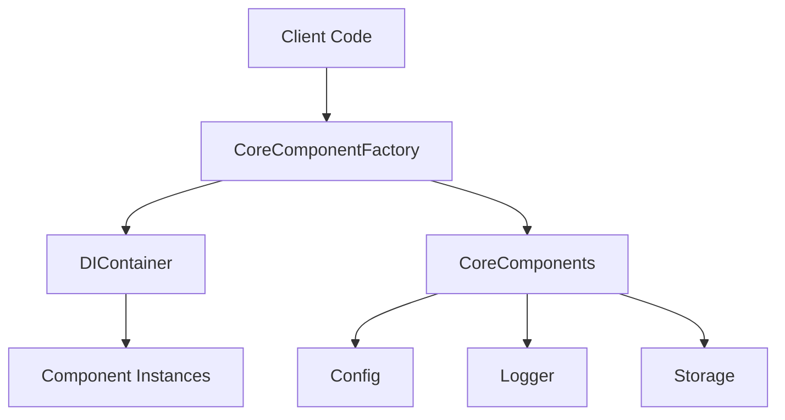
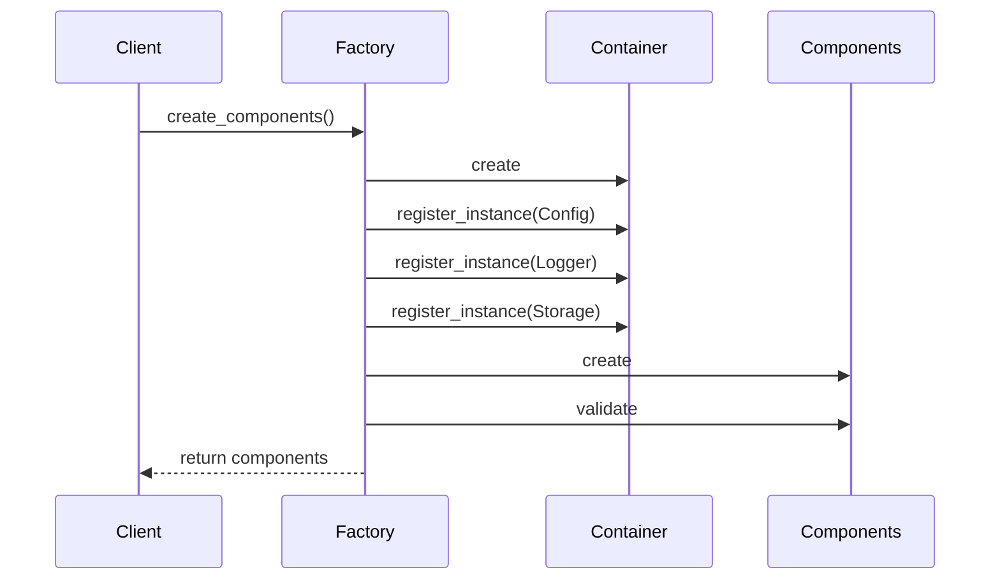
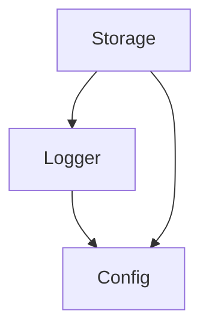

# Base Komponens Architektúra

## Áttekintés

A base komponens a Neural AI Next rendszer alapvető infrastruktúráját biztosítja. Felelős a komponensek közötti függőségek kezeléséért, a komponensek inicializálásáért és az egységes hozzáférés biztosításáért.



## Komponensek

### 1. DIContainer

A dependency injection konténer felelős a komponensek példányainak és függőségeinek kezeléséért.

#### Felelősségek:
- Komponens példányok nyilvántartása
- Factory függvények kezelése
- Függőségek feloldása
- Életciklus menedzsment

#### Belső működés:
```python
class DIContainer:
    def __init__(self):
        self._instances: Dict[Any, Any] = {}
        self._factories: Dict[Any, Any] = {}
```

- `_instances`: Tárolja az aktív komponens példányokat
- `_factories`: Tárolja a komponensek létrehozásához szükséges factory függvényeket

### 2. CoreComponents

A komponensek gyűjteménye, amely egységes interfészt biztosít a core komponensekhez.

#### Felelősségek:
- Core komponensek tárolása
- Komponens elérhetőség ellenőrzése
- Validáció

#### Belső szerkezet:
```python
class CoreComponents:
    def __init__(self):
        self.config: Optional[ConfigManagerInterface] = None
        self.logger: Optional[LoggerInterface] = None
        self.storage: Optional[StorageInterface] = None
```

### 3. CoreComponentFactory

A komponensek létrehozásáért és inicializálásáért felelős factory osztály.

#### Felelősségek:
- Komponensek létrehozása
- Függőségek összekapcsolása
- Inicializálási sorrend kezelése
- Konfigurációs opciók alkalmazása

#### Inicializálási folyamat:


## Függőségi Struktúra

### 1. Komponensek közötti függőségek



### 2. Inicializálási sorrend

1. Config Manager
   - Független más komponensektől
   - Először kell inicializálni

2. Logger
   - Függhet a Config-tól
   - Config után, Storage előtt

3. Storage
   - Függhet a Config-tól és Logger-től
   - Utoljára kell inicializálni

## Interfészek és Típusok

### 1. Core interfészek

```python
class ConfigManagerInterface(ABC):
    @abstractmethod
    def get_section(self, section: str) -> Any: ...

class LoggerInterface(ABC):
    @abstractmethod
    def info(self, message: str) -> None: ...
    @abstractmethod
    def warning(self, message: str) -> None: ...

class StorageInterface(ABC):
    @abstractmethod
    def save_object(self, obj: Any, path: str) -> None: ...
    @abstractmethod
    def load_object(self, path: str) -> Any: ...
```

### 2. Típus definíciók

```python
PathLike = Union[str, Path]
ComponentType = TypeVar('ComponentType')
FactoryType = Callable[[], ComponentType]
```

## Kiterjesztési Pontok

### 1. Új komponens hozzáadása

```python
# 1. Komponens interfész definiálása
class NewComponentInterface(ABC):
    @abstractmethod
    def do_something(self) -> None: ...

# 2. CoreComponents bővítése
class CoreComponents:
    def __init__(self):
        # ... existing components ...
        self.new_component: Optional[NewComponentInterface] = None

# 3. Factory bővítése
class CoreComponentFactory:
    @staticmethod
    def create_components(
        # ... existing params ...
        new_component_config: Optional[Dict] = None
    ) -> CoreComponents:
        # ... initialization logic ...
```

### 2. Egyedi konténer konfiguráció

```python
container = DIContainer()
container.register_factory(
    LoggerInterface,
    lambda: CustomLogger()
)
container.register_instance(
    ConfigManagerInterface,
    CustomConfig()
)
```

## Biztonsági megfontolások

### 1. Típusbiztonság
- Minden komponens interfész alapú
- Mypy típusellenőrzések
- Runtime típusellenőrzések

### 2. Kivételkezelés
- Komponens specifikus kivételek
- Inicializálási hibák kezelése
- Graceful degradation

### 3. Erőforrás menedzsment
- Komponensek megfelelő lezárása
- Memória szivárgás elkerülése
- Erőforrások felszabadítása

## Teljesítmény megfontolások

### 1. Lazy loading
- Komponensek késleltetett betöltése
- Csak szükséges függőségek inicializálása

### 2. Cache-elés
- Factory eredmények cache-elése
- Komponens példányok újrafelhasználása

### 3. Erőforrás optimalizáció
- Minimális memória használat
- Hatékony függőség feloldás
