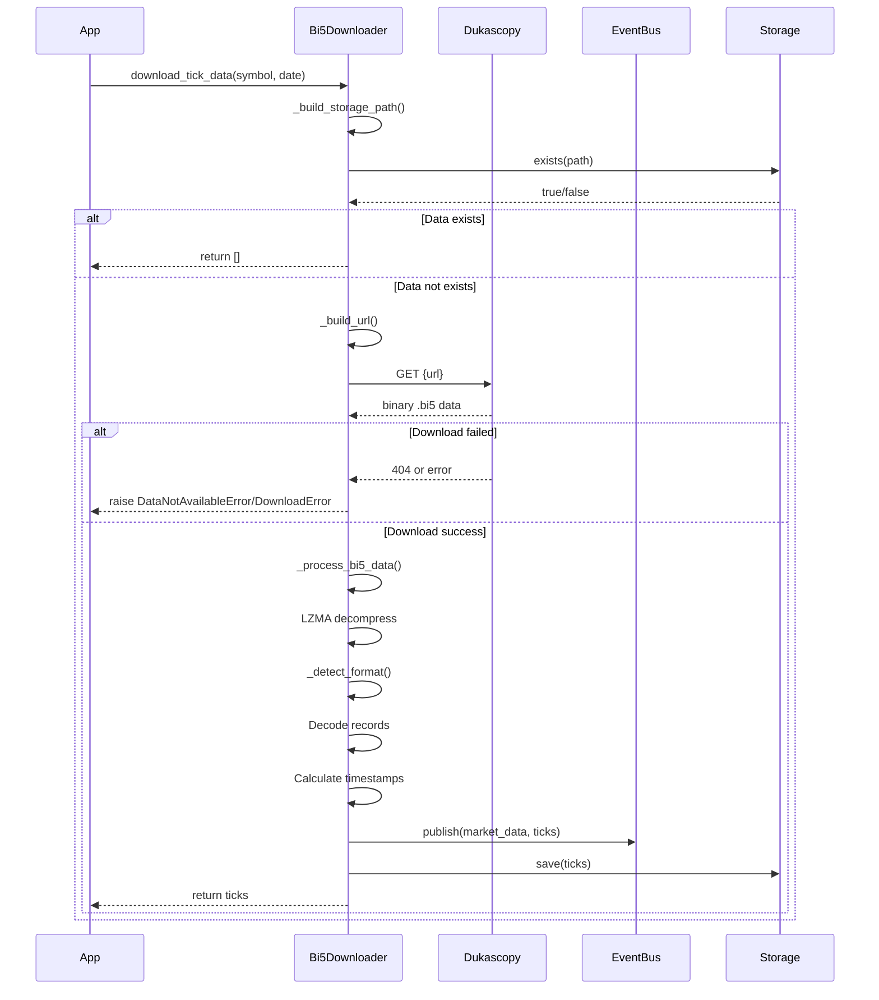

# Bi5 Downloader Implementation

## Áttekintés

A `Bi5Downloader` osztály a Dukascopy .bi5 tick adatok letöltését és dekódolását végzi. Ez a natív bináris formátum LZMA tömörítéssel és két lehetséges rekordformátummal (12 vagy 20 bájtos) rendelkezik.

## Architektúra

### Osztálystruktúra

```python
class Bi5Downloader(IJForexDownloader)
```

- **Interfész**: [`IJForexDownloader`](../interfaces/downloader_interface.md)
- **Bővítmény**: `IJForexDownloader` interfész
- **Dependency Injection**: Logger, EventBus, Config, HTTP Client, Storage

### Főbb metódusok

#### `__init__`

```python
def __init__(
    self,
    logger: "LoggerInterface",
    event_bus: "EventBusInterface",
    config: "ConfigManagerInterface",
    http_client: "aiohttp.ClientSession",
    storage: "StorageInterface",
)
```

Konstruktor, amely beállítja a függőségeket és a Dukascopy alap URL-t.

#### `_build_url`

```python
def _build_url(self, symbol: str, date: datetime) -> str
```

Létrehozza a Dukascopy .bi5 letöltési URL-t a következő formátumban:
`{BASE_URL}/{SYMBOL}/{YEAR}/{MONTH_00}/{DAY_00}/{HOUR_00}h_ticks.bi5`

**Fontos**: A hónap 0-indexelt (00-11), ezért `date.month - 1` értéket használja.

#### `_build_storage_path`

```python
def _build_storage_path(self, symbol: str, date: datetime) -> str
```

Létrehozza a tárolási útvonalat Parquet fájlhoz:
`data/jforex/{SYMBOL}/{YEAR}/{MONTH}/{DAY}/{HOUR}.parquet`

#### `_download_binary`

```python
async def _download_binary(self, url: str) -> bytes
```

Letölti a bináris .bi5 adatokat a Dukascopy szerverről.

- **404 hibát** (`DataNotAvailableError`) dob, ha nincs adat (hétvége, ünnep)
- **Hálózati hibát** (`DownloadError`) dob, ha a letöltés sikertelen

#### `_detect_format`

```python
def _detect_format(self, decompressed: bytes) -> tuple[int, str]
```

Dinamikusan detektálja a .bi5 rekordformátumot:

- **12 bájtos formátum**: `timestamp_delta, ask, bid` (alapértelmezett)
- **20 bájtos formátum**: `timestamp_delta, ask, bid, ask_vol, bid_vol`

Heurisztikát alkalmaz a formátum meghatározásához:
- Ellenőrzi, hogy a dekompresszált adat hossza osztható-e 20-szal
- Validálja az első néhány rekordot (volume és delta értékek)
- Ha valid, 20 bájtos formátumot használ, különben 12 bájtost

#### `_process_bi5_data`

```python
def _process_bi5_data(self, data: bytes, symbol: str, date: datetime) -> list["TickData"]
```

Feldolgozza és dekódolja a .bi5 bináris adatokat.

**Kritikus részlet - `base_timestamp` számítás:**

```python
# Helyes implementáció (2026.01.03-tól)
base_timestamp = (
    int(date.replace(minute=0, second=0, microsecond=0).timestamp()) * 1000
)
```

**Korábbi hiba (javítva):**

```python
# HIBÁS: Az óra információ elveszett!
base_timestamp = (
    int(date.replace(hour=0, minute=0, second=0, microsecond=0).timestamp()) * 1000
)
```

**A hiba jelentősége:**
- A Dukascopy .bi5 fájljai **óránkénti** darabokban érkeznek
- Minden fájl egy adott órához tartozik (pl. 10:00-10:59:59)
- A `timestamp_delta` mindig az adott óra elejétől (pl. 10:00:00) számítódik
- A régi kód az óra értékét nullázta ki (`hour=0`), ami helytelen timestamp-et eredményezett
- A javított kód megtartja az óra értékét, csak a perc, másodperc és mikroszekundum értékeket nullázza ki

**Feldolgozási lépések:**

1.  **LZMA dekompresszió**
2.  **Formátumdetektálás** (`_detect_format`)
3.  **Base timestamp számítás** (az óra eleje milliszekundumban)
4.  **Rekordok feldolgozása**:
    - Dinamikus unpakolás a detektált formátum alapján
    - Ár konverzió (integer → float, osztás 100000-rel)
    - Ár validáció (csak pozitív árak)
    - Timestamp delta validáció (nem lehet negatív)
    - Dátum egyezés ellenőrzése
5.  **TickData objektumok létrehozása**
6.  **Statisztikák logolása**

#### `_publish_ticks`

```python
async def _publish_ticks(self, ticks: list["TickData"]) -> None
```

Közzéteszi a tick adatokat az EventBus-on, 1000-es batch-ekben.

#### `download_tick_data`

```python
async def download_tick_data(self, symbol: str, date: datetime) -> list["TickData"]
```

Letölti és dekódolja a tick adatokat egy adott szimbólumra és dátumra.

- **Storage ellenőrzés**: Ha az adatok már léteznek, kihagyja a letöltést
- **Letöltés**: `_download_binary`
- **Feldolgozás**: `_process_bi5_data`
- **Közzététel**: `_publish_ticks`
- **Újrapróbálkozás**: 3 próbálkozás exponenciális várakozással

#### `validate_bi5_data`

```python
def validate_bi5_data(self, data: bytes) -> bool
```

Validálja a .bi5 adatok integritását (méret, LZMA dekompresszió, rekordok száma).

#### `get_available_dates`

```python
async def get_available_dates(
    self, symbol: str, start_date: datetime, end_date: datetime
) -> list[datetime]
```

Visszaadja az elérhető dátumokat egy adott tartományban (jelenleg placeholder implementáció).

#### `close`

```python
async def close(self) -> None
```

Bezárja a HTTP klienst, hogy elkerülje a "Unclosed client session" hibát.

## Adatfolyam



## Hibakezelés

### Kivételek

- **`DataNotAvailableError`**: Nincs adat a szerveren (404 válasz)
- **`DownloadError`**: Hálózati hiba vagy szerverhiba
- **`DecodeError`**: LZMA dekompresszió vagy struktúra feldolgozási hiba

### Logolás

A osztály átfogó logolást végez a műveletekről:

- `bi5_download_success`: Sikeres letöltés
- `bi5_data_not_available`: Nincs adat (404)
- `bi5_download_failed`: Hálózati hiba
- `bi5_format_detected`: Formátum detektálás eredménye
- `bi5_decode_success`: Sikeres dekódolás
- `bi5_chunk_stats`: Feldolgozási statisztikák
- `bi5_date_mismatch`: Dátum egyezésellenőrzés hibája

## Használati példa

```python
import asyncio
from datetime import datetime
import aiohttp

from neural_ai.collectors.jforex.factory import JForexFactory
from neural_ai.core.config.factory import ConfigFactory
from neural_ai.core.events.factory import EventFactory
from neural_ai.core.logger.factory import LoggerFactory
from neural_ai.core.storage.factory import StorageFactory

async def main():
    # Inicializálás
    logger = LoggerFactory.create()
    config = ConfigFactory.create()
    event_bus = EventBusFactory.create()
    storage = StorageFactory.create()
    
    async with aiohttp.ClientSession() as http_client:
        # Bi5Downloader létrehozása
        downloader = JForexFactory.create_bi5_downloader(
            logger=logger,
            event_bus=event_bus,
            config=config,
            http_client=http_client,
            storage=storage
        )
        
        # Adatok letöltése
        try:
            ticks = await downloader.download_tick_data(
                symbol="EURUSD",
                date=datetime(2024, 1, 15, 10)  # 2024.01.15. 10:00
            )
            print(f"Letöltve {len(ticks)} tick")
        except Exception as e:
            print(f"Hiba: {e}")
        finally:
            await downloader.close()

if __name__ == "__main__":
    asyncio.run(main())
```

## Jegyzetek

- A Dukascopy .bi5 fájljai óránkénti bontásban érkeznek
- A `base_timestamp` mindig az adott óra elejétől kell számoljon
- A formátumdetektálás automatikusan kezeli a 12 és 20 bájtos rekordokat
- A letöltött adatok automatikusan elmentésre kerülnek Parquet formátumban
- Az EventBus-on keresztül valós idejű tick adatok is elérhetők
