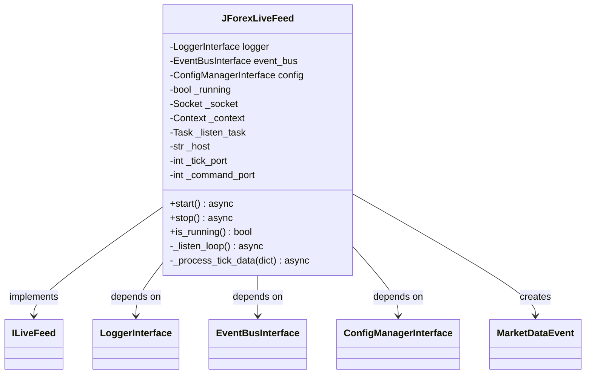

# JForexLiveFeed Implementáció

## Áttekintés

A `JForexLiveFeed` osztály a JForex live adatfolyam fogadását implementálja ZMQ (ZeroMQ) socketen keresztül. Ez az implementáció felelős a Java Bridge-el (`NeuralBridgeStrategy`) való kommunikációért, amely valós idejű tick adatokat küld a Python oldalra.

## Architektúra

### Osztálydiagram



### Függőségek

- **LoggerInterface**: Naplózási műveletekhez
- **EventBusInterface**: Piaci adatok publikálásához
- **ConfigManagerInterface**: Konfiguráció betöltéséhez
- **zmq.asyncio**: Aszinkron ZMQ kommunikációhoz

## Konfiguráció

A `JForexLiveFeed` a következő konfigurációs paramétereket használja a `configs/collectors.yaml` fájlból:

```yaml
jforex_live:
  enabled: true
  host: "127.0.0.1"
  tick_port: 5555
  command_port: 5556
```

### Konfigurációs paraméterek

| Paraméter | Típus | Alapértelmezett | Leírás |
|-----------|-------|-----------------|---------|
| `enabled` | bool | `false` | Engedélyezi-e a live feedet |
| `host` | str | `"127.0.0.1"` | A Java Bridge hoszt címe |
| `tick_port` | int | `5555` | Port a tick adatok fogadásához |
| `command_port` | int | `5556` | Port a parancsok küldéséhez (jelenleg nem használt) |

## Metódusok

### `start()`

Indítja a live adatfolyam fogadását.

**Működés:**
1. Létrehozza a ZMQ contextet
2. Létrehozza a SUB socketet
3. Csatlakozik a Java Bridge-hez (`tcp://{host}:{tick_port}`)
4. Feliratkozik minden üzenetre (`setsockopt_string(zmq.SUBSCRIBE, "")`)
5. Elindítja a háttérfolyamatot (`_listen_loop`)

**Kivételek:**
- `LiveFeedError`: Ha a csatlakozás vagy a fogadás során hiba történik

**Példa:**
```python
await live_feed.start()
```

### `stop()`

Leállítja a live adatfolyam fogadását.

**Működés:**
1. Beállítja a `_running` flaget `False`-ra
2. Leállítja a háttérfolyamatot
3. Lezárja a socketet
4. Lezárja a contextet

**Példa:**
```python
await live_feed.stop()
```

### `is_running()`

Visszaadja, hogy a live feed jelenleg fut-e.

**Visszatérési érték:**
- `bool`: `True`, ha a feed fut, `False` egyébként

**Példa:**
```python
if live_feed.is_running():
    print("Live feed is running")
```

### `_listen_loop()` (privát)

Háttérfolyamat a tickek folyamatos fogadásához.

**Működés:**
1. Végtelen ciklusban vár a ZMQ socketre érkező üzenetekre
2. JSON dekódolja a bejövő üzeneteket
3. Továbbítja a dekódolt adatokat a `_process_tick_data` metódusnak a teljes feldolgozásért
4. Hibák esetén naplózza a hibát és vár 1 másodpercet

**Refaktorálás (2025-12-31):**
- Eltávolítottuk a duplikált Event gyártást
- A metódus most csak a kommunikációért felelős, a feldolgozást a `_process_tick_data` végzi

### `_process_tick_data(data)` (privát)

Feldolgozza a tick adatokat és publikálja az EventBus-on.

**Paraméterek:**
- `data` (dict[str, object]): A tick adatok dictionary-ben (timestamp ms-ban, bid/ask float)

**Működés:**
1. Konvertálja a milliszekundumban érkező timestamp-et datetime objektummá
2. Létrehozza a `MarketDataEvent`-et a tick adatokból
3. Publikálja az eseményt az EventBus-on a "market_data" topicra
4. Hibák esetén naplózza a hibát

**Refaktorálás (2025-12-31):**
- A metódus most a `_listen_loop`-ból kapja a már dekódolt JSON adatokat
- Kezeli a milliszekundumban érkező timestamp-et (`datetime.fromtimestamp(ts_ms / 1000.0, tz=timezone.utc)`)
- A bid/ask értékek már float-ként érkeznek, nem kell castolni
- Egységesítette a tick feldolgozást, eltávolítva a duplikált kódot

## Használati példa

```python
from neural_ai.collectors.jforex.factory import JForexFactory
from neural_ai.core.config.factory import ConfigFactory
from neural_ai.core.events.factory import EventFactory
from neural_ai.core.logger.factory import LoggerFactory

# Komponensek létrehozása
config = ConfigFactory.create_yaml_config_manager("configs")
logger = LoggerFactory.create_default_logger("jforex_live")
event_bus = EventFactory.create_zeromq_bus(config, logger)

# Live feed létrehozása
live_feed = JForexFactory.create_live_feed(
    config=config,
    logger=logger,
    event_bus=event_bus
)

# Live feed indítása
await live_feed.start()

# ... alkalmazás logika ...

# Live feed leállítása
await live_feed.stop()
```

## Üzenet formátum

A Java Bridge a következő JSON formátumban küldi a tick adatokat:

```json
{
  "symbol": "EURUSD",
  "timestamp": 1704110400000,
  "bid": 1.10000,
  "ask": 1.10010,
  "volume": 1000
}
```

### Mezők leírása

| Mező | Típus | Leírás |
|------|-------|---------|
| `symbol` | str | A pénzpár szimbóluma (pl. "EURUSD") |
| `timestamp` | int | Az időbélyeg milliszekundumban (Unix timestamp * 1000) |
| `bid` | float | A bid ár |
| `ask` | float | Az ask ár |
| `volume` | int | A volumen (opcionális) |

**Megjegyzés:** A refaktorálás után (2025-12-31) a `type` mezőt eltávolítottuk, mivel a `_listen_loop` most csak a JSON dekódolásért felelős, és a `_process_tick_data` kezeli a teljes feldolgozást.

## Hibakezelés

A `JForexLiveFeed` robusztus hibakezelést implementál:

1. **Csatlakozási hiba**: Ha a ZMQ socket nem tud csatlakozni, a hiba naplózásra kerül és a feed nem indul el
2. **JSON dekódolási hiba**: Ha egy üzenet érvénytelen JSON-t tartalmaz, a hiba naplózásra kerül és az üzenet figyelmen kívül marad
3. **Tick feldolgozási hiba**: Ha egy tick adat érvénytelen, a hiba naplózásra kerül és az üzenet figyelmen kívül marad
4. **Általános hiba**: Bármely egyéb hiba esetén a rendszer naplózza a hibát és 1 másodpercet vár a következő próbálkozás előtt

## Teljesítmény

- **Késés**: A tickeket valós időben dolgozza fel, a ZMQ alacsony késleltetésű kommunikációt biztosít
- **Memóriahasználat**: Az üzeneteket azonnal feldolgozza és továbbítja, nem tárolja őket
- **Skálázhatóság**: A ZMQ aszinkron működése lehetővé teszi nagy mennyiségű tick feldolgozását

## Biztonság

- **Localhost kommunikáció**: A ZMQ socket csak localhost-on kommunikál (127.0.0.1)
- **SUB socket**: A Python oldal csak fogad, nem küld adatokat a Java Bridge-nek
- **Validáció**: A bejövő tick adatokat validálja a `MarketDataEvent` modell segítségével

## Fejlesztési jegyzetek

- Az osztály teljes egészében aszinkron működik
- A ZMQ context és socket élettartamát az osztály kezeli
- Az EventBus-on történő publikálás nem blokkoló
- A konfigurációból történő betöltés hibatűrő (alapértelmezett értékekkel)

## Refaktorálás (2025-12-31)

A `JForexLiveFeed` osztályt refaktoráltuk, hogy eltávolítsuk a duplikált kódot és egységesítsük a tick feldolgozást.

### Változások

1. **`_listen_loop` metódus:**
   - Eltávolítottuk a manuális Event gyártást
   - A metódus most csak JSON-t dekódol és hívja a `_process_tick_data`-t
   - Egyszerűbb, olvashatóbb kód

2. **`_process_tick_data` metódus:**
   - Kezeli a milliszekundumban érkező timestamp-et
   - A bid/ask értékek már float-ként érkeznek, nem kell castolni
   - Típusosítottuk a `data` paramétert (`dict[str, object]`)

### Előnyök

- **Egyszerűség:** A `_listen_loop` csak kommunikál, a `_process_tick_data` csak feldolgoz
- **Karbantarthatóság:** Nincs duplikált Event gyártás
- **Típusbiztonság:** Jobb típusosítás a `dict[str, object]` használatával
- **Teljesítmény:** Kevesebb művelet a tick feldolgozás során

## Kapcsolódó dokumentáció

- [ILiveFeed Interface](interfaces/live_interface.md)
- [JForex Factory](factory.md)
- [MarketDataEvent](../../../core/events/interfaces/event_models.md)
- [EventBus Interface](../../../core/events/interfaces/event_bus_interface.md)