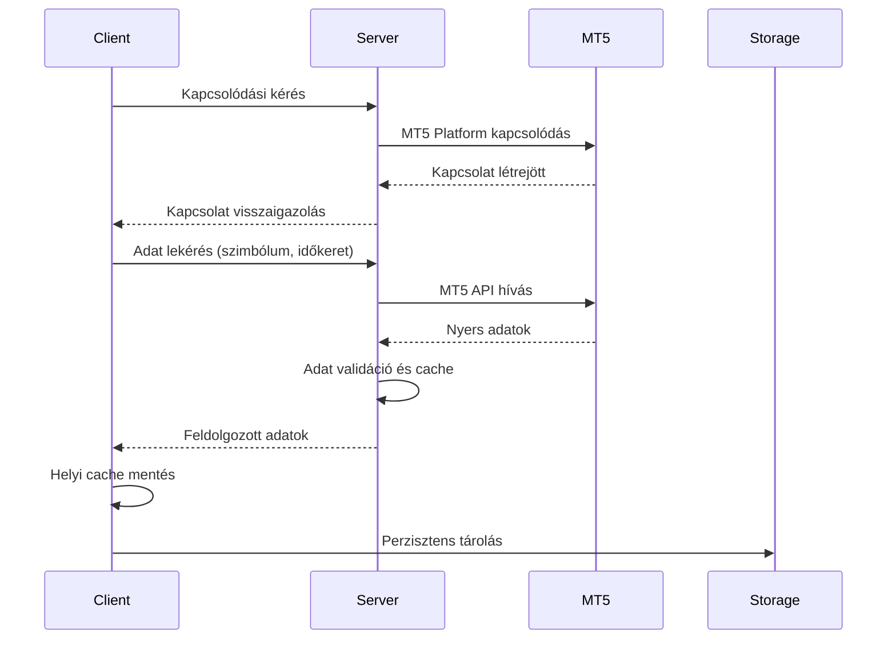

# MT5 Collector Komponens

## Áttekintés

Az MT5 Collector komponens felelős a MetaTrader 5 platformról történő adatok gyűjtéséért és rendszerezéséért. A komponens server-client architektúrával, aszinkron működéssel és hatékony kapcsolatkezeléssel biztosítja a különböző pénzügyi instrumentumok és időkeretek adatainak megbízható gyűjtését.

## Architektúra

### Server-Client Modell

```
MT5 Collector/
├── server/                # Windows Server komponensek
│   ├── bridge/           # MT5 API híd
│   │   ├── api.py       # MetaTrader5 API wrapper
│   │   └── auth.py      # Hitelesítési kezelő
│   ├── ws/              # WebSocket szerver
│   │   ├── server.py    # Aszinkron WS szerver
│   │   └── handlers.py  # Üzenet kezelők
│   ├── cache/           # Szerver oldali cache
│   │   ├── manager.py   # Cache menedzsment
│   │   └── store.py     # Adat tárolás
│   └── adapters/        # Adatformátum átalakítók
├── client/              # Linux Client komponensek
│   ├── collector/       # Collector implementáció
│   │   ├── sync.py     # Szinkronizációs logika
│   │   └── worker.py   # Adatgyűjtő worker
│   ├── cache/          # Kliens oldali cache
│   │   ├── local.py    # Helyi cache
│   │   └── sync.py     # Cache szinkronizáció
│   └── handlers/       # Eseménykezelők
└── protocol/           # Közös protokoll definíciók
    ├── messages/       # Üzenet definíciók
    │   ├── common.py   # Alap üzenetek
    │   └── data.py     # Adat üzenetek
    ├── api.py         # API definíciók
    └── errors.py      # Hibakezelés
```

### Komponens kommunikáció



## Fő funkciók

### Server Oldal

1. **MT5 API Bridge**
   - MetaTrader5 platformhoz való biztonságos kapcsolódás
   - Több terminál párhuzamos kezelése
   - Automatikus újrakapcsolódás
   - API hívások rate limiting

2. **WebSocket Szerver**
   - Aszinkron kommunikáció
   - SSL/TLS titkosítás
   - Kliens autentikáció
   - Több kliens kezelése

3. **Cache Menedzsment**
   - Gyakori lekérések gyorsítótárazása
   - Cache invalidáció
   - Cache szinkronizáció

### Client Oldal

1. **Collector Implementáció**
   - Adatgyűjtési logika
   - Hibakezelés és újrapróbálkozás
   - Adatvalidáció
   - Storage integráció

2. **Cache Kezelés**
   - Helyi cache
   - Cache szinkronizáció a szerverrel
   - Automatikus invalidáció

3. **Eseménykezelés**
   - Kapcsolat monitoring
   - Hibaállapotok kezelése
   - Metrikák gyűjtése

## Kommunikációs Protokoll

### Üzenet Típusok

```python
# Kapcsolódási üzenetek
ConnectRequest(client_id: str, auth_token: str)
ConnectResponse(session_id: str, status: str)

# Adat üzenetek
DataRequest(
    symbol: str,
    timeframe: str,
    start_date: datetime,
    end_date: datetime
)
DataResponse(
    data: DataFrame,
    metadata: Dict[str, Any]
)

# Cache üzenetek
CacheSync(
    entries: List[CacheEntry],
    timestamp: datetime
)

# Állapot üzenetek
Status(
    type: str,
    code: int,
    message: str
)
```

### Hibaállapotok

```python
class MT5Error(Exception):
    """Alap kivétel osztály"""
    pass

class ConnectionError(MT5Error):
    """Kapcsolódási hibák"""
    pass

class DataError(MT5Error):
    """Adat lekérési hibák"""
    pass

class CacheError(MT5Error):
    """Cache kezelési hibák"""
    pass
```

## Konfiguráció

```yaml
# Server konfiguráció
server:
  host: "0.0.0.0"
  port: 8765
  ssl:
    enabled: true
    cert_file: "cert.pem"
    key_file: "key.pem"

  # MT5 beállítások
  mt5:
    terminals:
      - name: "main"
        server: "MetaQuotes-Demo"
        login: 12345678
        password: "password123"
      - name: "backup"
        server: "MetaQuotes-Demo2"
        login: 87654321
        password: "password456"

    connection:
      timeout: 60
      max_retries: 3
      retry_delay: 5

  # Cache beállítások
  cache:
    enabled: true
    max_size: 1000000
    ttl: 3600

# Client konfiguráció
client:
  server_url: "ws://localhost:8765"
  auth_token: "secret_token"

  # Helyi cache
  cache:
    enabled: true
    path: "/tmp/mt5_cache"
    max_size: 500000
    sync_interval: 300

  # Collector beállítások
  collector:
    batch_size: 1000
    max_retries: 3
    validate_data: true
```

## Teljesítmény és Skálázhatóság

### Szerver oldal

1. **Kapcsolat pooling**
   - MT5 kapcsolatok újrafelhasználása
   - Kapcsolati erőforrások optimális használata

2. **Cache réteg**
   - Gyakori lekérések gyorsítótárazása
   - Cache invalidációs stratégia
   - Memória használat optimalizálás

3. **Terheléselosztás**
   - Több MT5 terminál párhuzamos használata
   - Kérések elosztása a terminálok között
   - Automatikus failover

### Kliens oldal

1. **Aszinkron műveletek**
   - Non-blocking I/O műveletek
   - Párhuzamos adatfeldolgozás
   - Event loop optimalizáció

2. **Batch feldolgozás**
   - Nagy adatmennyiségek chunk-okban történő kezelése
   - Memória használat optimalizálás
   - Progresszív adatbetöltés

3. **Helyi cache**
   - Gyakran használt adatok helyi tárolása
   - Cache szinkronizáció a szerverrel
   - Intelligens cache invalidáció

## Biztonság

### Hálózati biztonság

1. **SSL/TLS titkosítás**
   - Minden kommunikáció titkosítva
   - Tanúsítvány alapú autentikáció
   - Perfect Forward Secrecy

2. **Kliens autentikáció**
   - Token alapú autentikáció
   - Session kezelés
   - Rate limiting

### Adat biztonság

1. **Szenzitív adatok kezelése**
   - MT5 hitelesítési adatok titkosítása
   - Biztonságos konfiguráció tárolás
   - Memória tisztítás érzékeny adatoknál

2. **Adat validáció**
   - Input validáció minden ponton
   - Adatintegritás ellenőrzés
   - Anomália detektálás

## Monitoring és Diagnosztika

### Metrikák

- Kapcsolat állapot
- Lekérési latency
- Cache hit/miss arány
- Memória használat
- CPU használat
- Hiba ráta

### Naplózás

- Részletes műveleti logok
- Hiba logok
- Teljesítmény metrikák
- Audit logok

## Következő lépések

1. ### Server komponens implementáció
   - WebSocket szerver felállítása
   - MT5 API bridge implementáció
   - Cache réteg kialakítása

2. ### Client komponens implementáció
   - Collector logika implementáció
   - Helyi cache megvalósítás
   - Storage integráció

3. ### Tesztelés és optimalizáció
   - Unit tesztek írása
   - Integrációs tesztek
   - Teljesítmény tesztek
   - Biztonsági audit
