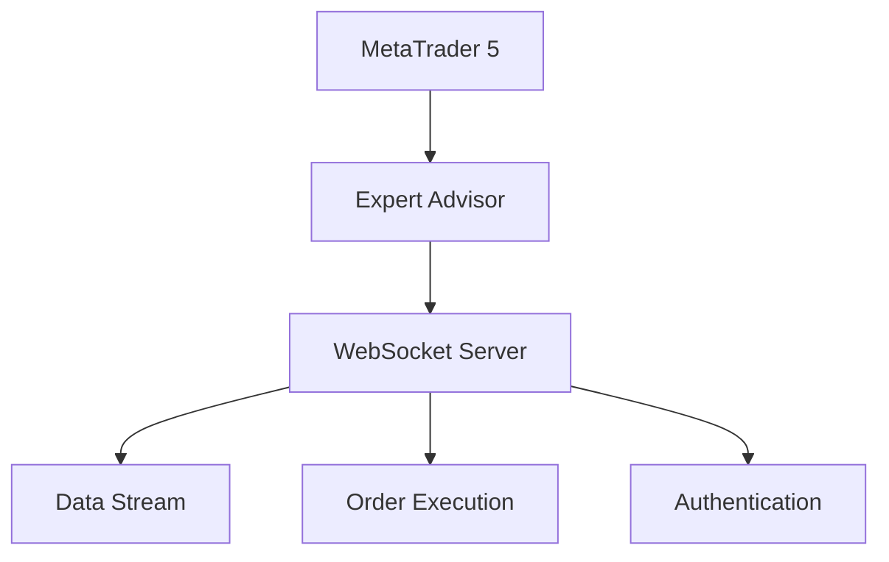
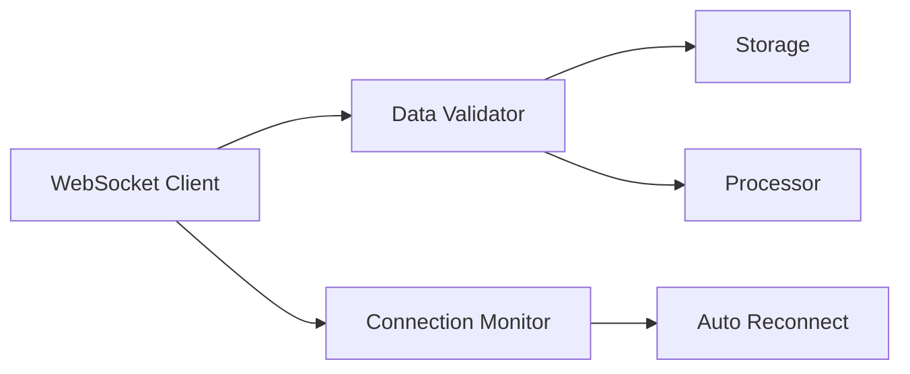
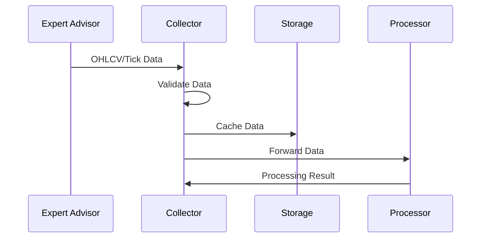

# MT5 Collector Design Specification

## Overview

Az MT5 Collector komponens egy minimális Expert Advisor és egy Neural-AI oldali collector
segítségével biztosítja a MetaTrader 5 platformmal való integrációt. A rendszer platformfüggetlen,
biztonságos és hatékonyan integrálódik a Neural-AI Next architektúrába.

## Architektúra

### 1. Expert Advisor Komponens



#### Funkciók
- WebSocket szerver funkcionalitás
- OHLCV és tick adatok streamelése
- Order végrehajtás fogadása
- Biztonságos kommunikáció
- Minimális üzleti logika

#### Biztonság
- Titkosított kommunikáció (TLS)
- Token alapú autentikáció
- IP cím szűrés
- Rate limiting

### 2. Neural-AI Collector



#### Funkciók
- EA kapcsolat kezelése
- Adat validáció és tisztítás
- Storage komponens integráció
- Dimension Processor integráció
- Kapcsolat monitorozás
- Automatikus újracsatlakozás

### 3. Adatfolyam



## Implementációs Részletek

### 1. Expert Advisor

```cpp
// MQL5 implementáció
class MTCollectorEA {
private:
    CWebSocketServer* Server;
    string AuthToken;

public:
    // Inicializálás
    int OnInit() {
        Server = new CWebSocketServer();
        return INIT_SUCCEEDED;
    }

    // Tick esemény
    void OnTick() {
        if (Server.HasConnections()) {
            // OHLCV adatok küldése
            SendMarketData();
        }
    }

    // Adat küldés
    void SendMarketData() {
        // Adatok összegyűjtése és küldése
    }
};
```

### 2. Neural-AI Collector

```python
class MT5Collector:
    def __init__(
        self,
        config: Dict[str, Any],
        logger: Optional[LoggerInterface] = None
    ) -> None:
        """Initialize MT5 Collector.

        Args:
            config: Configuration dictionary
            logger: Optional logger instance
        """
        self._config = config
        self._logger = logger or LoggerFactory.get_logger(__name__)
        self._storage = StorageFactory.get_storage(config["storage"])
        self._processor = DimensionProcessor(config["processor"])

    async def connect(self) -> bool:
        """Connect to Expert Advisor."""
        pass

    async def start(self) -> None:
        """Start data collection."""
        pass

    async def process_message(self, msg: Dict[str, Any]) -> None:
        """Process received message."""
        pass
```

## Konfiguráció

```yaml
mt5_collector:
  expert_advisor:
    host: "0.0.0.0"
    port: 8765
    auth_token: "secret_token"  # Titkosítva tárolva
    ssl:
      enabled: true
      cert_file: "cert.pem"
      key_file: "key.pem"

  collector:
    reconnect:
      max_retries: 3
      retry_delay: 5
    validation:
      check_timestamp: true
      check_sequence: true

  storage:
    type: "file"
    path: "data/mt5"
    format: "parquet"

  processor:
    dimensions: ["D1", "D2", "D3"]  # Aktív dimenziók
```

## Kommunikációs Protokoll

### 1. Kapcsolódás

```json
{
    "type": "auth",
    "token": "encoded_token",
    "timestamp": 1234567890
}
```

### 2. OHLCV Adat

```json
{
    "type": "ohlcv",
    "symbol": "EURUSD",
    "timeframe": "M1",
    "data": {
        "timestamp": 1234567890,
        "open": 1.23456,
        "high": 1.23457,
        "low": 1.23455,
        "close": 1.23456,
        "volume": 100
    }
}
```

### 3. Tick Adat

```json
{
    "type": "tick",
    "symbol": "EURUSD",
    "data": {
        "timestamp": 1234567890,
        "bid": 1.23456,
        "ask": 1.23457,
        "volume": 1
    }
}
```

### 4. Order Végrehajtás

```json
{
    "type": "order",
    "action": "DEAL_TYPE_BUY",
    "symbol": "EURUSD",
    "volume": 0.1,
    "price": 1.23456,
    "sl": 1.23356,
    "tp": 1.23556,
    "comment": "Neural-AI Trade"
}
```

## Hibakezelés

1. **Kapcsolódási hibák**
   - Automatikus újracsatlakozás
   - Exponenciális backoff
   - Állapot monitorozás

2. **Adat validációs hibák**
   - Timestamp ellenőrzés
   - Szekvencia ellenőrzés
   - Érték validáció

3. **Order hibák**
   - Visszaigazolás ellenőrzés
   - Retry logika
   - Állapot követés

## Biztonság

1. **Kommunikáció**
   - TLS titkosítás
   - Token alapú autentikáció
   - Kapcsolat timeout

2. **Adat**
   - Input validáció
   - Szanitizáció
   - Audit log

## Teljesítmény

1. **Optimalizációk**
   - Batch üzenetek
   - Bináris protokoll
   - Message queue

2. **Monitoring**
   - Kapcsolat latency
   - Message throughput
   - Error rate

## Tesztelés

1. **Unit tesztek**
   ```python
   def test_connection():
       """Test EA connection."""
       pass

   def test_data_validation():
       """Test data validation."""
       pass
   ```

2. **Integrációs tesztek**
   ```python
   def test_storage_integration():
       """Test storage integration."""
       pass

   def test_processor_integration():
       """Test processor integration."""
       pass
   ```

## Következő lépések

1. **EA Implementáció**
   - WebSocket szerver
   - Adat streamelés
   - Order végrehajtás

2. **Collector Implementáció**
   - Kapcsolat kezelés
   - Adat validáció
   - Storage integráció

3. **Tesztelés**
   - Unit tesztek
   - Integrációs tesztek
   - Teljesítmény tesztek

4. **Dokumentáció**
   - API referencia
   - Példa kódok
   - Telepítési útmutató
