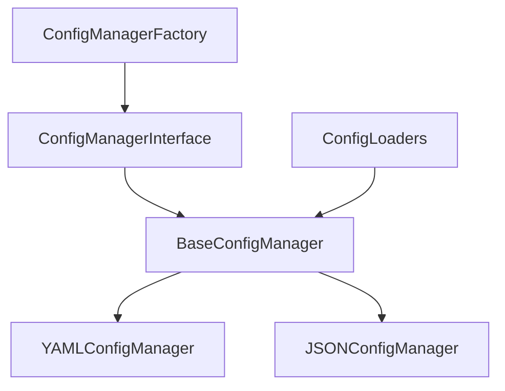

# Config Komponens Architektúra

## Áttekintés

A config komponens egy rugalmas, hierarchikus konfigurációkezelő rendszer, amely különböző formátumú konfigurációs fájlok kezelését teszi lehetővé.

## Architektúrális diagram



## Komponens rétegek

### 1. Interfész réteg
- Konfiguráció betöltés
- Érték lekérés/beállítás
- Validáció

### 2. Implementációs réteg
- YAML és JSON támogatás
- Konfiguráció validáció
- Formátum kezelés

### 3. Factory réteg
- Példányosítás
- Konfiguráció betöltés
- Validáció

## Függőségek kezelése

### Külső függőségek
- PyYAML: YAML fájlok kezelése
- JSON: Beépített JSON kezelés

### Belső függőségek
- Logger komponens: Naplózás
- Base komponens: Factory pattern

## Fejlesztési irányelvek

### 1. Konfiguráció formátum
```yaml
section:
  subsection:
    key: value
    list:
      - item1
      - item2
```

### 2. Validáció
- Séma alapú validáció
- Típus ellenőrzés
- Kötelező mezők

### 3. Hibaüzenetek
- Részletes hibaüzenetek
- Hibapozíció megjelölése
- Kontextus információk

## Bővítési lehetőségek

1. Új formátumok támogatása
2. Remote konfiguráció
3. Dinamikus újratöltés
4. Konfiguráció versioning
