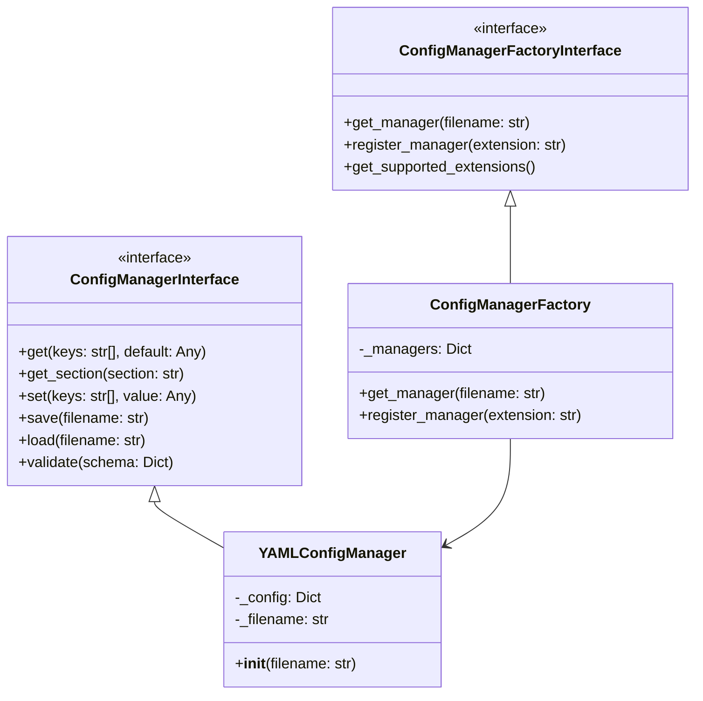

<!-- filepath: /home/elynea/Dokumentumok/neural-ai-next/docs/components/config/README.md -->
# Konfigurációkezelő Komponens

## Áttekintés

A konfigurációkezelő komponens felelős a Neural-AI-Next rendszer különböző részeinek konfigurálásáért. Egységes interfészt biztosít a konfigurációs adatok kezeléséhez, többféle formátum támogatásával (YAML, JSON, stb.).

## Fő funkciók

- Konfigurációs fájlok betöltése és elemzése
- Konfigurációs értékek lekérése hierarchikus kulcsokkal
- Alapértelmezett értékek kezelése
- Konfigurációk validálása
- Konfigurációs változtatások mentése

## Architektúra

A konfigurációkezelő az alábbi komponensekből áll:

1. **ConfigManagerInterface**: Alap interfész a konfigurációkezeléshez
2. **ConfigManagerFactory**: Factory osztály a megfelelő implementáció létrehozásához
3. **Implementációk**:
   - YAMLConfigManager: YAML fájlok kezelése
   - JSONConfigManager: JSON fájlok kezelése
   - INIConfigManager: INI fájlok kezelése

## Használati példák

```python
# Konfiguráció betöltése
config_manager = ConfigManagerFactory.get_manager("configs/app.yaml")

# Értékek lekérése
log_level = config_manager.get("logging", "level", default="INFO")

# Teljes szekció lekérése
storage_config = config_manager.get_section("storage")

# Érték beállítása
config_manager.set("processing", "batch_size", 64)

# Konfiguráció mentése
config_manager.save()
```


## Konfigurációs fájl struktúra

A rendszer a következő konfigurációs fájl struktúrát használja:

/configs
├── app/                      # Alkalmazás szintű konfigurációk
│   ├── logging.yaml          # Logging beállítások
│   └── system.yaml           # Rendszer beállítások
├── collectors/               # Adatgyűjtő konfigurációk
│   ├── mt5.yaml
│   └── api.yaml
├── processors/               # Processzor konfigurációk
│   ├── d1_price_action.yaml
│   ├── d2_support_resistance.yaml
│   └── ...
└── storage/                  # Tároló konfigurációk
    └── storage.yaml

Konfiguráció validálás
A komponens opcionális validációs sémákat használhat a konfigurációs értékek ellenőrzésére:
```python
# Schema definíció
schema = {
    "logging": {
        "level": {"type": "string", "choices": ["DEBUG", "INFO", "WARNING", "ERROR", "CRITICAL"]},
        "file": {"type": "string"}
    },
    "processing": {
        "batch_size": {"type": "integer", "min": 1, "max": 1024}
    }
}

# Validáció
is_valid, errors = config_manager.validate(schema)
if not is_valid:
    print(f"Configuration errors: {errors}")
```

## Fejlesztési útmutató
Új konfigurációkezelő implementáció létrehozásához:

1. Implementálja a ConfigManagerInterface interfészt
2. Regisztrálja az új implementációt a ConfigManagerFactory osztályban
3. Készítsen unit teszteket az új implementációhoz
# Konfiguráció Kezelő - Technikai Specifikáció

## 1. Áttekintés

A konfiguráció kezelő komponens egy moduláris, kiterjeszthető rendszer, amely különböző formátumú konfigurációs fájlok kezelését teszi lehetővé. A komponens a SOLID elvek és a tiszta kód alapelvek mentén került kialakításra.

## 2. Architektúra

### 2.1. Komponens Diagram



### 2.2. Rétegek

1. **Interfész réteg**
   - ConfigManagerInterface
   - ConfigManagerFactoryInterface

2. **Implementációs réteg**
   - YAMLConfigManager
   - ConfigManagerFactory

3. **Validációs réteg**
   - Séma alapú validáció
   - Típus ellenőrzések

## 3. Működési Mechanizmus

### 3.1. Konfigurációs Fájl Betöltése

1. A Factory megvizsgálja a fájl kiterjesztését
2. Kiválasztja a megfelelő manager implementációt
3. Létrehozza a manager példányt
4. Betölti és feldolgozza a fájlt

### 3.2. Érték Lekérése

1. A get() metódus fogadja a kulcs útvonalat
2. Rekurzívan bejárja a konfigurációs fát
3. Visszaadja az értéket vagy az alapértelmezettet

### 3.3. Validációs Folyamat

```python
def validate(schema):
    for key, rules in schema.items():
        # Típus ellenőrzés
        value_type = rules.get("type")
        if value_type and not isinstance(value, TYPE_MAP[value_type]):
            return False, f"Invalid type for {key}"

        # Érték korlátok
        if "min" in rules and value < rules["min"]:
            return False, f"Value too small for {key}"

        # Választható értékek
        if "choices" in rules and value not in rules["choices"]:
            return False, f"Invalid choice for {key}"

    return True, None
```

## 4. Tervezési Döntések

### 4.1. Választott Megoldások

| Terület | Megoldás | Indoklás |
|---------|----------|-----------|
| Alap formátum | YAML | Jól olvasható, hierarchikus |
| Validáció | Séma alapú | Rugalmas, bővíthető |
| Factory | Regisztrációs mechanizmus | Könnyű bővíthetőség |

### 4.2. Alternatívák

| Alternatíva | Előnyök | Hátrányok | Döntés |
|-------------|---------|-----------|---------|
| JSON alapú | Szabványos | Kevésbé olvasható | Nem |
| INI alapú | Egyszerű | Limitált hierarchia | Nem |
| Env fájl | Biztonságos | Nincs struktúra | Nem |

## 5. Teljesítmény

### 5.1. Erőforrás Használat

- Memória: ~100KB/konfig fájl
- CPU: Elhanyagolható
- I/O: Csak betöltéskor/mentéskor

### 5.2. Optimalizációk

1. Lazy loading
2. Caching mechanizmus
3. Inkrementális validáció

## 6. Biztonság

### 6.1. Kockázatok és Kezelésük

| Kockázat | Kezelés |
|----------|---------|
| Érzékeny adatok | Külön env fájl használata |
| Fájl hozzáférés | Jogosultság ellenőrzés |
| YAML injekció | safe_load használata |

### 6.2. Biztonságos Használat

```python
# Helyes:
config = yaml.safe_load(file)

# Helytelen:
config = yaml.load(file)  # Potenciális RCE
```

## 7. Bővíthetőség

### 7.1. Új Formátum Hozzáadása

1. Implementálja a ConfigManagerInterface-t
2. Regisztrálja a Factory-nál
3. Készítsen teszteket

```python
@dataclass
class NewFormatConfig(ConfigManagerInterface):
    def load(self, filename: str) -> None:
        # Implementáció
        pass

ConfigManagerFactory.register_manager(".new", NewFormatConfig)
```

### 7.2. Validáció Bővítése

```python
class CustomValidator:
    def validate(self, value: Any) -> bool:
        # Egyedi validáció
        pass

schema = {
    "field": {
        "validator": CustomValidator()
    }
}
```

## 8. Tesztelés

### 8.1. Unit Tesztek

- Konfiguráció betöltése
- Érték lekérése/beállítása
- Validáció
- Factory működése

### 8.2. Integrációs Tesztek

- Fájl műveletek
- Több formátum együttes használata
- Validációs forgatókönyvek

## 9. Korlátok és Jövőbeli Fejlesztések

### 9.1. Ismert Korlátok

1. Nagy fájlok memóriában
2. Nincs séma örököltetés
3. Limitált típuskészlet

### 9.2. Tervezett Fejlesztések

1. Streaming feldolgozás
2. Séma kompozíció
3. Környezet-függő konfigurációk
4. Automatikus reload

## 10. Függőségek

### 10.1. Közvetlen függőségek

- PyYAML: Konfigurációs fájlok kezelése
- typing: Típus annotációk

### 10.2. Opcionális függőségek

- json: JSON támogatás
- toml: TOML támogatás
