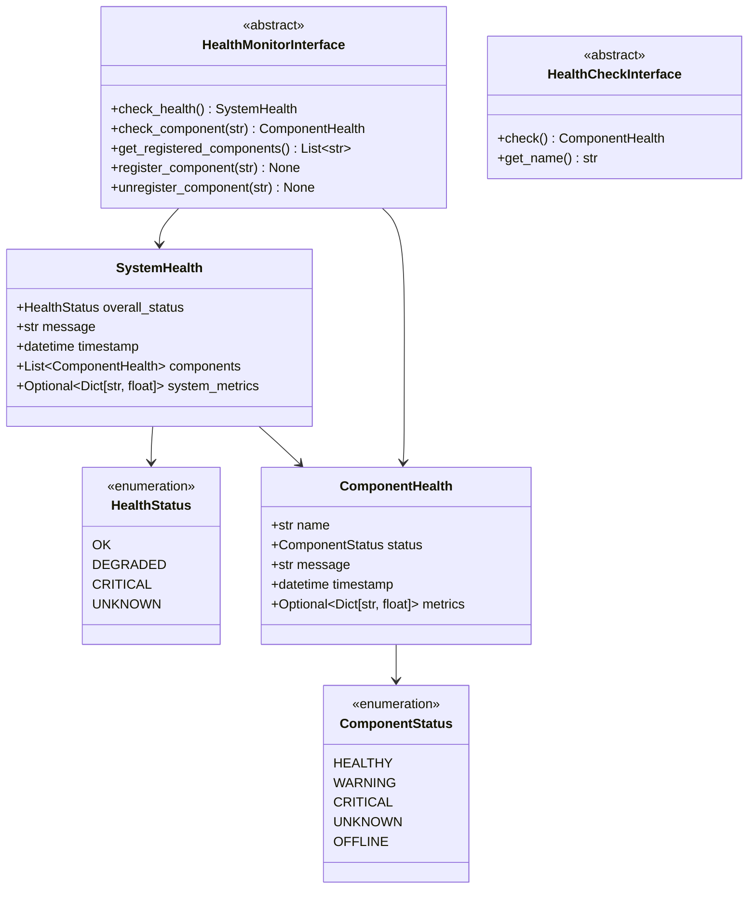

# Health Interface - Rendszer Egészségügyi Monitorozás

## 🎯 Cél és Feladat

A `health_interface.py` modul a rendszer egészségügyi monitorozásához szükséges interfészeket definiálja. Ez magában foglalja a komponensek állapotának ellenőrzését, erőforrás-használat monitorozását és rendszer metrikák gyűjtését.

## 🏗️ Architektúra

### Osztálydiagram



### Komponensek

#### ComponentStatus Enum
A rendszer komponenseinek állapotát definiálja:
- `HEALTHY`: A komponens egészségesen működik
- `WARNING`: A komponens működik, de figyelmeztetéseket jelez
- `CRITICAL`: A komponens kritikus hibát észlelt
- `UNKNOWN`: A komponens állapota ismeretlen
- `OFFLINE`: A komponens offline vagy nem elérhető

#### HealthStatus Enum
A teljes rendszer egészségügyi állapotát definiálja:
- `OK`: A rendszer teljesen egészséges
- `DEGRADED`: A rendszer működik, de csökkentett teljesítménnyel
- `CRITICAL`: A rendszer kritikus állapotban van
- `UNKNOWN`: A rendszer állapota ismeretlen

#### ComponentHealth Dataclass
Egy adott komponens egészségügyi információit tartalmazza:
- `name`: A komponens neve
- `status`: A komponens állapota
- `message`: Részletes üzenet vagy hiba
- `timestamp`: Az állapot ellenőrzésének időpontja
- `metrics`: Opcionális metrikák (pl. response time, error rate)

#### SystemHealth Dataclass
A teljes rendszer egészségügyi állapotát tartalmazza:
- `overall_status`: A rendszer általános állapota
- `message`: Részletes üzenet
- `timestamp`: Az ellenőrzés időpontja
- `components`: A komponensek egészségügyi információi
- `system_metrics`: Rendszer szintű metrikák (CPU, memória, stb.)

#### HealthMonitorInterface
A rendszer egészségügyi monitorozás fő interfésze:
- `check_health()`: A teljes rendszer egészségügyi állapotának ellenőrzése
- `check_component()`: Egy adott komponens állapotának ellenőrzése
- `get_registered_components()`: A monitorozott komponensek listája
- `register_component()`: Új komponens regisztrálása
- `unregister_component()`: Komponens eltávolítása

#### HealthCheckInterface
Egyedi egészségügyi ellenőrzések interfésze:
- `check()`: Az ellenőrzés végrehajtása
- `get_name()`: Az ellenőrzés nevének lekérdezése

## 🔧 Használat

### Alapvető egészségügyi ellenőrzés

```python
from neural_ai.core.system.interfaces.health_interface import (
    HealthMonitorInterface,
    SystemHealth,
    ComponentHealth,
    ComponentStatus,
    HealthStatus
)
from datetime import datetime

class BasicHealthMonitor(HealthMonitorInterface):
    def __init__(self):
        self._components = []
    
    def check_health(self) -> SystemHealth:
        component_healths = []
        for component in self._components:
            component_healths.append(self.check_component(component))
        
        # Összesített állapot meghatározása
        overall_status = self._calculate_overall_status(component_healths)
        
        return SystemHealth(
            overall_status=overall_status,
            message="Rendszer egészségügyi állapot ellenőrizve",
            timestamp=datetime.now(),
            components=component_healths
        )
    
    def check_component(self, component_name: str) -> ComponentHealth:
        # Komponens specifikus ellenőrzés implementációja
        pass
    
    def get_registered_components(self) -> List[str]:
        return list(self._components)
    
    def register_component(self, component_name: str) -> None:
        if component_name not in self._components:
            self._components.append(component_name)
    
    def unregister_component(self, component_name: str) -> None:
        if component_name in self._components:
            self._components.remove(component_name)
    
    def _calculate_overall_status(self, components: List[ComponentHealth]) -> HealthStatus:
        # Összesített állapot logika
        if any(c.status == ComponentStatus.CRITICAL for c in components):
            return HealthStatus.CRITICAL
        elif any(c.status == ComponentStatus.WARNING for c in components):
            return HealthStatus.DEGRADED
        else:
            return HealthStatus.OK
```

### Egyedi egészségügyi ellenőrzés létrehozása

```python
from neural_ai.core.system.interfaces.health_interface import (
    HealthCheckInterface,
    ComponentHealth,
    ComponentStatus
)
from datetime import datetime

class DatabaseHealthCheck(HealthCheckInterface):
    def __init__(self, database_connection):
        self._db = database_connection
    
    def check(self) -> ComponentHealth:
        try:
            # Adatbázis kapcsolat ellenőrzése
            self._db.execute("SELECT 1")
            return ComponentHealth(
                name="database",
                status=ComponentStatus.HEALTHY,
                message="Adatbázis kapcsolat OK",
                timestamp=datetime.now(),
                metrics={"response_time_ms": 10.5}
            )
        except Exception as e:
            return ComponentHealth(
                name="database",
                status=ComponentStatus.CRITICAL,
                message=f"Adatbázis hiba: {str(e)}",
                timestamp=datetime.now()
            )
    
    def get_name(self) -> str:
        return "database_connection_check"
```

## 📝 API Referencia

### HealthMonitorInterface

#### `check_health()`
Ellenőrzi a teljes rendszer egészségügyi állapotát.

**Returns:**
- `SystemHealth`: A rendszer teljes egészségügyi állapota

#### `check_component(component_name: str)`
Ellenőrzi egy adott komponens egészségügyi állapotát.

**Parameters:**
- `component_name`: A komponens neve

**Returns:**
- `ComponentHealth`: A komponens egészségügyi információi

**Raises:**
- `ValueError`: Ha a komponens nem létezik

#### `get_registered_components()`
Visszaadja a monitorozott komponensek listáját.

**Returns:**
- `List[str]`: A monitorozott komponensek nevei

#### `register_component(component_name: str)`
Regisztrál egy új komponenst a monitorozásra.

**Parameters:**
- `component_name`: A komponens neve

#### `unregister_component(component_name: str)`
Eltávolít egy komponenst a monitorozás alól.

**Parameters:**
- `component_name`: A komponens neve

### HealthCheckInterface

#### `check()`
Végrehajtja az egészségügyi ellenőrzést.

**Returns:**
- `ComponentHealth`: Az ellenőrzés eredménye

#### `get_name()`
Visszaadja az ellenőrzés nevét.

**Returns:**
- `str`: Az ellenőrzés neve

## 🐛 Hibakezelés

### Komponens nem található
```python
try:
    health = monitor.check_component("nonexistent_component")
except ValueError as e:
    print(f"Hiba: {e}")
```

### Egészségügyi állapot értelmezése
```python
system_health = monitor.check_health()

if system_health.overall_status == HealthStatus.CRITICAL:
    # Kritikus állapot kezelése
    send_alert("Kritikus rendszerállapot!")
elif system_health.overall_status == HealthStatus.DEGRADED:
    # Csökkentett teljesítmény kezelése
    log_warning("Rendszer csökkentett teljesítménnyel működik")
```

## 🔗 Kapcsolódó Komponensek

- [`hardware_interface.py`](../utils/interfaces/hardware_interface.md): Hardverinformációk lekérdezése
- [`logger_interface.py`](../logger/interfaces/logger_interface.md): Naplózás a monitorozáshoz
- [`config_interface.py`](../config/interfaces/config_interface.md): Konfiguráció kezelése