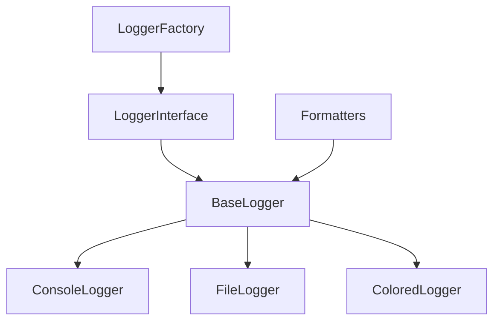

# Logger Komponens Architektúra

## Áttekintés

A logger komponens egy rugalmas, többszintű naplózási rendszer, amely különböző formátumú és célú naplózást tesz lehetővé.

## Architektúrális diagram



## Komponens rétegek

### 1. Interfész réteg
- Naplózási műveletek
- Formázási beállítások
- Output kezelés

### 2. Implementációs réteg
- Console logging
- File logging
- Színes output

### 3. Formatter réteg
- Üzenet formázás
- Szint jelölés
- Időbélyeg kezelés

## Függőségek kezelése

### Külső függőségek
- colorama: színes konzol kimenet
- yaml: konfiguráció betöltés

### Belső függőségek
- Config komponens: beállítások
- Base komponens: factory pattern

## Fejlesztési irányelvek

### 1. Naplózási szintek
- DEBUG
- INFO
- WARNING
- ERROR
- CRITICAL

### 2. Formázás
```python
"{timestamp} [{level}] {message}"
```

### 3. Rotáció
- Méret alapú
- Idő alapú
- Tömörítés

## Bővítési lehetőségek

1. Network logging
2. Strukturált naplózás
3. Log aggregáció
4. Metrika gyűjtés
