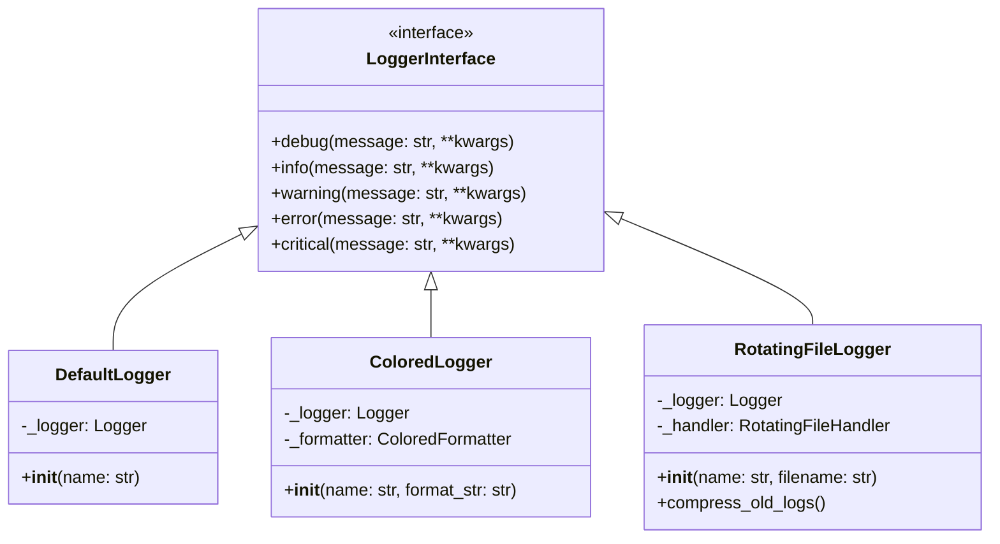

# Logger Komponens Specifikáció

## Áttekintés

A Logger komponens a Neural-AI-Next rendszer egyik alapvető infrastruktúra eleme, amely felelős a rendszer működése során keletkező események, információk és hibák strukturált rögzítéséért. A cél egy egységes, konfigurálható és kiterjeszthető naplózási mechanizmus biztosítása, amely támogatja a fejlesztést, hibaelhárítást és a rendszer működésének monitorozását.

## Fő funkciók

- Különböző részletességi szintű naplózás támogatása (DEBUG, INFO, WARNING, ERROR, CRITICAL)
- Többféle kimeneti formátum és cél támogatása (konzol, fájl, hálózat)
- Strukturált naplózás extra kontextus információkkal
- Hierarchikus logger struktúra (modul/almodul szintű logolás)
- Konfigurálható formátumok és szűrők
- Teljesítményoptimalizált működés

## Architektúra

A Logger komponens az alábbi fő részekből áll:

1. **LoggerInterface**: Az alapvető naplózási funkcionalitást definiáló interfész
2. **LoggerFactoryInterface**: Logger példányok létrehozásáért felelős interfész
3. **Implementációk**:
   - DefaultLogger: Python stdlib logging alapú alap implementáció
   - FileLogger: Fájl alapú naplózás
   - ConsoleLogger: Konzol kimenet
   - NetworkLogger: Távoli naplózás
4. **LoggerFactory**: Különböző logger implementációk példányosítása

## Interfészek

### LoggerInterface

```python
class LoggerInterface(ABC):
    @abstractmethod
    def debug(self, message: str, **kwargs) -> None:
        """Debug szintű üzenet logolása."""
        pass

    @abstractmethod
    def info(self, message: str, **kwargs) -> None:
        """Információs szintű üzenet logolása."""
        pass

    @abstractmethod
    def warning(self, message: str, **kwargs) -> None:
        """Figyelmeztetés szintű üzenet logolása."""
        pass

    @abstractmethod
    def error(self, message: str, **kwargs) -> None:
        """Hiba szintű üzenet logolása."""
        pass

    @abstractmethod
    def critical(self, message: str, **kwargs) -> None:
        """Kritikus hiba szintű üzenet logolása."""
        pass
```

### LoggerFactoryInterface

```python
class LoggerFactoryInterface(ABC):
    @staticmethod
    @abstractmethod
    def get_logger(name: str, config: Optional[Dict[str, Any]] = None) -> LoggerInterface:
        """Logger példány létrehozása vagy meglévő visszaadása."""
        pass

    @staticmethod
    @abstractmethod
    def configure(config: Dict[str, Any]) -> None:
        """Globális logger konfiguráció beállítása."""
        pass
```
## Használati esetek
1. Alkalmazás szintű naplózás:

- Rendszerindulás és leállás
- Komponensek inicializálása
- Állapotváltozások
2. Hibakövetés és debugging:

- Kivételek és hibák részletes rögzítése
- Diagnosztikai információk
3. Üzleti logika naplózása:

- Fontos esemény és adat változások
- Döntési pontok és eredmények
4. Teljesítménymérés:

- Műveletek időtartama
- Erőforrás-használat

## Konfiguráció

A Logger komponens konfigurálása a configs/logging.yaml fájlban történik:

```yaml
logger:
  default_level: INFO
  format: "%(asctime)s - %(name)s - %(levelname)s - %(message)s"
  date_format: "%Y-%m-%d %H:%M:%S"
  handlers:
    console:
      enabled: true
      level: INFO
    file:
      enabled: true
      level: DEBUG
      filename: "logs/app.log"
      max_size: 10485760  # 10MB
      backup_count: 5
    network:
      enabled: false
      level: WARNING
      host: "logserver.example.com"
      port: 9999
```
## Teljesítmény követelmények
- A naplózás nem befolyásolhatja jelentősen a rendszer teljesítményét
- A kritikus szakaszokban a naplózás aszinkron módon történik
- Nagy mennyiségű log esetén is hatékony működés
## Biztonsági szempontok
- Érzékeny adatok automatikus maszkolása
- Log rotáció és tisztítási szabályok
- Hozzáférés-szabályozás a log fájlokhoz
## Függőségek
- Python standard könyvtár (logging)
- ConfigManagerInterface a konfigurációhoz
# Logger Komponens - Technikai Specifikáció

## 1. Áttekintés

A Logger komponens egy moduláris, bővíthető naplózó rendszer, amely a SOLID elvek és a tiszta kód alapelvek mentén került kialakításra. A komponens támogatja a különböző kimeneti formátumokat és naplózási stratégiákat.

## 2. Tervezési Döntések

### 2.1. Architektúra

A komponens tiszta architektúrát követ:
- Interfészek definiálják a szerződéseket
- Konkrét implementációk elkülönítve
- Factory minta a példányosításhoz
- Dependency Injection támogatás

### 2.2. Választott Megoldások

#### Színes Kimenet
- ANSI escape kódok használata
- Könnyen bővíthető színsémák
- Platform-független megoldás

#### Fájl Rotáció
- Python beépített handlers használata
- Hatékony fájlkezelés
- Atomi műveletek a biztonságos rotációhoz

### 2.3. Alternatívák és Kompromisszumok

| Alternatíva | Előnyök | Hátrányok | Döntés |
|-------------|---------|-----------|---------|
| Külső logging lib | Több funkció | Függőség | Nem |
| Saját rotáció | Teljes kontroll | Komplexitás | Nem |
| JSON formátum | Strukturált | Nehezebb olvasni | Opcionális |

## 3. Komponens Felépítése

### 3.1. Osztálydiagram



### 3.2. Komponensek Részletezése

#### LoggerInterface
- Absztrakt interfész
- Definiálja az alap műveleteket
- Típusbiztos metódusok

#### DefaultLogger
- Egyszerű implementáció
- Standard logging használata
- Minimális overhead

#### ColoredLogger
- ANSI színkódok kezelése
- Színes formatter használata
- Stream alapú kimenet

#### RotatingFileLogger
- Fájl kezelés
- Rotációs stratégiák
- Tömörítési funkciók

## 4. Implementációs Részletek

### 4.1. Színkezelés

```python
COLORS = {
    'DEBUG': '\033[94m',     # Kék
    'INFO': '\033[92m',      # Zöld
    'WARNING': '\033[93m',   # Sárga
    'ERROR': '\033[91m',     # Piros
    'CRITICAL': '\033[97;41m' # Fehér piros háttéren
}
```

### 4.2. Rotációs Logika

```python
if rotation_type == "time":
    handler = TimedRotatingFileHandler(
        filename=filename,
        when=when,
        backupCount=backup_count
    )
else:
    handler = RotatingFileHandler(
        filename=filename,
        maxBytes=max_bytes,
        backupCount=backup_count
    )
```

### 4.3. Tömörítés

```python
def compress_old_logs(directory: str) -> None:
    for log_file in glob.glob("*.log.*"):
        with open(log_file, "rb") as f_in:
            with gzip.open(f"{log_file}.gz", "wb") as f_out:
                f_out.writelines(f_in)
```

## 5. Teljesítmény Megfontolások

### 5.1. Erőforrás Használat

- Memória: ~10-20MB alapértelmezett konfiguráció esetén
- CPU: Elhanyagolható terhelés
- I/O: Buffered írás használata

### 5.2. Skálázhatóság

- Több száz log/másodperc kezelése
- Automatikus erőforrás felszabadítás
- Thread-safe működés

### 5.3. Optimalizációk

- Lazy loading formatters
- Cached színkódok
- Batch írási műveletek

## 6. Biztonsági Megfontolások

### 6.1. Fájl Műveletek

- Biztonságos fájl jogosultságok
- Atomi írási műveletek
- Path traversal védelem

### 6.2. Adatvédelem

- Szenzitív adatok maszkolása
- Biztonságos kivételkezelés
- Audit log támogatás

## 7. Tesztelés

### 7.1. Teszttípusok

- Unit tesztek: ~95% lefedettség
- Integrációs tesztek: Fájlrendszer műveletek
- Teljesítmény tesztek: Nagy mennyiségű log

### 7.2. Tesztelési Stratégia

- Mock objektumok használata
- Temporary fájlrendszer
- Paraméteres tesztek

## 8. Karbantarthatóság

### 8.1. Kód Minőség

- Statikus kódelemzés használata
- Dokumentált API
- Típusannotációk

### 8.2. Bővíthetőség

- Új logger típusok hozzáadása
- Formázók testreszabása
- Handler kiterjesztés

## 9. Függőségek

### 9.1. Belső Függőségek

- Python standard library
- Neural AI Core framework

### 9.2. Külső Függőségek

- Nincsenek kötelező külső függőségek
- Opcionális: colorama (Windows)
