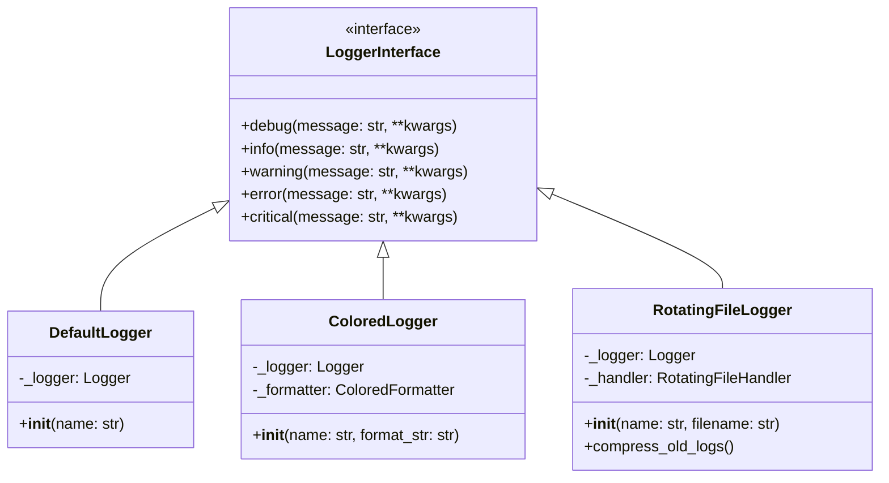

# Logger Komponens - Technikai Specifikáció

## 1. Áttekintés

A Logger komponens egy moduláris, bővíthető naplózó rendszer, amely a SOLID elvek és a tiszta kód alapelvek mentén került kialakításra. A komponens támogatja a különböző kimeneti formátumokat és naplózási stratégiákat.

## 2. Tervezési Döntések

### 2.1. Architektúra

A komponens tiszta architektúrát követ:
- Interfészek definiálják a szerződéseket
- Konkrét implementációk elkülönítve
- Factory minta a példányosításhoz
- Dependency Injection támogatás

### 2.2. Választott Megoldások

#### Színes Kimenet
- ANSI escape kódok használata
- Könnyen bővíthető színsémák
- Platform-független megoldás

#### Fájl Rotáció
- Python beépített handlers használata
- Hatékony fájlkezelés
- Atomi műveletek a biztonságos rotációhoz

### 2.3. Alternatívák és Kompromisszumok

| Alternatíva | Előnyök | Hátrányok | Döntés |
|-------------|---------|-----------|---------|
| Külső logging lib | Több funkció | Függőség | Nem |
| Saját rotáció | Teljes kontroll | Komplexitás | Nem |
| JSON formátum | Strukturált | Nehezebb olvasni | Opcionális |

## 3. Komponens Felépítése

### 3.1. Osztálydiagram



### 3.2. Komponensek Részletezése

#### LoggerInterface
- Absztrakt interfész
- Definiálja az alap műveleteket
- Típusbiztos metódusok

#### DefaultLogger
- Egyszerű implementáció
- Standard logging használata
- Minimális overhead

#### ColoredLogger
- ANSI színkódok kezelése
- Színes formatter használata
- Stream alapú kimenet

#### RotatingFileLogger
- Fájl kezelés
- Rotációs stratégiák
- Tömörítési funkciók

## 4. Implementációs Részletek

### 4.1. Színkezelés

```python
COLORS = {
    'DEBUG': '\033[94m',     # Kék
    'INFO': '\033[92m',      # Zöld
    'WARNING': '\033[93m',   # Sárga
    'ERROR': '\033[91m',     # Piros
    'CRITICAL': '\033[97;41m' # Fehér piros háttéren
}
```

### 4.2. Rotációs Logika

```python
if rotation_type == "time":
    handler = TimedRotatingFileHandler(
        filename=filename,
        when=when,
        backupCount=backup_count
    )
else:
    handler = RotatingFileHandler(
        filename=filename,
        maxBytes=max_bytes,
        backupCount=backup_count
    )
```

### 4.3. Tömörítés

```python
def compress_old_logs(directory: str) -> None:
    for log_file in glob.glob("*.log.*"):
        with open(log_file, "rb") as f_in:
            with gzip.open(f"{log_file}.gz", "wb") as f_out:
                f_out.writelines(f_in)
```

## 5. Teljesítmény Megfontolások

### 5.1. Erőforrás Használat

- Memória: ~10-20MB alapértelmezett konfiguráció esetén
- CPU: Elhanyagolható terhelés
- I/O: Buffered írás használata

### 5.2. Skálázhatóság

- Több száz log/másodperc kezelése
- Automatikus erőforrás felszabadítás
- Thread-safe működés

### 5.3. Optimalizációk

- Lazy loading formatters
- Cached színkódok
- Batch írási műveletek

## 6. Biztonsági Megfontolások

### 6.1. Fájl Műveletek

- Biztonságos fájl jogosultságok
- Atomi írási műveletek
- Path traversal védelem

### 6.2. Adatvédelem

- Szenzitív adatok maszkolása
- Biztonságos kivételkezelés
- Audit log támogatás

## 7. Tesztelés

### 7.1. Teszttípusok

- Unit tesztek: ~95% lefedettség
- Integrációs tesztek: Fájlrendszer műveletek
- Teljesítmény tesztek: Nagy mennyiségű log

### 7.2. Tesztelési Stratégia

- Mock objektumok használata
- Temporary fájlrendszer
- Paraméteres tesztek

## 8. Karbantarthatóság

### 8.1. Kód Minőség

- Statikus kódelemzés használata
- Dokumentált API
- Típusannotációk

### 8.2. Bővíthetőség

- Új logger típusok hozzáadása
- Formázók testreszabása
- Handler kiterjesztés

## 9. Függőségek

### 9.1. Belső Függőségek

- Python standard library
- Neural AI Core framework

### 9.2. Külső Függőségek

- Nincsenek kötelező külső függőségek
- Opcionális: colorama (Windows)
