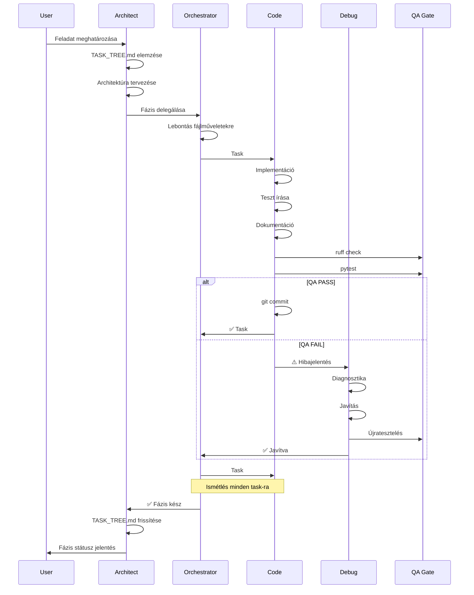

# 🏛️ Hierarchikus Agent Rendszer - Neural AI Next

**Verzió:** 1.0 | **Státusz:** ✅ AKTÍV | **Dátum:** 2026-02-04

---

## 📋 Áttekintés

A Neural AI Next projekt hierarchikus AI ágensrendszert használ a komplex fejlesztési feladatok kezelésére. Ez a rendszer biztosítja, hogy:
- Az architektúra konzisztens maradjon
- A kód minőség garantált legyen
- A felelősségi körök egyértelműek legyenek
- A feladatok nyomon követhetők legyenek

---

## 🎯 Hierarchikus Struktúra

```
┌─────────────────────────────────────────────────────────┐
│                   1. ARCHITECT                          │
│              (Stratégia & Tervezés)                     │
│  • Elemzi a feladatot                                   │
│  • Tervez (fázisok, modulok, fájlok)                    │
│  • TASK_TREE.md vezetése                                │
│  • NEM ír kódot!                                        │
└────────────────────┬────────────────────────────────────┘
                     │
                     │ Delegálja a tervet
                     ▼
┌─────────────────────────────────────────────────────────┐
│                  2. ORCHESTRATOR                        │
│            (Feladat Lebontás & Delegálás)               │
│  • Lebontja a tervet fájlműveletekre                    │
│  • Szigorú specifikáció készítése                       │
│  • Delegál a Code Agent-nek                             │
│  • QA Gate követelések meghatározása                    │
│  • NEM ír kódot!                                        │
└────────────────────┬────────────────────────────────────┘
                     │
                     │ Task-onként delegál
                     ▼
┌─────────────────────────────────────────────────────────┐
│                    3. CODE AGENT                        │
│                  (Implementáció)                        │
│  • Kód írása az Orchestrator utasításai alapján         │
│  • Tesztek írása (Mirror struktúra)                     │
│  • Mirror dokumentáció létrehozása                      │
│  • QA Gate futtatása (ruff + pytest)                   │
│  • Atomic commit                                        │
└────────────────────┬────────────────────────────────────┘
                     │
                     │ HA QA Gate FAIL
                     ▼
┌─────────────────────────────────────────────────────────┐
│                   4. DEBUG AGENT                        │
│                 (Hibajavítás)                           │
│  • Diagnosztika (hiba elemzése)                         │
│  • Root cause azonosítása                               │
│  • Javítás (Code Agent szabályai szerint)               │
│  • QA Gate újrafuttatása                                │
│  • Ciklus amíg PASS                                     │
└─────────────────────────────────────────────────────────┘

┌─────────────────────────────────────────────────────────┐
│                    5. ASK AGENT                         │
│            (Információszolgáltatás)                     │
│  • Read-only dokumentáció keresés                       │
│  • Gyors információszerzés                              │
│  • Forráshivatkozások                                   │
│  • Bármelyik agent használhatja párhuzamosan            │
└─────────────────────────────────────────────────────────┘
```

---

## 🔄 Munkafolyamat Diagram



---

## 📜 Felelősségi Mátrix

| Agent | Tervezés | Kód Írás | Tesztelés | Dokumentálás | Commit | Delegálás |
|:------|:--------:|:--------:|:---------:|:------------:|:------:|:---------:|
| **Architect** | ✅ | ❌ | ❌ | TASK_TREE | ❌ | ✅→Orchestrator |
| **Orchestrator** | ❌ | ❌ | ❌ | ❌ | ❌ | ✅→Code/Debug |
| **Code** | ❌ | ✅ | ✅ | ✅ | ✅ | ❌ |
| **Debug** | ❌ | Javítás | ✅ | Frissítés | ✅ | ❌ |
| **Ask** | ❌ | ❌ | ❌ | ❌ | ❌ | ❌ |

---

## 🛑 Kritikus Szabályok

### 1. Eszközhasználati Korlátozások

| Agent | `write_to_file` | `apply_diff` | `read_file` | `execute_command` |
|:------|:---------------:|:------------:|:-----------:|:-----------------:|
| **Architect** | ❌ | ❌ | ✅ | Csak info (ls, find) |
| **Orchestrator** | ❌ | ❌ | ✅ | ❌ |
| **Code** | ✅ | ✅ | ✅ | ✅ (build, test, git) |
| **Debug** | ✅ | ✅ | ✅ | ✅ (test, ruff, git) |
| **Ask** | ❌ | ❌ | ✅ | ❌ |

### 2. Delegálási Protokoll

**Architect → Orchestrator:**
```
Orchestrator! Implementáld a Phase X.Y-t.

Modulok:
1. neural_ai/module/xyz/processor.py
2. neural_ai/module/xyz/factory.py
3. tests/module/xyz/test_processor.py

Követelmények:
- Réteg: Domain
- Függőségek: core.logger, data.storage
- DI pattern használata

Részletek: lásd TASK_TREE.md:123-145
```

**Orchestrator → Code:**
```
Code Agent! A feladat a neural_ai/module/xyz/processor.py létrehozása.

1. Architektúra:
   - Réteg: Domain
   - Importálhat: data, core (NEM ui)
   - DI: logger, config konstruktorban
   - TYPE_CHECKING körkörös importokhoz

2. Kódminőség:
   - Magyar docstringek (Google Style)
   - TypedDict a config-hoz
   - Strukturált logolás extra dict-tel
   - Polars DataFrame (NEM pandas)

3. Tesztelés:
   - Mirror struktúra: tests/module/xyz/test_processor.py
   - 100% coverage cél
   - QA Gate: ruff + pytest

4. Lezárás:
   - Mirror docs: docs/components/module/xyz/processor.md
   - Atomic commit: feat(xyz): Magyar üzenet
```

**Code/Orchestrator → Debug:**
```
Debug Agent! A tests/module/xyz/test_processor.py megbukott.

Hiba:
```
[pytest output]
```

QA követelmény: 100% PASS + 0 ruff hiba

Javítsd és commitold.
```

### 3. Quality Gate Követelmények

**MINDEN commit előtt kötelező:**
- [ ] `/home/elynea/miniconda3/envs/neural-ai-next/bin/ruff check .` → 0 hiba
- [ ] `/home/elynea/miniconda3/envs/neural-ai-next/bin/pytest` → Minden teszt PASS
- [ ] Mirror dokumentáció létezik (`docs/components/`)
- [ ] TypedDict használva factory-kban
- [ ] Strukturált logolás (extra dict)
- [ ] Magyar docstringek
- [ ] Réteg függőségek helyesek

**HA BÁRMI FAIL:** Debug Agent hívása, **NEM** a Code Agent javítja!

---

## 📊 TASK_TREE.md Integráció

Az Architect felelős a `docs/development/TASK_TREE.md` naprakészen tartásáért:

```markdown
## 🗂️ PHASE [X.Y]: [MODUL NÉV]

### 🏗️ MODULE: [modul/path]

| File Path | Matrix [S|T|D] | Stmt Cov | Brch Cov | Status |
|-----------|:--------------:|:---------|:---------|:------:|
| `processor.py` | [🟢|✅|✅] | 95% | 90% | ✅ DONE |
| `factory.py` | [🟡|✅|❌] | 80% | 75% | 🟡 WIP |
| `test_processor.py` | [🔴|❌|❌] | 0% | 0% | 🔴 PENDING |
```

**Színkódok:**
- 🔴 CRITICAL/PENDING: 0-49% Coverage
- 🟡 WIP: 50-79% Coverage
- 🟢 STABLE: 80-99% Coverage
- ✅ PERFECT: 100% Coverage

---

## 🔍 Példa Munkafolyamat

### Feladat: D03 Trend Processor Implementálása

#### 1. Architect (Tervezés)
```
[Architect olvassa a TASK_TREE.md-t]
[Elemzi: Phase 2.3, Module: processors/dimensions/d03_trend]

Tervezés:
- interfaces/trend_interface.py
- implementations/trend_processor.py
- factory.py
- exceptions/trend_error.py
- tests/processors/dimensions/d03_trend/test_processor.py

Delegálás Orchestrator-nak →
```

#### 2. Orchestrator (Delegálás)
```
Orchestrator lebontja 5 task-ra:

Task 1: interfaces/trend_interface.py
Task 2: exceptions/trend_error.py
Task 3: implementations/trend_processor.py
Task 4: factory.py
Task 5: tests/.../test_processor.py

Mindegyikhez szigorú specifikáció →
```

#### 3. Code Agent (Implementáció)
```
Task 1 fogadása:
- Létrehozza interfaces/trend_interface.py
- ABC interface, magyar docstring
- QA Gate: ruff ✅, pytest ✅
- Commit: feat(d03): trend interface létrehozva
- Jelentés: ✅ Task 1 kész

[Ismétlés Task 2-5-re]
```

#### 4. Debug Agent (Javítás - ha szükséges)
```
Task 3-nál pytest FAIL:
- Diagnosztika: import hiba (körkörös)
- Javítás: TYPE_CHECKING blokk hozzáadása
- QA Gate: ruff ✅, pytest ✅
- Commit: fix(d03): körkörös import javítva
- Jelentés: ✅ Javítva
```

#### 5. Architect (Követés)
```
[TASK_TREE.md frissítése]
processors/dimensions/d03_trend/
- interfaces/trend_interface.py → ✅ DONE
- implementations/trend_processor.py → ✅ DONE
- factory.py → ✅ DONE
- tests/.../test_processor.py → ✅ DONE

Phase 2.3: D03 Trend → ✅ COMPLETE
```

---

## 🚨 Anti-Patterns (TILOS!)

### ❌ ROSSZ: Architect kódol
```
Architect: "Létrehozom a processor.py-t..."
[write_to_file használata]
```
**HIBA:** Az Architect NEM ír kódot! Csak delegál.

### ❌ ROSSZ: Orchestrator implementál
```
Orchestrator: "Megírom a factory-t..."
[write_to_file használata]
```
**HIBA:** Az Orchestrator NEM ír kódot! Csak delegál a Code Agent-nek.

### ❌ ROSSZ: Code Agent önállóan dönt
```
Code Agent: "Szerintem Pandas-t használok itt..."
```
**HIBA:** Az Architect határozta meg (Polars). Code Agent csak követi az utasítást.

### ❌ ROSSZ: Code Agent javítja saját hibáit
```
Code Agent: "Pytest bukott, javítom..."
```
**HIBA:** Debug Agent-et kell hívni! Code Agent jelentést ad, nem javít.

### ✅ HELYES Munkafolyamat
```
Architect → Orchestrator: "Implementáld a Phase 2.3-at"
Orchestrator → Code: "Hozd létre interfaces/trend_interface.py [részletes spec]"
Code: [Implementál, QA Gate] → ✅ vagy ⚠️
Ha ⚠️ → Debug Agent: [Javít, QA Gate] → ✅
Code → Orchestrator: "✅ Task kész"
Orchestrator → Architect: "✅ Phase kész"
Architect: [TASK_TREE.md frissítése]
```

---

## 📚 Kapcsolódó Dokumentumok

- **Architektúra Szabvány:** `docs/development/architecture_standards.md`
- **Custom Instructions:** `docs/development/custom-instructions.md`
- **TASK_TREE:** `docs/development/TASK_TREE.md`
- **Agent Szabályok:**
  - `AGENTS.md` (Root - Hierarchia)
  - `.roo/rules-architect/AGENTS.md`
  - `.roo/rules-orchestrator/AGENTS.md`
  - `.roo/rules-code/AGENTS.md`
  - `.roo/rules-debug/AGENTS.md`
  - `.roo/rules-ask/AGENTS.md`

---

**Ez a hierarchikus rendszer garantálja a kód minőségét, az architektúra konzisztenciáját és a feladatok követhetőségét.**
