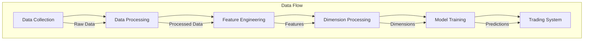

# Neural-AI Implementációs Stratégia

## 1. Komponens Függőségi Hierarchia



## 2. Implementációs Sorrend

### 2.1 Első Fázis - Alaprendszer (Befejezve ✅)

1. **Data Collection System**
   - ✅ neural_ai/collectors/mt5/ - MT5 adatgyűjtő implementálva
   - ✅ neural_ai/core/ - Alap komponensek implementálva

2. **Base Processor**
   - 🔴 neural_ai/processors/ - Feldolgozók implementálása szükséges

### 2.2 Második Fázis - Dimenziók (Folyamatban 🚧)

1. **D1-D5 (Alap dimenziók)**
   - 🔴 neural_ai/processors/dimensions/d1_price.py      # Price Action
   - 🔴 neural_ai/processors/dimensions/d2_structure.py   # S/R Levels
   - 🔴 neural_ai/processors/dimensions/d3_trend.py      # Trend
   - 🔴 neural_ai/processors/dimensions/d4_ma.py         # Moving Averages
   - 🔴 neural_ai/processors/dimensions/d5_momentum.py    # Momentum

2. **D6-D10 (Közép dimenziók)**
   - 🔴 neural_ai/processors/dimensions/d6_fibonacci.py
   - 🔴 neural_ai/processors/dimensions/d7_candlestick.py
   - 🔴 neural_ai/processors/dimensions/d8_patterns.py
   - 🔴 neural_ai/processors/dimensions/d9_volume.py
   - 🔴 neural_ai/processors/dimensions/d10_volatility.py

3. **D11-D15 (Felső dimenziók)**
   - 🔴 neural_ai/processors/dimensions/d11_context.py
   - 🔴 neural_ai/processors/dimensions/d12_orderflow.py
   - 🔴 neural_ai/processors/dimensions/d13_divergence.py
   - 🔴 neural_ai/processors/dimensions/d14_breakout.py
   - 🔴 neural_ai/processors/dimensions/d15_risk.py

### 2.3 Harmadik Fázis - Model Architektúrák (Tervezés alatt 📋)

1. **Base Models**
   - 🔴 neural_ai/models/base_model.py
   - 🔴 neural_ai/models/layers/l1_base.py

2. **Specialized Models**
   - 🔴 neural_ai/models/architectures/wavenet_icm.py
   - 🔴 neural_ai/models/architectures/dual_head_gru.py
   - 🔴 neural_ai/models/architectures/quantum_lstm.py

### 2.4 Negyedik Fázis - Training System (Tervezés alatt 📋)

1. **Training Pipeline**
   - 🔴 neural_ai/trainers/base_trainer.py
   - 🔴 neural_ai/trainers/lightning/data.py
   - 🔴 neural_ai/trainers/lightning/models.py

2. **Validation System**
   - 🔴 neural_ai/validation/backtest.py
   - 🔴 neural_ai/validation/performance.py
   - 🔴 neural_ai/validation/risk.py

## 3. Technikai Specifikációk

### 3.1 Dimenzió Processzorok

Minden dimenzió processzor követi a következő mintát:

```python
from neural_ai.core.base.interfaces import ProcessorInterface
from neural_ai.core.logger import LoggerFactory

class DimensionProcessor(ProcessorInterface):
    """
    [Dimenzió név] feldolgozó komponens.
    """

    def __init__(self, config: Dict[str, Any], logger=None):
        self.config = config
        self.logger = logger or LoggerFactory.get_logger(__name__)

    def process(self, data: pd.DataFrame) -> Dict[str, Any]:
        """
        [Dimenzió] feldolgozás implementációja.

        Args:
            data: OHLCV adatok pandas DataFrame-ben

        Returns:
            Feldolgozott dimenzió adatok
        """
        pass
```

### 3.2 Tesztelési Stratégia

```python
# Minden komponenshez:
tests/
├── processors/
│   ├── test_base_processor.py
│   └── dimensions/
│       ├── test_d1_price.py
│       └── ...
├── models/
│   └── architectures/
│       ├── test_wavenet.py
│       └── ...
└── trainers/
    └── test_training.py
```

### 3.3 Integration Tests

```python
tests/integration/
├── test_data_pipeline.py
├── test_model_training.py
└── test_trading_system.py
```

## 4. Deployment Pipeline

### 4.1 Development
```bash
# Fejlesztési környezet setup
conda activate neural-ai-next
export PYTHONPATH=/home/elynea/miniconda3/envs/neural-ai-next/bin/python
```

### 4.2 Testing
```bash
# Test futtatás
pytest tests/ -v
```

### 4.3 Production
```python
# Production deployment check
SYSTEM_CHECKS = {
    'data_collection': check_mt5_connection(),
    'processing': validate_processors(),
    'models': validate_model_loading(),
    'performance': check_system_metrics()
}
```

## 5. Monitoring és Maintenance

### 5.1 Monitoring Setup
```python
# Monitoring metrics
METRICS = {
    'system_health': ['cpu', 'memory', 'gpu'],
    'model_performance': ['accuracy', 'latency'],
    'trading_performance': ['pnl', 'drawdown']
}
```

### 5.2 Maintenance Tasks
```python
# Regular maintenance
MAINTENANCE = {
    'daily': ['backup_data', 'check_logs'],
    'weekly': ['retrain_models', 'update_stats'],
    'monthly': ['system_optimization', 'strategy_review']
}
```

## 6. Következő Lépések

### Rövid távú célok (1-2 hét)
1. D1-D5 dimenzió processzorok implementálása
2. Alap tesztelési keretrendszer létrehozása
3. Dokumentáció frissítése

### Közép távú célok (1 hónap)
1. D6-D15 dimenzió processzorok implementálása
2. Model architektúrák fejlesztése
3. Integrációs tesztek írása

### Hosszú távú célok (2-3 hónap)
1. Training pipeline implementálása
2. Validation system fejlesztése
3. Teljes rendszer integráció és tesztelés
