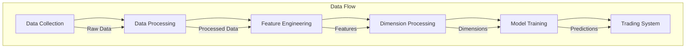

# Neural-AI Implementációs Útmutató

## 1. Komponens Függőségek



## 2. Implementációs Sorrend

### 2.1 Első Fázis - Alaprendszer
1. Data Collection System
   ```python

   - src/collectors/mt5_collector.py
   - src/collectors/utils/*
   ```

2. Base Processor
   ```python

   - src/processors/base_processor.py
   - src/processors/feature_engineering/*
   ```

### 2.2 Második Fázis - Dimenziók
1. D1-D5 (Alap dimenziók)
   ```python

   - src/processors/dimensions/d1_price.py      # Price Action
   - src/processors/dimensions/d2_structure.py   # S/R Levels
   - src/processors/dimensions/d3_trend.py      # Trend
   - src/processors/dimensions/d4_ma.py         # Moving Averages
   - src/processors/dimensions/d5_momentum.py    # Momentum
   ```

2. D6-D10 (Közép dimenziók)
   ```python
   - src/processors/dimensions/d6_fibonacci.py
   - src/processors/dimensions/d7_candlestick.py
   - src/processors/dimensions/d8_patterns.py
   - src/processors/dimensions/d9_volume.py
   - src/processors/dimensions/d10_volatility.py
   ```

3. D11-D15 (Felső dimenziók)
   ```python
   - src/processors/dimensions/d11_context.py
   - src/processors/dimensions/d12_orderflow.py
   - src/processors/dimensions/d13_divergence.py
   - src/processors/dimensions/d14_breakout.py
   - src/processors/dimensions/d15_risk.py
   ```

### 2.3 Harmadik Fázis - Model Architektúrák
1. Base Models
   ```python
   - src/models/base_model.py
   - src/models/layers/l1_base.py
   ```

2. Specialized Models
   ```python
   - src/models/architectures/wavenet_icm.py
   - src/models/architectures/dual_head_gru.py
   - src/models/architectures/quantum_lstm.py
   ```

### 2.4 Negyedik Fázis - Training System
1. Training Pipeline
   ```python
   # Új fájlok:
   - src/trainers/base_trainer.py
   - src/trainers/lightning/data.py
   - src/trainers/lightning/models.py
   ```

2. Validation System
   ```python
   # Új fájlok:
   - src/validation/backtest.py
   - src/validation/performance.py
   - src/validation/risk.py
   ```

## 3. Tesztelési Stratégia

### 3.1 Unit Tests
```python
# Minden komponenshez:
tests/
├── collectors/
│   └── test_mt5_collector.py    # Már implementált
├── processors/
│   ├── test_base_processor.py   # Következő
│   └── dimensions/
│       ├── test_d1_price.py     # Következő
│       └── ...
├── models/
│   └── architectures/
│       ├── test_wavenet.py
│       └── ...
└── trainers/
    └── test_training.py
```

### 3.2 Integration Tests
```python
tests/integration/
├── test_data_pipeline.py
├── test_model_training.py
└── test_trading_system.py
```

## 4. Deployment Pipeline

### 4.1 Development
```bash
# Fejlesztési környezet setup
python -m venv venv
source venv/bin/activate
pip install -r requirements.txt
```

### 4.2 Testing
```python
# Test futtatás
pytest tests/ -v
```

### 4.3 Production
```python
# Production deployment check
SYSTEM_CHECKS = {
    'data_collection': check_mt5_connection(),
    'processing': validate_processors(),
    'models': validate_model_loading(),
    'performance': check_system_metrics()
}
```

## 5. Monitoring és Maintenance

### 5.1 Monitoring Setup
```python
# Monitoring metrics
METRICS = {
    'system_health': ['cpu', 'memory', 'gpu'],
    'model_performance': ['accuracy', 'latency'],
    'trading_performance': ['pnl', 'drawdown']
}
```

### 5.2 Maintenance Tasks
```python
# Regular maintenance
MAINTENANCE = {
    'daily': ['backup_data', 'check_logs'],
    'weekly': ['retrain_models', 'update_stats'],
    'monthly': ['system_optimization', 'strategy_review']
}
```
