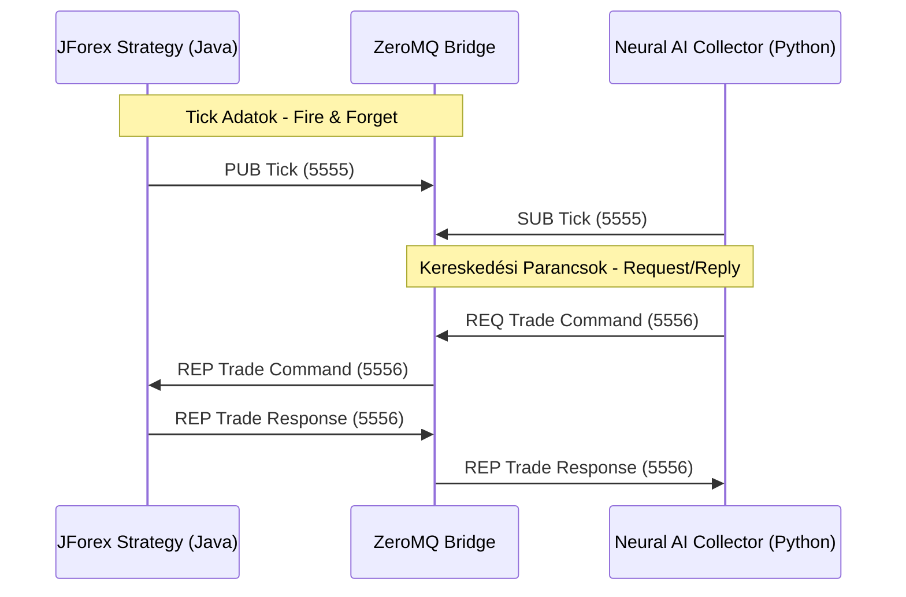
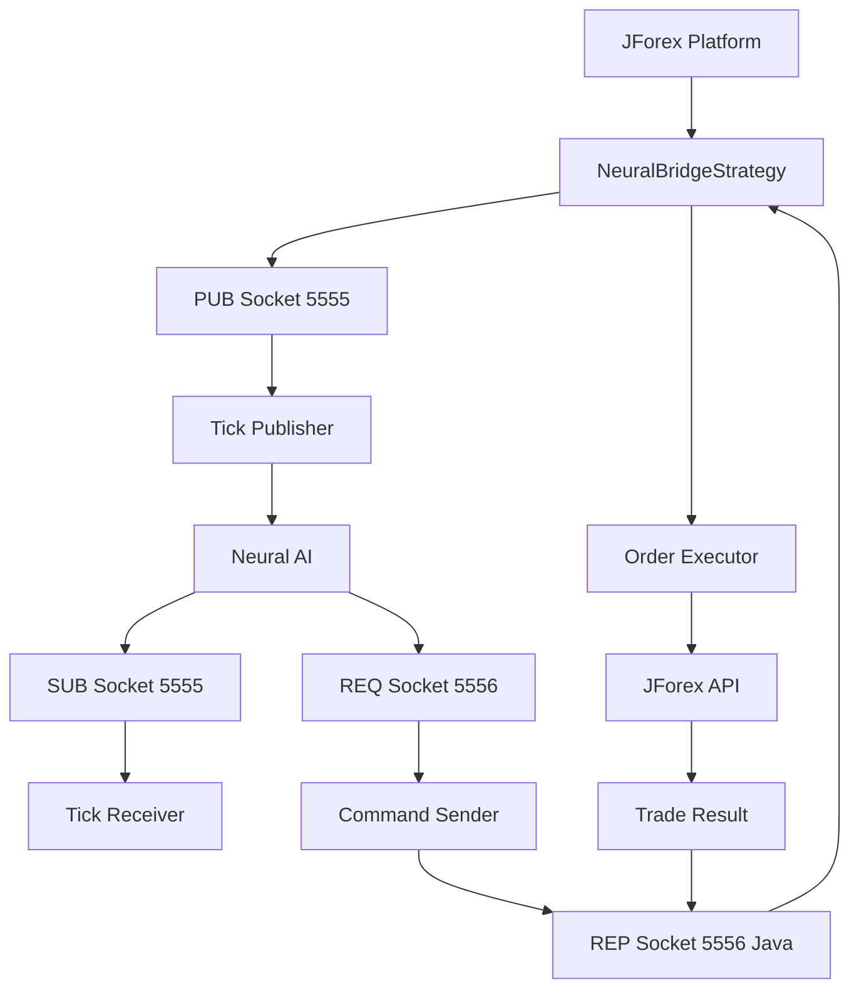

# Phase 2.2: JForex Live Bridge Implementáció Tervezése

## 🎯 Cél és Áttekintés

Ez a dokumentum a **JForex Live Bridge** részletes tervezési tervét tartalmazza, amely valós idejű, kétirányú kapcsolatot hoz létre a JForex (Java) és a Neural AI (Python) rendszerek között ZeroMQ segítségével. A Phase 2.1 JForex Collector sikeres implementációja után ez a következő kritikus lépés a valós idejű kereskedési képességek kiépítésében.

**Státusz:** `🔴 TERVELÉS ALATT`  
**Komplexitás:** `⭐⭐⭐⭐⭐`  
**Token Becslés:** `~200k`  
**Határidő:** Phase 2.1 után azonnali megkezdés

---

## 📋 Tartalomjegyzék

1. [Architektúra](#1-architektúra)
2. [Kommunikációs Protokoll](#2-kommunikációs-protokoll)
3. [Java Oldali Specifikáció](#3-java-oldali-specifikáció)
4. [Python Oldali Specifikáció](#4-python-oldali-specifikáció)
5. [Task Tree Frissítés](#5-task-tree-frissítés)
6. [Implementációs Lépések](#6-implementációs-lépések)
7. [Függőségek és Konfiguráció](#7-függőségek-és-konfiguráció)

---

## 1. Architektúra

### 1.1 ZeroMQ Bridge Koncepció

A Live Bridge két független ZeroMQ socket párt használ:

- **Tick Adatok (PUB/SUB):** JForex publikálja a valós idejű Tick adatokat, Neural AI feliratkozik rájuk
- **Kereskedési Parancsok (REQ/REP):** Neural AI küld kereskedési parancsokat, JForex válaszol



### 1.2 Socket Konfiguráció

| Socket Típus | Port | Irány | Leírás |
|-------------|------|-------|---------|
| PUB (Java) | 5555 | JForex → Neural AI | Tick adatok publikálása |
| SUB (Python) | 5555 | Neural AI ← JForex | Tick adatok fogadása |
| REP (Java) | 5556 | JForex ↔ Neural AI | Kereskedési parancsok kezelése |
| REQ (Python) | 5556 | Neural AI → JForex | Kereskedési parancsok küldése |

### 1.3 Adatfolyam Diagram



---

## 2. Kommunikációs Protokoll

### 2.1 JSON Formátum Specifikáció

Minden üzenet **strict JSON schema**-t követ, UTF-8 kódolással.

#### Tick Üzenet

```json
{
  "type": "TICK",
  "symbol": "EUR/USD",
  "bid": 1.05234,
  "ask": 1.05256,
  "timestamp": 1700000000000,
  "source": "jforex"
}
```

#### Kereskedési Parancs

```json
{
  "action": "SUBMIT_ORDER",
  "symbol": "EUR/USD",
  "amount": 0.1,
  "side": "BUY",
  "order_type": "MARKET",
  "slippage": 2,
  "comment": "Neural AI Trade"
}
```

#### Válasz Üzenetek

**Sikeres kereskedés:**
```json
{
  "status": "OK",
  "order_id": "123456789",
  "symbol": "EUR/USD",
  "amount": 0.1,
  "side": "BUY",
  "price": 1.05234,
  "timestamp": 1700000000000
}
```

**Hiba válasz:**
```json
{
  "status": "ERROR",
  "error_code": "INSUFFICIENT_FUNDS",
  "message": "Not enough margin available",
  "timestamp": 1700000000000
}
```

### 2.2 Schema Validáció

Minden üzenet validálása JSON Schema segítségével:

```json
{
  "$schema": "http://json-schema.org/draft-07/schema#",
  "type": "object",
  "required": ["type"],
  "properties": {
    "type": {
      "enum": ["TICK", "SUBMIT_ORDER", "ORDER_STATUS", "CANCEL_ORDER"]
    }
  },
  "allOf": [
    {
      "if": { "properties": { "type": { "const": "TICK" } } },
      "then": {
        "required": ["symbol", "bid", "ask", "timestamp"],
        "properties": {
          "symbol": { "type": "string" },
          "bid": { "type": "number", "minimum": 0 },
          "ask": { "type": "number", "minimum": 0 },
          "timestamp": { "type": "integer" }
        }
      }
    }
  ]
}
```

---

## 3. Java Oldali Specifikáció

### 3.1 Függőségek

```gradle
dependencies {
    implementation 'org.zeromq:jeromq:0.5.3'
    implementation 'com.google.code.gson:gson:2.10.1'
    implementation 'org.json:json:20231013'
}
```

### 3.2 Osztály Szerkezet

```java
package com.neuralai.jforex.bridge;

import com.dukascopy.api.*;
import org.zeromq.ZMQ;
import com.google.gson.Gson;

@RequiresFullAccess
public class NeuralBridgeStrategy implements IStrategy {

    private ZMQ.Context context;
    private ZMQ.Socket tickPublisher;
    private ZMQ.Socket commandReceiver;

    private Gson gson;
    private IEngine engine;
    private IConsole console;

    // Konfiguráció
    private static final int TICK_PORT = 5555;
    private static final int COMMAND_PORT = 5556;
    private static final String BIND_ADDRESS = "tcp://*:";
}
```

### 3.3 Lifecycle Metódusok

#### onStart()

```java
@Override
public void onStart(IContext context) throws JFException {

    this.engine = context.getEngine();
    this.console = context.getConsole();
    this.gson = new Gson();

    // ZeroMQ kontextus inicializálása
    this.context = ZMQ.context(1);

    // Tick publisher socket (PUB)
    this.tickPublisher = context.socket(ZMQ.PUB);
    this.tickPublisher.bind(BIND_ADDRESS + TICK_PORT);

    // Command receiver socket (REP)
    this.commandReceiver = context.socket(ZMQ.REP);
    this.commandReceiver.bind(BIND_ADDRESS + COMMAND_PORT);

    console.getInfo().println("Neural Bridge started - Ports: " + TICK_PORT + ", " + COMMAND_PORT);

    // Command listener indítása külön szálban
    new Thread(this::commandListener).start();
}
```

#### onTick()

```java
@Override
public void onTick(Instrument instrument, ITick tick) throws JFException {

    // Csak EUR/USD tick-eket küldünk példaként
    if (!instrument.equals(Instrument.EURUSD)) {
        return;
    }

    // JSON üzenet összeállítása
    Map<String, Object> tickMessage = new HashMap<>();
    tickMessage.put("type", "TICK");
    tickMessage.put("symbol", instrument.name());
    tickMessage.put("bid", tick.getBid());
    tickMessage.put("ask", tick.getAsk());
    tickMessage.put("timestamp", tick.getTime());
    tickMessage.put("source", "jforex");

    String jsonMessage = gson.toJson(tickMessage);

    // Tick publikálása
    tickPublisher.send(jsonMessage.getBytes(ZMQ.CHARSET), 0);

    console.getInfo().println("Tick published: " + instrument + " " + tick.getBid());
}
```

#### commandListener()

```java
private void commandListener() {
    while (!Thread.currentThread().isInterrupted()) {
        try {
            // Parancs fogadása
            byte[] request = commandReceiver.recv(0);
            String jsonCommand = new String(request, ZMQ.CHARSET);

            console.getInfo().println("Command received: " + jsonCommand);

            // JSON parancs elemzése
            Map<String, Object> command = gson.fromJson(jsonCommand, Map.class);
            String action = (String) command.get("action");

            String response;

            if ("SUBMIT_ORDER".equals(action)) {
                response = handleSubmitOrder(command);
            } else {
                response = createErrorResponse("UNKNOWN_ACTION", "Unknown action: " + action);
            }

            // Válasz küldése
            commandReceiver.send(response.getBytes(ZMQ.CHARSET), 0);

        } catch (Exception e) {
            console.getError().println("Command processing error: " + e.getMessage());
            String errorResponse = createErrorResponse("PROCESSING_ERROR", e.getMessage());
            commandReceiver.send(errorResponse.getBytes(ZMQ.CHARSET), 0);
        }
    }
}
```

#### handleSubmitOrder()

```java
private String handleSubmitOrder(Map<String, Object> command) {
    try {
        String symbol = (String) command.get("symbol");
        Double amount = ((Number) command.get("amount")).doubleValue();
        String side = (String) command.get("side");

        Instrument instrument = Instrument.valueOf(symbol.replace("/", ""));
        OrderCommand orderCommand = "BUY".equals(side) ? OrderCommand.BUY : OrderCommand.SELL;

        // Order leadása
        IOrder order = engine.submitOrder(
            "NeuralAI_" + System.currentTimeMillis(),
            instrument,
            orderCommand,
            amount,
            0.0, // price (market order)
            2.0, // slippage
            0.0, // stop loss
            0.0, // take profit
            0,   // good till time
            "Neural AI Trade"
        );

        // Sikeres válasz
        Map<String, Object> response = new HashMap<>();
        response.put("status", "OK");
        response.put("order_id", order.getId());
        response.put("symbol", symbol);
        response.put("amount", amount);
        response.put("side", side);
        response.put("price", order.getOpenPrice());
        response.put("timestamp", System.currentTimeMillis());

        return gson.toJson(response);

    } catch (Exception e) {
        return createErrorResponse("ORDER_FAILED", e.getMessage());
    }
}
```

#### onStop()

```java
@Override
public void onStop() throws JFException {
    // Socket-ek lezárása
    if (tickPublisher != null) {
        tickPublisher.close();
    }
    if (commandReceiver != null) {
        commandReceiver.close();
    }
    if (context != null) {
        context.term();
    }

    console.getInfo().println("Neural Bridge stopped");
}
```

---

## 4. Python Oldali Specifikáció

### 4.1 Fájl Helye és Interface

**Fájl:** `neural_ai/collectors/jforex/implementations/live_feed.py`

A Live Feed implementálja a `CollectorInterface`-t vagy egy új `LiveProviderInterface`-t:

```python
from abc import ABC, abstractmethod
from typing import List, Dict, Any, Optional
from datetime import datetime
import asyncio
import zmq
import json
from dataclasses import dataclass

@dataclass
class LiveTickData:
    """Valós idejű Tick adat."""
    symbol: str
    bid: float
    ask: float
    timestamp: datetime
    source: str = "jforex_live"

@dataclass
class TradeCommand:
    """Kereskedési parancs."""
    action: str
    symbol: str
    amount: float
    side: str
    order_type: str = "MARKET"
    slippage: Optional[int] = None
    comment: Optional[str] = None

@dataclass
class TradeResponse:
    """Kereskedési válasz."""
    status: str
    order_id: Optional[str] = None
    error_code: Optional[str] = None
    message: Optional[str] = None
    timestamp: datetime

class LiveProviderInterface(ABC):
    """Live adat provider interface."""

    @abstractmethod
    async def start_feed(self) -> None:
        """Live feed indítása."""
        pass

    @abstractmethod
    async def stop_feed(self) -> None:
        """Live feed leállítása."""
        pass

    @abstractmethod
    async def execute_trade(self, command: TradeCommand) -> TradeResponse:
        """Kereskedési parancs végrehajtása."""
        pass

    @abstractmethod
    async def get_tick_stream(self) -> AsyncIterator[LiveTickData]:
        """Tick adatok stream-elése."""
        pass
```

### 4.2 Live Feed Implementáció

```python
import zmq.asyncio
from neural_ai.core.base.interfaces import ILogger, IConfig
from neural_ai.core.events.interfaces import IEventBus
from neural_ai.collectors.jforex.interfaces import LiveProviderInterface

class JForexLiveFeed(LiveProviderInterface):
    """JForex valós idejű adat feed ZeroMQ bridge-en keresztül."""

    TICK_PORT = 5555
    COMMAND_PORT = 5556

    def __init__(
        self,
        logger: ILogger,
        config: IConfig,
        event_bus: IEventBus
    ):
        self.logger = logger
        self.config = config
        self.event_bus = event_bus

        # ZeroMQ kontextus
        self.context = zmq.asyncio.Context()

        # Tick subscriber
        self.tick_socket: Optional[zmq.asyncio.Socket] = None

        # Command requester
        self.command_socket: Optional[zmq.asyncio.Socket] = None

        # Task-ok
        self.tick_task: Optional[asyncio.Task] = None
        self.running = False

        # Konfiguráció
        self.jforex_host = config.get("jforex_live.host", "localhost")

    async def start_feed(self) -> None:
        """Live feed indítása."""

        self.running = True

        # Tick socket létrehozása és csatlakozás
        self.tick_socket = self.context.socket(zmq.SUB)
        self.tick_socket.connect(f"tcp://{self.jforex_host}:{self.TICK_PORT}")
        self.tick_socket.setsockopt_string(zmq.SUBSCRIBE, "")

        # Command socket létrehozása és csatlakozás
        self.command_socket = self.context.socket(zmq.REQ)
        self.command_socket.connect(f"tcp://{self.jforex_host}:{self.COMMAND_PORT}")

        # Tick receiver task indítása
        self.tick_task = asyncio.create_task(self._tick_receiver_loop())

        self.logger.info(
            "jforex_live_feed_started",
            host=self.jforex_host,
            tick_port=self.TICK_PORT,
            command_port=self.COMMAND_PORT
        )

    async def stop_feed(self) -> None:
        """Live feed leállítása."""

        self.running = False

        # Task leállítása
        if self.tick_task:
            self.tick_task.cancel()
            try:
                await self.tick_task
            except asyncio.CancelledError:
                pass

        # Socket-ek lezárása
        if self.tick_socket:
            self.tick_socket.close()
        if self_command_socket:
            self.command_socket.close()

        self.logger.info("jforex_live_feed_stopped")

    async def _tick_receiver_loop(self) -> None:
        """Tick adatok fogadása és feldolgozása."""

        while self.running:
            try:
                # Tick üzenet fogadása
                message = await self.tick_socket.recv_string()

                # JSON dekódolás
                tick_data = json.loads(message)

                # TickData objektum létrehozása
                tick = LiveTickData(
                    symbol=tick_data["symbol"],
                    bid=tick_data["bid"],
                    ask=tick_data["ask"],
                    timestamp=datetime.fromtimestamp(tick_data["timestamp"] / 1000),
                    source=tick_data.get("source", "jforex_live")
                )

                # EventBus publikálás
                await self.event_bus.publish("live_tick", tick)

                self.logger.debug(
                    "live_tick_received",
                    symbol=tick.symbol,
                    bid=tick.bid,
                    ask=tick.ask
                )

            except asyncio.CancelledError:
                break
            except Exception as e:
                self.logger.error(
                    "tick_receive_error",
                    error=str(e)
                )
                await asyncio.sleep(1)  # Hibakezelés után várakozás

    async def execute_trade(self, command: TradeCommand) -> TradeResponse:
        """Kereskedési parancs végrehajtása."""

        if not self.command_socket:
            raise RuntimeError("Live feed not started")

        try:
            # Parancs JSON-ba
            command_dict = {
                "action": command.action,
                "symbol": command.symbol,
                "amount": command.amount,
                "side": command.side,
                "order_type": command.order_type,
                "slippage": command.slippage,
                "comment": command.comment
            }

            json_command = json.dumps(command_dict)

            # Parancs küldése
            await self.command_socket.send_string(json_command)

            # Válasz fogadása
            response_json = await self.command_socket.recv_string()

            # Válasz dekódolása
            response_data = json.loads(response_json)

            # TradeResponse létrehozása
            response = TradeResponse(
                status=response_data["status"],
                order_id=response_data.get("order_id"),
                error_code=response_data.get("error_code"),
                message=response_data.get("message"),
                timestamp=datetime.fromtimestamp(response_data.get("timestamp", 0) / 1000)
            )

            self.logger.info(
                "trade_command_executed",
                symbol=command.symbol,
                side=command.side,
                amount=command.amount,
                status=response.status,
                order_id=response.order_id
            )

            return response

        except Exception as e:
            self.logger.error(
                "trade_execution_error",
                symbol=command.symbol,
                error=str(e)
            )
            raise
```

---

## 5. Task Tree Frissítés

### 5.1 Új Fázis Hozzáadása

A `docs/development/TASK_TREE.md` frissítése az új Phase 2.2-vel:

```markdown
## 🗂️ PHASE `[2.2]`: `[JFOREX LIVE BRIDGE - REAL-TIME DATA INTEGRATION]`

**Goal:** `[Implement ZeroMQ bridge for real-time JForex data streaming and trading commands]` | **Token Budget:** `[~200k]` | **Complexity:** `[⭐⭐⭐⭐⭐]`

### 🏗️ MODULE: `[collectors/jforex/live_bridge]`

| File Path | Matrix `[S|T|D]` | Stmt Coverage | Brch Coverage | Complexity | Status |
|-----------|:----------------:|:--------------|:--------------|:----------:|:------:|
| `implementations/live_feed.py` | `[🔴|❌|❌]` | `0%` | `0%` | ⭐⭐⭐⭐⭐ | `🔴 PENDING` |
| `java/NeuralBridgeStrategy.java` | `[🔴|❌|❌]` | `N/A` | `N/A` | ⭐⭐⭐⭐⭐ | `🔴 PENDING` |
| `interfaces/live_provider_interface.py` | `[🟡|➖|❌]` | `0%` | `N/A` | ⭐⭐ | `🔴 PENDING` |
```

### 5.2 Függőségek Frissítése

Phase 2.2 függ a következő moduloktól:
- `core/events` ✅ COMPLETED
- `core/config` ✅ COMPLETED  
- `core/logger` ✅ COMPLETED
- Phase 2.1 `collectors/jforex` (interface-ek újrafelhasználása)

---

## 6. Implementációs Lépések

### 6.1 Fázis Bontás

#### Phase 2.2.1: Java Bridge (1-2 nap)
- [ ] Java projekt létrehozása (külön repository vagy submodule)
- [ ] ZeroMQ és Gson függőségek hozzáadása
- [ ] NeuralBridgeStrategy skeleton implementáció
- [ ] Tick publishing tesztelése

#### Phase 2.2.2: Python Interface (1 nap)
- [ ] `LiveProviderInterface` létrehozása
- [ ] `LiveTickData`, `TradeCommand`, `TradeResponse` dataclasses
- [ ] Interface dokumentáció

#### Phase 2.2.3: Python Live Feed (2-3 nap)
- [ ] `JForexLiveFeed` osztály implementáció
- [ ] ZeroMQ SUB socket tick fogadásra
- [ ] ZeroMQ REQ socket kereskedésre
- [ ] Asyncio task management

#### Phase 2.2.4: Integration Testing (2 nap)
- [ ] Java-Python bridge tesztelése
- [ ] Tick data streaming validáció
- [ ] Trade command execution teszt
- [ ] Error handling tesztelés

#### Phase 2.2.5: Dokumentáció (1 nap)
- [ ] Mirror dokumentáció létrehozása
- [ ] API dokumentáció
- [ ] Deployment guide

### 6.2 Fájlok Listája

```
# Java oldal (külön projekt vagy submodule)
jforex-bridge/
├── src/main/java/com/neuralai/jforex/bridge/
│   ├── NeuralBridgeStrategy.java
│   └── JsonSchemas.java
├── build.gradle
└── README.md

# Python oldal
neural_ai/collectors/jforex/
├── interfaces/
│   ├── live_provider_interface.py
│   └── live_data_models.py
└── implementations/
    └── live_feed.py

# Dokumentáció
docs/components/collectors/jforex/live_bridge/
├── index.md
├── java_bridge.md
└── python_feed.md
```

---

## 7. Függőségek és Konfiguráció

### 7.1 Python Függőségek

```toml
# pyproject.toml

[project.dependencies]
# ZeroMQ
pyzmq = "^25.1.0"

[project.optional-dependencies]
jforex = [
    "pyzmq = \"^25.1.0\"",
]
```

### 7.2 Konfiguráció

#### configs/jforex_live.yaml

```yaml
# JForex Live Bridge Konfiguráció

jforex_live:
  # Kapcsolódás beállítások
  host: "localhost"                    # JForex gép IP címe
  tick_port: 5555                      # Tick adatok port
  command_port: 5556                   # Kereskedési parancsok port

  # Kapcsolódási timeout-ok
  connect_timeout: 5000                # ms
  request_timeout: 10000               # ms

  # Retry beállítások
  max_retries: 3
  retry_delay: 1000                    # ms

  # Logging
  log_level: "INFO"
  log_tick_data: false                 # Tick adatok logolása (nagy forgalom esetén false)

  # Symbol szűrés
  symbols:                             # Csak ezeknek a symbol-oknak a tick-jeit fogadjuk
    - "EUR/USD"
    - "GBP/USD"
    - "USD/JPY"
```

### 7.3 Java Konfiguráció

```gradle
// build.gradle

plugins {
    id 'java'
}

repositories {
    mavenCentral()
}

dependencies {
    // ZeroMQ
    implementation 'org.zeromq:jeromq:0.5.3'

    // JSON kezelés
    implementation 'com.google.code.gson:gson:2.10.1'

    // JForex API (feltételezzük hogy elérhető)
    implementation files('lib/jforex-api.jar')
}
```

---

## 8. Biztonság és Megbízhatóság

### 8.1 Kapcsolódási Biztonság

- **Socket Authentication:** TCP kapcsolat validáció
- **Message Validation:** JSON schema ellenőrzés minden üzenetre
- **Timeout Handling:** Automatikus újrakapcsolódás megszakadt kapcsolat esetén

### 8.2 Hiba Kezelés

- **Circuit Breaker:** Túl sok hiba esetén automatikus leállás
- **Graceful Degradation:** Egyik socket meghibásodása esetén a másik tovább működik
- **Logging:** Részletes hibanaplózás diagnosztika céljából

---

## 9. Teljesítmény Optimalizáció

### 9.1 Tick Feldolgozás

- **Async Processing:** Non-blocking tick feldolgozás
- **Buffer Management:** Tick adatok buffer-elése nagy forgalom esetén
- **Filtering:** Symbol és idő szűrés Python oldalon

### 9.2 Kereskedési Parancsok

- **Request Batching:** Több parancs egyszerre küldése
- **Response Caching:** Gyakori lekérdezések cache-elése
- **Rate Limiting:** Kereskedési frekvencia korlátozása

---

## 10. Kapcsolódó Dokumentumok

- [Phase 2.1 JForex Collector](docs/planning/phase2_jforex.md)
- [System Architecture](docs/planning/specs/01_system_architecture.md)
- [Event Bus](docs/components/core/events/index.md)
- [ZeroMQ Events](docs/components/core/events/implementations/zeromq_bus.md)
- [TASK_TREE](docs/development/TASK_TREE.md)

---

## 11. Változásnapló

| Verzió | Dátum | Változás | Szerző |
|--------|-------|----------|--------|
| 1.0 | 2025-12-30 | Kezdeti terv létrehozása | Architect |

---

**Státusz:** `🔴 TERVELÉS ALATT`  
**Utolsó frissítés:** 2025-12-30  
**Következő áttekintés:** Phase 2.2.1 megkezdésekor