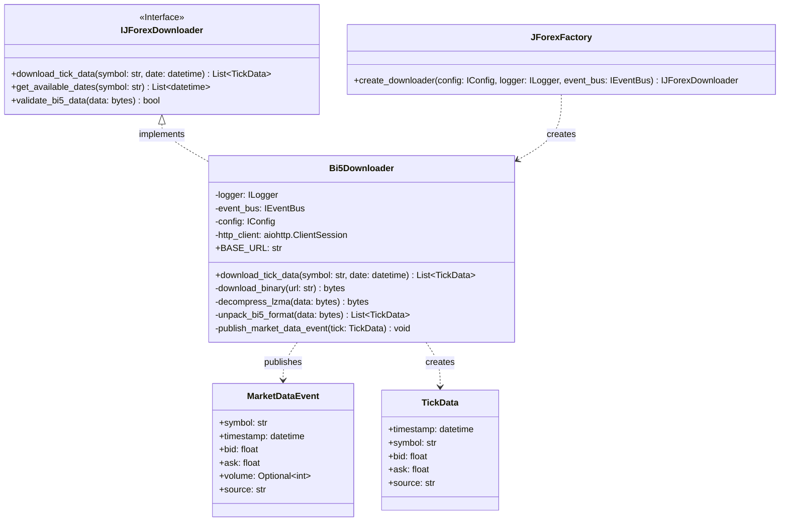

# Phase 2: JForex Collector Implementáció Tervezése

## 🎯 Cél és Áttekintés

Ez a dokumentum a **JForex Collector** modul részletes tervezési tervét tartalmazza, amely a Dukascopy natív .bi5 formátumú Tick adatok letöltését, dekódolását és feldolgozását valósítja meg. A Phase 1 Core modulok (Base, Config, DB, Events, Logger, Storage, System, Utils) sikeres implementációja után ez a következő kritikus lépés az adatgyűjtő rendszer kiépítésében.

**Státusz:** `🔴 TERVELÉS ALATT`  
**Komplexitás:** `⭐⭐⭐⭐`  
**Token Becslés:** `~150k`  
**Határidő:** Phase 1 után azonnali megkezdés

---

## 📋 Tartalomjegyzék

1. [Architektúra](#1-architektúra)
2. [Adatstruktúra](#2-adatstruktúra)
3. [Hibakezelés](#3-hibakezelés)
4. [Tesztelési Terv](#4-tesztelési-terv)
5. [Implementációs Lépések](#5-implementációs-lépések)
6. [Függőségek és Konfiguráció](#6-függőségek-és-konfiguráció)

---

## 1. Architektúra

### 1.1 JForex Collector Modul Szerkezete

A JForex Collector modul a Core architektúra szabványait követi:

```
neural_ai/collectors/jforex/
├── __init__.py                 # Exportálja a Factory-t és Interface-t
├── factory.py                  # DI Container integráció
├── exceptions/
│   ├── __init__.py
│   ├── download_error.py       # Letöltési hibák
│   └── decode_error.py         # Dekódolási hibák
├── implementations/
│   ├── __init__.py
│   └── bi5_downloader.py       # Konkrét implementáció
└── interfaces/
    ├── __init__.py
    └── downloader_interface.py # Letöltő interface
```

### 1.2 Osztály Diagram



### 1.3 EventBus Integráció

A JForex Collector a következő eseményeket küldi az EventBus-ra:

#### MarketDataEvent Publikálás

```python
from neural_ai.core.events.interfaces.event_models import MarketDataEvent

async def publish_market_data_event(
    self,
    tick: TickData
) -> None:
    """Tick adat publikálása az EventBus-ra."""
    
    event = MarketDataEvent(
        symbol=tick.symbol,
        timestamp=tick.timestamp,
        bid=tick.bid,
        ask=tick.ask,
        volume=None,  # JForex .bi5 nem tartalmaz volume-t
        source="jforex"
    )
    
    await self.event_bus.publish("market_data", event)
    
    self.logger.debug(
        "market_data_event_published",
        symbol=tick.symbol,
        timestamp=tick.timestamp.isoformat(),
        bid=tick.bid,
        ask=tick.ask
    )
```

#### EventBus Feliratkozás

A Collector NEM iratkozik fel más eseményekre, csak publikál. A Storage Service és Strategy Engine fogadja és dolgozza fel az adatokat.

---

## 2. Adatstruktúra

### 2.1 .bi5 Bináris Formátum Specifikáció

A Dukascopy .bi5 formátuma LZMA tömörített bináris adat, amely a következő struktúrával rendelkezik:

#### Tömörítetlen Formátum

```
Minden rekord: 12 bájt (Big-Endian)
Struct format: '>Iff' (unsigned int, float, float)

[timestamp_delta: 4 bájt] [ask: 4 bájt] [bid: 4 bájt]

- timestamp_delta: Ezredmásodperc eltolás a nap kezdetéhez képest
- ask: Ask ár (float)
- bid: Bid ár (float)
```

#### Python Struct Unpacking

```python
import struct
from datetime import datetime, timedelta

def unpack_bi5_data(
    data: bytes,
    symbol: str,
    date: datetime
) -> List[TickData]:
    """Bi5 bináris adatok dekódolása."""
    
    ticks: List[TickData] = []
    
    # Rekord mérete: 12 bájt
    record_size = 12
    num_records = len(data) // record_size
    
    # Alap timestamp a nap kezdetéhez (UTC éjfél)
    base_timestamp = int(date.replace(
        hour=0, minute=0, second=0, microsecond=0
    ).timestamp()) * 1000
    
    for i in range(num_records):
        offset = i * record_size
        record = data[offset:offset + record_size]
        
        # Big-endian unpack
        timestamp_delta, ask, bid = struct.unpack('>Iff', record)
        
        # Timestamp számítása
        timestamp_ms = base_timestamp + timestamp_delta
        timestamp = datetime.fromtimestamp(timestamp_ms / 1000, tz=timezone.utc)
        
        # TickData objektum létrehozása
        tick = TickData(
            timestamp=timestamp,
            symbol=symbol.upper(),
            bid=round(bid, 5),  # Forex árak 5 tizedesjegyre
            ask=round(ask, 5),
            source="jforex"
        )
        
        ticks.append(tick)
    
    return ticks
```

### 2.2 TickData Modell

```python
from dataclasses import dataclass
from datetime import datetime

@dataclass
class TickData:
    """JForex Tick adat modell."""
    
    timestamp: datetime
    symbol: str
    bid: float
    ask: float
    source: str = "jforex"
    
    @property
    def spread(self) -> float:
        """Spread kiszámítása pip-ben."""
        return round((self.ask - self.bid) * 10000, 1)  # 1 pip = 0.0001
    
    @property
    def mid_price(self) -> float:
        """Középár kiszámítása."""
        return round((self.bid + self.ask) / 2, 5)
```

### 2.3 MarketDataEvent Konverzió

```python
from neural_ai.core.events.interfaces.event_models import MarketDataEvent

def convert_tick_to_event(tick: TickData) -> MarketDataEvent:
    """TickData konvertálása MarketDataEvent-té."""
    
    return MarketDataEvent(
        symbol=tick.symbol,
        timestamp=tick.timestamp,
        bid=tick.bid,
        ask=tick.ask,
        volume=None,  # JForex nem szolgáltat volume adatot
        source=tick.source
    )
```

---

## 3. Hibakezelés

### 3.1 404-es Hiba (Ünnepnapok)

A Dukascopy szerver 404-es hibát ad vissza, ha az adott napon nincs adat (ünnepnap, hétvége stb.).

#### Implementáció

```python
from neural_ai.collectors.jforex.exceptions import (
    DownloadError,
    DataNotAvailableError
)

async def download_tick_data(
    self,
    symbol: str,
    date: datetime
) -> List[TickData]:
    """Tick adatok letöltése hibakezeléssel."""
    
    url = self._build_url(symbol, date)
    
    try:
        async with self.http_client.get(url) as response:
            if response.status == 404:
                # Ünnepnap vagy hétvége
                self.logger.warning(
                    "bi5_data_not_available",
                    symbol=symbol,
                    date=date.isoformat(),
                    reason="404_not_found"
                )
                raise DataNotAvailableError(
                    f"No data available for {symbol} on {date.date()}"
                )
            
            response.raise_for_status()
            content = await response.read()
            
    except aiohttp.ClientError as e:
        self.logger.error(
            "bi5_download_failed",
            symbol=symbol,
            date=date.isoformat(),
            error=str(e),
            url=url
        )
        raise DownloadError(f"Failed to download {symbol} data: {e}")
    
    # Dekódolás
    try:
        ticks = self._decode_bi5_data(content, symbol, date)
        return ticks
        
    except Exception as e:
        self.logger.error(
            "bi5_decode_failed",
            symbol=symbol,
            date=date.isoformat(),
            error=str(e)
        )
        raise DecodeError(f"Failed to decode {symbol} data: {e}")
```

### 3.2 Sérült Fájl Kezelése

A letöltött .bi5 fájl sérült lehet (nem teljes, hibás tömörítés stb.).

#### Validáció

```python
import lzma

def validate_bi5_data(self, data: bytes) -> bool:
    """Bi5 adatok validálása."""
    
    # 1. Méret ellenőrzése
    if len(data) < 12:
        self.logger.warning(
            "bi5_invalid_size",
            size=len(data),
            expected_min=12
        )
        return False
    
    # 2. LZMA dekompresszió ellenőrzése
    try:
        decompressed = lzma.decompress(data)
        
        # 3. Rekordok száma ellenőrzése
        if len(decompressed) % 12 != 0:
            self.logger.warning(
                "bi5_invalid_record_count",
                decompressed_size=len(decompressed)
            )
            return False
        
        return True
        
    except lzma.LZMAError as e:
        self.logger.error(
            "bi5_lzma_decompress_failed",
            error=str(e)
        )
        return False
```

### 3.3 Retry Mechanizmus

Exponenciális backoff-el történő újrapróbálkozás:

```python
import asyncio
from tenacity import retry, stop_after_attempt, wait_exponential

class Bi5Downloader:
    """JForex Bi5 letöltő retry mechanizmussal."""
    
    MAX_RETRIES = 3
    
    @retry(
        stop=stop_after_attempt(MAX_RETRIES),
        wait=wait_exponential(multiplier=1, min=2, max=10),
        reraise=True
    )
    async def download_with_retry(
        self,
        symbol: str,
        date: datetime
    ) -> List[TickData]:
        """Letöltés retry mechanizmussal."""
        
        return await self.download_tick_data(symbol, date)
```

---

## 4. Tesztelési Terv

### 4.1 Mock Letöltés Implementációja

A tesztek során NEM töltünk le valódi adatokat a Dukascopy szerverről. Ehelyett mock objektumokat használunk.

#### Mock Bi5 Adat Generátor

```python
import struct
import lzma
from datetime import datetime, timedelta

class MockBi5DataGenerator:
    """Mock .bi5 adatok generálása teszteléshez."""
    
    @staticmethod
    def generate_mock_bi5_data(
        symbol: str,
        date: datetime,
        num_ticks: int = 1000
    ) -> bytes:
        """Mock .bi5 adatok generálása."""
        
        # Tick adatok generálása
        base_timestamp = int(date.replace(
            hour=0, minute=0, second=0, microsecond=0
        ).timestamp()) * 1000
        
        # Random árak generálása
        import random
        base_price = random.uniform(1.0000, 1.5000)
        
        raw_data = bytearray()
        
        for i in range(num_ticks):
            # Timestamp delta (1 másodperces lépések)
            timestamp_delta = i * 1000
            
            # Árak generálása (kis véletlen változással)
            bid = base_price + random.uniform(-0.0010, 0.0010)
            ask = bid + 0.0001  # 1 pip spread
            
            # Bináris adatok hozzáadása
            raw_data.extend(struct.pack('>Iff', timestamp_delta, ask, bid))
        
        # LZMA tömörítés
        compressed = lzma.compress(bytes(raw_data))
        
        return compressed
```

### 4.2 Teszt Osztályok

#### Mock HTTP Client

```python
from unittest.mock import AsyncMock, MagicMock

class MockHttpClient:
    """Mock HTTP kliens .bi5 letöltéshez."""
    
    def __init__(self, mock_data: bytes = None):
        self.mock_data = mock_data or b""
        self.get = AsyncMock()
        
    def setup_success_response(self):
        """Sikeres válasz beállítása."""
        mock_response = MagicMock()
        mock_response.status = 200
        mock_response.read = AsyncMock(return_value=self.mock_data)
        mock_response.__aenter__ = AsyncMock(return_value=mock_response)
        mock_response.__aexit__ = AsyncMock(return_value=None)
        
        self.get.return_value = mock_response
        
    def setup_404_response(self):
        """404-es hiba beállítása."""
        mock_response = MagicMock()
        mock_response.status = 404
        mock_response.__aenter__ = AsyncMock(return_value=mock_response)
        mock_response.__aexit__ = AsyncMock(return_value=None)
        
        self.get.return_value = mock_response
```

### 4.3 Tesztesetek

```python
import pytest
from datetime import datetime

class TestBi5Downloader:
    """Bi5Downloader tesztosztály."""
    
    @pytest.mark.asyncio
    async def test_download_success(self):
        """Sikeres letöltés tesztelése."""
        
        # Mock adatok generálása
        mock_data = MockBi5DataGenerator.generate_mock_bi5_data(
            symbol="EURUSD",
            date=datetime(2023, 12, 1),
            num_ticks=100
        )
        
        # Mock HTTP kliens
        mock_http = MockHttpClient(mock_data)
        mock_http.setup_success_response()
        
        # Downloader létrehozása
        downloader = Bi5Downloader(
            logger=MockLogger(),
            event_bus=MockEventBus(),
            config=MockConfig(),
            http_client=mock_http
        )
        
        # Letöltés
        ticks = await downloader.download_tick_data(
            symbol="EURUSD",
            date=datetime(2023, 12, 1)
        )
        
        # Ellenőrzés
        assert len(ticks) == 100
        assert ticks[0].symbol == "EURUSD"
        assert ticks[0].bid < ticks[0].ask  # Spread ellenőrzése
    
    @pytest.mark.asyncio
    async def test_download_404_error(self):
        """404-es hiba kezelésének tesztelése."""
        
        mock_http = MockHttpClient()
        mock_http.setup_404_response()
        
        downloader = Bi5Downloader(
            logger=MockLogger(),
            event_bus=MockEventBus(),
            config=MockConfig(),
            http_client=mock_http
        )
        
        with pytest.raises(DataNotAvailableError):
            await downloader.download_tick_data(
                symbol="EURUSD",
                date=datetime(2023, 12, 25)  # Karácsony
            )
    
    @pytest.mark.asyncio
    async def test_decode_corrupted_data(self):
        """Sérült adatok dekódolásának tesztelése."""
        
        # Érvénytelen adatok
        corrupted_data = b"invalid_lzma_data"
        
        mock_http = MockHttpClient(corrupted_data)
        mock_http.setup_success_response()
        
        downloader = Bi5Downloader(
            logger=MockLogger(),
            event_bus=MockEventBus(),
            config=MockConfig(),
            http_client=mock_http
        )
        
        with pytest.raises(DecodeError):
            await downloader.download_tick_data(
                symbol="EURUSD",
                date=datetime(2023, 12, 1)
            )
```

### 4.4 Coverage Célok

- **Statement Coverage:** 100%
- **Branch Coverage:** 100%
- **Tesztesetek száma:** 15+
- **Mock adatok mérete:** 100-1000 tick

---

## 5. Implementációs Lépések

### 5.1 Fázisok Bontása

#### Phase 2.1: Alapstruktúra (1-2 nap)
- [ ] `neural_ai/collectors/` mappa létrehozása
- [ ] `jforex/` modul struktúra kialakítása
- [ ] `__init__.py` fájlok létrehozása
- [ ] Exception osztályok implementálása

#### Phase 2.2: Interface Design (1 nap)
- [ ] `IJForexDownloader` interface létrehozása
- [ ] Metódusok definiálása (download, validate, get_available_dates)
- [ ] Type hints és docstringek

#### Phase 2.3: Core Implementáció (2-3 nap)
- [ ] `Bi5Downloader` osztály implementálása
- [ ] HTTP letöltés (aiohttp)
- [ ] LZMA dekompresszió
- [ ] Struct unpacking
- [ ] EventBus integráció

#### Phase 2.4: Hibakezelés (1 nap)
- [ ] Exception osztályok implementálása
- [ ] Retry mechanizmus
- [ ] Validáció
- [ ] Logging

#### Phase 2.5: Factory és DI (1 nap)
- [ ] `JForexFactory` létrehozása
- [ ] DI Container integráció
- [ ] Konfiguráció kezelés

#### Phase 2.6: Tesztelés (2 nap)
- [ ] Mock adat generátor
- [ ] Unit tesztek írása
- [ ] Integration tesztek
- [ ] Coverage ellenőrzés

#### Phase 2.7: Dokumentáció (1 nap)
- [ ] Google Style docstringek
- [ ] `docs/components/collectors/jforex/` mirror dokumentáció
- [ ] API dokumentáció

### 5.2 Fájlok Listája

```
neural_ai/collectors/
├── __init__.py
└── jforex/
    ├── __init__.py
    ├── factory.py
    ├── exceptions/
    │   ├── __init__.py
    │   ├── download_error.py
    │   └── decode_error.py
    ├── implementations/
    │   ├── __init__.py
    │   └── bi5_downloader.py
    └── interfaces/
        ├── __init__.py
        └── downloader_interface.py

tests/collectors/jforex/
├── __init__.py
├── test_factory.py
├── test_bi5_downloader.py
└── mocks/
    ├── __init__.py
    ├── mock_http_client.py
    └── mock_bi5_generator.py

docs/components/collectors/jforex/
├── index.md
├── factory.md
├── exceptions/
│   ├── index.md
│   ├── download_error.md
│   └── decode_error.md
├── implementations/
│   ├── index.md
│   └── bi5_downloader.md
└── interfaces/
    ├── index.md
    └── downloader_interface.md
```

---

## 6. Függőségek és Konfiguráció

### 6.1 Függőségek

#### Új Függőségek

```toml
# pyproject.toml

[project.dependencies]
# JForex Collector
aiohttp = "^3.9.0"           # HTTP kliens
lzma = "^0.1.0"              # LZMA dekompresszió
tenacity = "^8.2.0"          # Retry mechanizmus

[project.optional-dependencies]
dev = [
    "pytest-asyncio = "^0.21.0",
    "pytest-mock = "^3.12.0"
]
```

#### Meglévő Core Függőségek

- `neural_ai.core.logger` - Logging
- `neural_ai.core.events` - EventBus
- `neural_ai.core.config` - Konfiguráció
- `neural_ai.core.storage` - Adattárolás (jövőbeli)

### 6.2 Konfiguráció

#### configs/jforex.yaml

```yaml
# JForex Collector Konfiguráció

jforex:
  # Dukascopy base URL
  base_url: "https://www.dukascopy.com/datafeed"
  
  # Letöltési beállítások
  download:
    timeout: 30              # Másodperc
    max_retries: 3
    retry_delay: 2           # Másodperc
    chunk_size: 8192         # Bájt
    
  # Naplózás
  logging:
    level: "INFO"
    format: "json"
    
  # Symbol lista
  symbols:
    - "EURUSD"
    - "GBPUSD"
    - "USDJPY"
    - "AUDUSD"
    - "USDCAD"
    - "EURGBP"
    - "EURJPY"
    - "GBPJPY"
    
  # Dátumtartomány
  date_range:
    start: "2003-01-01"
    end: "2025-12-31"
```

#### .env.example

```bash
# JForex Collector

# Dukascopy letöltési beállítások
JFOREX_BASE_URL=https://www.dukascopy.com/datafeed
JFOREX_TIMEOUT=30
JFOREX_MAX_RETRIES=3

# Proxy beállítások (opcionális)
JFOREX_PROXY_URL=
JFOREX_PROXY_USER=
JFOREX_PROXY_PASS=
```

### 6.3 Factory Konfiguráció

```python
from neural_ai.core.base.interfaces import IConfig, ILogger
from neural_ai.core.events.interfaces import IEventBus
from neural_ai.collectors.jforex.interfaces import IJForexDownloader
from neural_ai.collectors.jforex.implementations import Bi5Downloader

class JForexFactory:
    """JForex Collector Factory."""
    
    @staticmethod
    def create_downloader(
        config: IConfig,
        logger: ILogger,
        event_bus: IEventBus
    ) -> IJForexDownloader:
        """Letöltő létrehozása DI segítségével."""
        
        # Konfiguráció betöltése
        jforex_config = config.get("jforex", {})
        
        # HTTP kliens létrehozása
        timeout = aiohttp.ClientTimeout(total=jforex_config.get("timeout", 30))
        http_client = aiohttp.ClientSession(timeout=timeout)
        
        # Bi5Downloader példányosítása
        downloader = Bi5Downloader(
            logger=logger,
            event_bus=event_bus,
            config=config,
            http_client=http_client
        )
        
        logger.info(
            "jforex_downloader_created",
            base_url=jforex_config.get("base_url")
        )
        
        return downloader
```

---

## 7. Teljesítmény Optimalizáció

### 7.1 Párhuzamos Letöltés

Több szimbólum és dátum párhuzamos letöltése:

```python
import asyncio

async def download_multiple_symbols(
    self,
    symbols: List[str],
    start_date: datetime,
    end_date: datetime
) -> Dict[str, List[TickData]]:
    """Több szimbólum párhuzamos letöltése."""
    
    # Dátumok generálása
    dates = []
    current = start_date
    while current <= end_date:
        dates.append(current)
        current += timedelta(days=1)
    
    # Párhuzamos letöltések
    tasks = []
    for symbol in symbols:
        for date in dates:
            task = self.download_tick_data(symbol, date)
            tasks.append(task)
    
    # Várunk minden letöltésre
    results = await asyncio.gather(*tasks, return_exceptions=True)
    
    # Eredmények csoportosítása
    data_by_symbol = {}
    for result in results:
        if isinstance(result, Exception):
            self.logger.error("download_task_failed", error=str(result))
            continue
        
        symbol = result[0].symbol if result else None
        if symbol:
            if symbol not in data_by_symbol:
                data_by_symbol[symbol] = []
            data_by_symbol[symbol].extend(result)
    
    return data_by_symbol
```

### 7.2 Chunk-based Feldolgozás

Nagy adatmennyiségek darabolása:

```python
async def download_and_store_chunked(
    self,
    symbol: str,
    start_date: datetime,
    end_date: datetime,
    chunk_size: int = 1000
) -> None:
    """Letöltés és tárolás chunk-okban."""
    
    current = start_date
    chunk = []
    
    while current <= end_date:
        try:
            ticks = await self.download_tick_data(symbol, current)
            chunk.extend(ticks)
            
            # Ha elértük a chunk méretet, tároljuk
            if len(chunk) >= chunk_size:
                await self._store_chunk(chunk)
                chunk = []
                
        except DataNotAvailableError:
            pass  # Ünnepnap, hétvége
        
        current += timedelta(days=1)
    
    # Maradék chunk tárolása
    if chunk:
        await self._store_chunk(chunk)
```

---

## 8. Biztonság és Megbízhatóság

### 8.1 Rate Limiting

Dukascopy szerver terhelésének korlátozása:

```python
from asyncio import Semaphore

class Bi5Downloader:
    """Rate limited Bi5 letöltő."""
    
    def __init__(self, max_concurrent: int = 5):
        self.semaphore = Semaphore(max_concurrent)
    
    async def download_with_rate_limit(
        self,
        symbol: str,
        date: datetime
    ) -> List[TickData]:
        """Letöltés rate limittel."""
        
        async with self.semaphore:
            return await self.download_tick_data(symbol, date)
```

### 8.2 Circuit Breaker

Hibák detektálása és automatikus leállás:

```python
from circuitbreaker import circuit

class Bi5Downloader:
    """Circuit breaker-rel ellátott letöltő."""
    
    FAILURE_THRESHOLD = 5
    RECOVERY_TIMEOUT = 60
    
    @circuit(
        failure_threshold=FAILURE_THRESHOLD,
        recovery_timeout=RECOVERY_TIMEOUT
    )
    async def download_tick_data(
        self,
        symbol: str,
        date: datetime
    ) -> List[TickData]:
        """Letöltés circuit breaker-rel."""
        # Implementáció
        pass
```

---

## 9. Integrációs Terv

### 9.1 EventBus Integráció

A JForex Collector a következő eseményeket küldi:

1. **market_data** - Tick adatok
2. **download_started** - Letöltés kezdete
3. **download_completed** - Letöltés vége
4. **download_failed** - Sikertelen letöltés

### 9.2 Storage Service Integráció

A letöltött adatok automatikus tárolása:

```python
from neural_ai.core.storage.interfaces import IStorageService

class Bi5Downloader:
    """Storage integrációval ellátott letöltő."""
    
    def __init__(
        self,
        storage: IStorageService,
        # ... egyéb függőségek
    ):
        self.storage = storage
    
    async def download_and_store(
        self,
        symbol: str,
        date: datetime
    ) -> None:
        """Letöltés és automatikus tárolás."""
        
        ticks = await self.download_tick_data(symbol, date)
        
        # Tárolás Parquet formátumban
        await self.storage.store_tick_data(
            symbol=symbol,
            data=ticks,
            date=date
        )
```

---

## 10. Következő Lépések

### 10.1 Rövid Távú Célok (1-2 hét)

1. **Alapstruktúra létrehozása** - Mappák, exception-ök
2. **Interface design** - IJForexDownloader
3. **Core implementáció** - Bi5Downloader
4. **Hibakezelés** - Exception-ök, retry
5. **Tesztelés** - Unit és integration tesztek
6. **Dokumentáció** - Mirror docs

### 10.2 Közép Távú Célok (1 hónap)

1. **Java Bridge implementáció** - JForex kereskedés
2. **MT5 Collector** - FastAPI szerver
3. **IBKR Collector** - TWS API integráció
4. **Advanced Analytics** - VectorBT backtest

### 10.3 Hosszú Távú Célok (3-6 hónap)

1. **Distributed Collection** - Több gépen futó collector-ök
2. **Real-time Processing** - Streaming adatok
3. **AI Integration** - ML modellek a collector-ökbe
4. **Cloud Deployment** - AWS/GCP/Azure támogatás

---

## 11. Kapcsolódó Dokumentumok

- [System Architecture](docs/planning/specs/01_system_architecture.md)
- [Collectors Strategy](docs/planning/specs/05_collectors_strategy.md)
- [Event Bus Documentation](docs/components/core/events/index.md)
- [Storage Service](docs/components/core/storage/index.md)
- [TASK_TREE](docs/development/TASK_TREE.md)

---

## 12. Változásnapló

| Verzió | Dátum | Változás | Szerző |
|:------:|:-----:|:---------|:-------|
| 1.0 | 2025-12-29 | Kezdeti terv létrehozása | Architect |
| 1.1 | - | - | - |

---

**Státusz:** `🔴 TERVELÉS ALATT`  
**Utolsó frissítés:** 2025-12-29  
**Következő áttekintés:** Phase 2.1 megkezdésekor