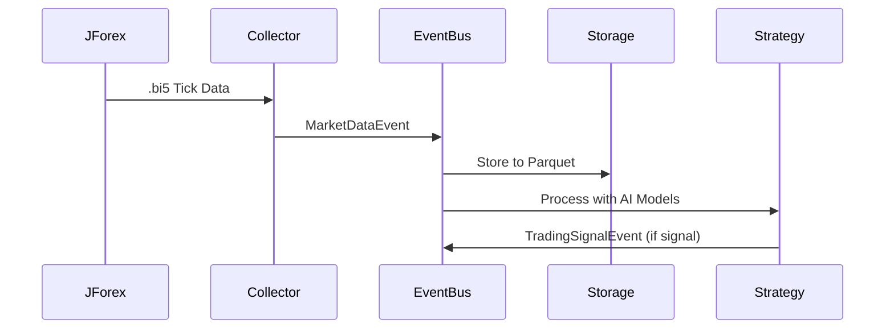
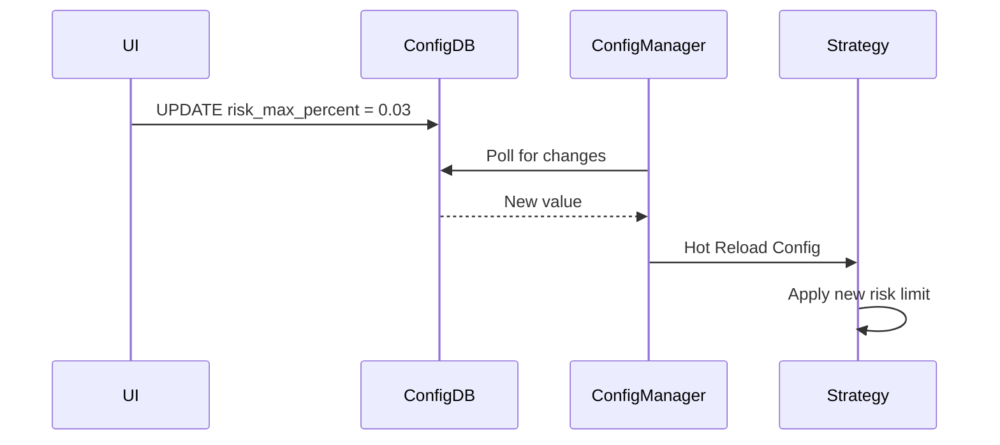

# 01 - System Architecture Specification

## 🎯 Cél és Filozófia

**Cél:** Intézményi szintű, eseményvezérelt (Event-Driven) kereskedési ökoszisztéma építése, amely 25+ évnyi Tick adatot képes feldolgozni és elemzni.

**Filozófia:** 
- **Loose Coupling (Laza csatolás):** Komponensek függetlenek egymástól, csak eseményekkel kommunikálnak.
- **High Cohesion (Magas kohézió):** Minden komponens egy jól definiált, specifikus feladatot lát el.
- **Database-First:** Minden döntés az adatbázisban tárolt konfigurációból indul ki.
- **Premium Instrumentumok:** Csak a nagy likviditású, alacsony spread-el rendelkező párokra optimalizálva (EURUSD, GBPUSD, USDJPY, USDCHF, XAUUSD).

---

## 🏗️ Architektúra Áttekintés

### Event-Driven Core Flow

```
┌─────────────┐
│  Collector  │ (JForex Bi5, MT5 API)
└──────┬──────┘
       │ Market Data (Tick)
       ▼
┌─────────────────┐
│   EventBus      │ (ZeroMQ/AsyncIO)
│  (Event Router) │
└────┬────────┬───┘
     │        │
     │        ├──────────────┐
     │        │              │
     ▼        ▼              ▼
┌─────────┐ ┌──────────┐ ┌──────────────┐
│ Storage │ │ Strategy │ │  Analytics   │
│ Service │ │  Engine  │ │   Engine     │
└─────────┘ └──────────┘ └──────────────┘
     │            │              │
     ▼            ▼              ▼
┌──────────────────────────────────────┐
│         Parquet Data Lake            │
│  (Partitioned by Symbol/Year/Month)  │
└──────────────────────────────────────┘
```

### Komponens Architektúra

#### 1. **EventBus (Esemény Router)**
**Felelősség:** Aszinkron események továbbítása a komponensek között.

**Technológia:**
- `asyncio` (Python 3.12) - Aszinkron működés
- `ZeroMQ` (opcionális) - High-performance messaging
- `Pydantic` - Esemény validáció

**Kulcsfontosságú jellemzők:**
- **Pub/Sub Pattern:** Komponensek előfizethetnek specifikus eseménytípusokra.
- **Decoupling:** Nincs közvetlen függőség a komponensek között.
- **Reliability:** Események perzisztens tárolása (ha szükséges).

**Esemény Típusok:**
```python
class MarketDataEvent(BaseModel):
    symbol: str
    timestamp: datetime
    bid: float
    ask: float
    volume: int
    source: str  # 'JForex' | 'MT5'

class ConfigUpdateEvent(BaseModel):
    key: str
    value: Any
    updated_by: str
    timestamp: datetime

class TradingSignalEvent(BaseModel):
    symbol: str
    direction: str  # 'LONG' | 'SHORT'
    confidence: float  # 0.0 - 1.0
    source_strategy: str
    timestamp: datetime
```

---

#### 2. **Collector Komponensek (Adatgyűjtők)**

**2.1 JForex Bi5 Downloader**
**Felelősség:** Natív .bi5 fájlok letöltése és dekódolása.

**Technológia:**
- `LZMA decompression` - .bi5 fájlok kibontása
- `struct` modul - Bináris adatok feldolgozása
- `asyncio` - Párhuzamos letöltés több párra

**Adatfolyam:**
```
Dukascopy Server
       │
       ▼ .bi5 (LZMA compressed)
[Bi5Downloader]
       │
       ▼ Tick Data (bid, ask, volume)
   EventBus (MarketDataEvent)
```

**Jellemzők:**
- **Chunk-based Download:** Nagy adatmennyiségek hatékony letöltése.
- **Resume Capability:** Megszakadt letöltés folytatása.
- **Rate Limiting:** API limit betartása.

**2.2 MT5 FastAPI Server**
**Felelősség:** MT5 Expert Advisor-ból érkező Tick adatok fogadása.

**Technológia:**
- `FastAPI` - REST API végpont
- `WebSockets` - Valós idejű adatátvitel
- `Pydantic` - Request/Response validáció

**API Végpontok:**
```python
# Tick adatok fogadása
POST /api/v1/tick
Body: {
    "symbol": "EURUSD",
    "bid": 1.08542,
    "ask": 1.08544,
    "volume": 1000000,
    "timestamp": "2025-12-23T20:00:00Z"
}

# MetaTrader állapot lekérdezése
GET /api/v1/status
Response: {
    "connected": true,
    "symbols": ["EURUSD", "XAUUSD"],
    "last_update": "2025-12-23T20:00:00Z"
}
```

---

#### 3. **Storage Service (Adattárolás)**

**Felelősség:** Tick adatok particionált tárolása Parquet formátumban.

**Technológia:**
- `FastParquet` - Parquet fájlok írása/olvasása
- `Polars` - Adatfeldolgozás (chunk-based)
- `Pandas` - Kompatibilitás

**Fájlstruktúra:**
```
data/
├── EURUSD/
│   ├── tick/
│   │   ├── year=2025/
│   │   │   ├── month=12/
│   │   │   │   ├── day=23.parquet
│   │   │   │   ├── day=24.parquet
│   │   │   │   └── ...
│   │   │   └── ...
│   │   └── ...
│   ├── GBPUSD/
│   │   └── ...
│   └── ...
```

**Parquet Schema:**
```python
schema = {
    'timestamp': 'datetime64[ns]',
    'bid': 'float64',
    'ask': 'float64',
    'spread': 'float64',  # ask - bid
    'volume': 'int64',
    'source': 'string'
}
```

**Jellemzők:**
- **Partitioning:** Gyors szűrés Symbol/Year/Month/Day alapján.
- **Compression:** Snappy vagy Gzip tömörítés.
- **Append Mode:** Új adatok hozzáfűzése meglévő fájlokhoz.

---

#### 4. **Strategy Engine (Kereskedési Stratégiák)**

**Felelősség:** AI modellek futtatása és kereskedési jelzések generálása.

**Technológia:**
- `PyTorch` - Neurális hálók
- `Lightning` - Training/Inference keretrendszer
- `VectorBT Pro` - Backtesting

**Integráció a Hierarchikus Modellekkel:**
A rendszer integrálja a meglévő hierarchikus AI modelleket ([`docs/models/hierarchical/structure.md`](docs/models/hierarchical/structure.md)):

**1. Szint - Alap Elemzők:**
- `Microstructure Analyzer` (Tick/M1 adatok)
- `Scalp Pattern Detector` (M1/M5)
- `Intraday Trend Engine` (M15/H1)

**2. Szint - Specializált Elemzők:**
- `Trend Detector` (Multi-timeframe)
- `Volatility Regime Classifier`
- `Correlation Analyzer`

**3-6. Szintek - Meta Elemzés és Döntéshozatal:**
- `Market Regime Predictor`
- `Risk Manager`
- `Signal Generator`

**Event Flow:**
```
MarketDataEvent
       │
       ▼
[Strategy Engine]
       │
       ├──► [D1: Base Data] ──► [D2: S/R Levels] ──► ...
       │                                              │
       ▼                                              ▼
[Signal Aggregation] ──► TradingSignalEvent ──► EventBus
```

---

#### 5. **Configuration System (Konfiguráció Kezelés)**

**Felelősség:** Dinamikus konfiguráció kezelése két rétegben.

**Layer 1 - Statikus Konfiguráció (.env):**
```
APP_ENV=development
LOG_LEVEL=INFO
DB_URL=sqlite+aiosqlite:///neural_ai.db
TRADING_SYMBOLS=["EURUSD", "XAUUSD", "GBPUSD", "USDJPY", "USDCHF"]
JFOREX_API_KEY=your_api_key
MT5_SERVER_URL=http://localhost:8000
```

**Layer 2 - Dinamikus Konfiguráció (SQL Database):**
```sql
CREATE TABLE config_dynamic (
    id INTEGER PRIMARY KEY,
    key TEXT UNIQUE NOT NULL,
    value JSON NOT NULL,
    category TEXT,
    updated_by TEXT,
    updated_at TIMESTAMP DEFAULT CURRENT_TIMESTAMP
);

-- Példa adatok:
INSERT INTO config_dynamic (key, value, category) VALUES
('risk_max_percent', '0.02', 'risk'),
('active_symbols', '["EURUSD", "XAUUSD"]', 'trading'),
('strategy_enabled', 'true', 'strategy'),
('collector_interval', '60', 'collector');
```

**Hot Reload Mechanizmus:**
```python
class DynamicConfigManager:
    async def watch_for_changes(self):
        """Figyeli az adatbázis változásokat és frissíti a cache-t."""
        while True:
            await asyncio.sleep(5)  # 5 másodperces poll interval
            changes = await self.fetch_changes()
            if changes:
                self.cache.update(changes)
                await self.notify_subscribers(changes)
```

---

#### 6. **Observability Stack (Megfigyelhetőség)**

**Felelősség:** Rendszer állapot monitorozása és naplózás.

**Technológia:**
- `structlog` - Strukturált naplózás (JSON + Console)
- `OpenTelemetry` (jövőbeli) - Distributed tracing

**Log Format:**
```json
{
  "timestamp": "2025-12-23T20:00:00.123Z",
  "level": "INFO",
  "event": "tick_received",
  "symbol": "EURUSD",
  "bid": 1.08542,
  "ask": 1.08544,
  "source": "JForex",
  "trace_id": "abc123",
  "component": "collector.jforex"
}
```

**Log Destination:**
- **Console:** Színes, ember által olvasható formátum (fejlesztéshez)
- **File:** JSON formátum (production)
- **Database:** Kritikus események perzisztens tárolása

---

## 🔄 Komponens Interakciók (Sequence Diagram)

### Tick Adat Folyamat:


### Konfiguráció Frissítés:


---

## 🛡️ Biztonsági Elvek

1. **API Authentication:**
   - JWT token alapú hitelesítés MT5 API-hoz
   - API kulcsok titkosítva tárolva `.env` fájlban

2. **Adatbiztonság:**
   - Parquet fájlok csak olvasható jogosultsággal a collectornak
   - Adatbázis kapcsolat SSL/TLS titkosítással (production)

3. **Rate Limiting:**
   - JForex API hívások throttling (max 10 req/sec)
   - EventBus backpressure kezelés (ha a Storage leterhelt)

---

## 📊 Teljesítmény Követelmények

| Komponens | Átviteli sebesség | Késleltetés | Tároló |
|-----------|------------------|-------------|--------|
| Collector | 10,000 tick/sec | < 100ms | - |
| EventBus | 50,000 event/sec | < 10ms | 1GB RAM |
| Storage | 5,000 write/sec | < 50ms | 1TB SSD |
| Strategy | 1,000 tick/sec | < 500ms | GPU (CUDA) |

---

## 🚀 Következő Lépések

1. **Implementáció Prioritás:**
   1. EventBus core (ZeroMQ nélkül, egyszerű asyncio-val kezdeni)
   2. Storage Service (Parquet írás/olvasás)
   3. JForex Collector (Bi5 dekódolás)
   4. MT5 FastAPI Server
   5. Strategy Engine integráció

2. **Tesztelési Stratégia:**
   - Unit tesztek minden komponensre (pytest)
   - Integration tesztek (EventBus + Storage)
   - End-to-End tesztek (Collector → Strategy)

3. **Monitoring:**
   - Prometheus metrikák (jövőbeli)
   - Grafana dashboard (jövőbeli)

---

## 🔗 Kapcsolódó Dokumentumok

- [`docs/models/hierarchical/structure.md`](docs/models/hierarchical/structure.md) - AI Modellek architektúrája
- [`docs/processors/dimensions/overview.md`](docs/processors/dimensions/overview.md) - D1-D15 Processzorok
- [`pyproject.toml`](pyproject.toml) - Függőségek és konfiguráció
- [`docs/development/core_dependencies.md`](docs/development/core_dependencies.md) - DI Container és alapelvek