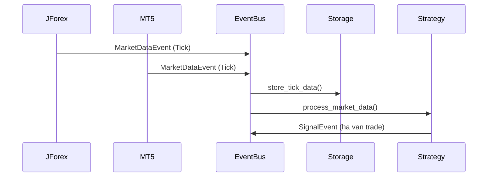
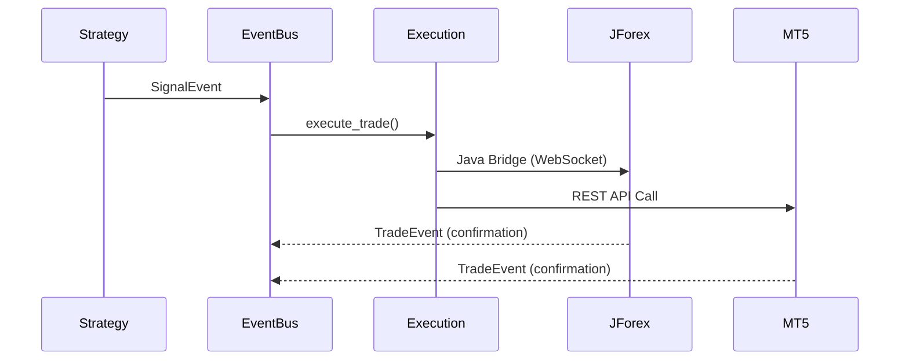

# 01 - Rendszerarchitektúra (Event-Driven Core)

## 🎯 Cél és Szándék

Ez a dokumentum definiálja a **Neural AI Next** intézményi szintű, eseményvezérelt (Event-Driven) kereskedési ökoszisztéma magjának architektúráját. A rendszer 25 évnyi Tick adat feldolgozására és valós idejű döntéshozatalra lett tervezve, kizárólag prémium instrumentumokra optimalizálva (High Liquidity, Low Spread).

**Filozófia:** *"Loose Coupling, High Cohesion"* (Laza csatolás, magas kohézió)

---

## 🏗️ Architektúra Áttekintés

### Alapelvek

1. **Eseményvezérelt Architektúra:** Minden komponens izolált, csak eseményekkel kommunikál.
2. **Zero Direct Coupling:** Nincs közvetlen hívás komponensek között.
3. **Database-First:** Minden konfiguráció és állapot az adatbázisban él.
4. **Big Data Támogatás:** 25 évnyi Tick adat particionált Parquet tárolása.
5. **Aszinkron Mindenhol:** Teljes `asyncio` alapú működés.

### Fő Komponensek

```
┌─────────────────┐
│   COLLECTORS    │  (Adatgyűjtők)
│  - JForex Bi5   │
│  - MT5 Server   │
│  - IBKR API     │
└────────┬────────┘
         │
         │ MarketDataEvent
         ▼
┌─────────────────┐
│   EVENT BUS     │  (Eseménybusz)
│  - ZeroMQ       │
│  - AsyncIO      │
└────────┬────────┘
         │
         ├──────────────────┬─────────────────┐
         │                  │                 │
         ▼                  ▼                 ▼
┌─────────────────┐  ┌─────────────────┐  ┌─────────────────┐
│    STORAGE      │  │  STRATEGY       │  │   ANALYTICS     │
│   SERVICE       │  │   ENGINE        │  │   ENGINE        │
│  - Parquet      │  │  - D1-D15       │  │  - ML Models    │
│  - Partitioned  │  │  - Processors   │  │  - Backtest     │
└─────────────────┘  └─────────────────┘  └─────────────────┘
```

---

## 📦 Komponens Részletezés

### 1. Collectors (Adatgyűjtők)

#### JForex Bi5 Downloader
- **Cél:** Natív Dukascopy .bi5 fájlok letöltése és dekódolása
- **Technológia:** LZMA decompression + Struct unpacking
- **Adatformátum:** Tick adat (timestamp, bid, ask)
- **Tárolás:** Közvetlenül Parquet formátumba írás
- **Függőség:** `dukascopy-python`, `lzma`

```python
class Bi5Downloader:
    """JForex natív Bi5 adatletöltő és dekódoló."""
    
    async def download_tick_data(
        self, 
        symbol: str, 
        date: datetime
    ) -> List[TickData]:
        """Letölti és dekódolja a Tick adatokat egy adott napra."""
        pass
```

#### MT5 FastAPI Server
- **Cél:** MT5 Expert Advisorokból érkező Tick és Trade események fogadása
- **Technológia:** FastAPI + WebSocket
- **Végpontok:**
  - `POST /api/v1/tick` - Tick adatok fogadása
  - `POST /api/v1/trade` - Trade események fogadása
  - `GET /api/v1/health` - Health check
- **Függőség:** `fastapi`, `websockets`, `pydantic`

```python
class MT5CollectorService:
    """MT5-ből érkező adatok fogadása és továbbítása."""
    
    async def handle_tick_event(self, event: TickEvent) -> None:
        """Tick esemény feldolgozása és továbbítása az EventBus-ra."""
        pass
```

#### IBKR API Collector (Jövőbeli)
- **Cél:** Interactive Brokers TWS API integráció
- **Technológia:** IBKR Python API
- **Státusz:** Tervezés alatt

---

### 2. Event Bus (Eseménybusz)

#### Event Types (Eseménytípusok)

```python
from pydantic import BaseModel
from datetime import datetime
from typing import Optional

class MarketDataEvent(BaseModel):
    """Piaci adat esemény."""
    symbol: str
    timestamp: datetime
    bid: float
    ask: float
    volume: Optional[int] = None
    source: str  # 'jforex', 'mt5', 'ibkr'
    
class TradeEvent(BaseModel):
    """Kereskedési esemény."""
    symbol: str
    timestamp: datetime
    direction: str  # 'BUY', 'SELL'
    price: float
    volume: float
    order_id: str
    
class SignalEvent(BaseModel):
    """Jelzés esemény (Strategy Engine -> Execution)."""
    symbol: str
    timestamp: datetime
    signal_type: str  # 'ENTRY_LONG', 'EXIT_SHORT', stb.
    confidence: float  # 0.0 - 1.0
    strategy_id: str
```

#### Event Bus Implementáció

```python
import asyncio
import zmq
import zmq.asyncio

class EventBus:
    """ZeroMQ alapú aszinkron eseménybusz."""
    
    def __init__(self, context: zmq.asyncio.Context):
        self.context = context
        self.publishers: Dict[str, zmq.Socket] = {}
        self.subscribers: Dict[str, List[Callable]] = {}
    
    async def publish(self, event_type: str, event: BaseModel) -> None:
        """Esemény közzététele a buszon."""
        pass
    
    def subscribe(
        self, 
        event_type: str, 
        callback: Callable[[BaseModel], Awaitable[None]]
    ) -> None:
        """Feliratkozás eseménytípusra."""
        pass
    
    async def run_forever(self) -> None:
        """Eseménybusz örök futás."""
        await asyncio.Event().wait()
```

**Függőségek:** `pyzmq`, `pydantic`, `asyncio`

---

### 3. Storage Service (Tároló Szolgáltatás)

#### ParquetStorage Osztály

```python
import polars as pl
from fastparquet import write

class ParquetStorageService:
    """Particionált Parquet tároló Big Data számára."""
    
    BASE_PATH = "/data/tick"
    
    async def store_tick_data(
        self, 
        symbol: str, 
        data: pl.DataFrame,
        date: datetime
    ) -> None:
        """Tick adatok tárolása particionált struktúrában."""
        # Elérési út: {BASE_PATH}/{symbol}/tick/year={YYYY}/month={MM}/day={DD}/data.parquet
        pass
    
    async def read_tick_data(
        self,
        symbol: str,
        start_date: datetime,
        end_date: datetime
    ) -> pl.DataFrame:
        """Tick adatok olvasása dátumtartományból."""
        pass
```

**Particionálási stratégia:**
```
/data/tick/
├── EURUSD/
│   ├── tick/
│   │   ├── year=2023/
│   │   │   ├── month=12/
│   │   │   │   ├── day=01/
│   │   │   │   │   └── data.parquet
│   │   │   │   ├── day=02/
│   │   │   │   └── ...
│   │   │   └── ...
│   │   └── ...
├── GBPUSD/
└── ...
```

**Függőségek:** `fastparquet`, `polars`, `pandas`

---

### 4. Strategy Engine (Stratégia Motor)

#### D1-D15 Processzorok Integrációja

A Strategy Engine a [`docs/processors/dimensions/overview.md`](docs/processors/dimensions/overview.md) dokumentumban definiált 15 dimenzió processzort használja:

- **D1:** Alap adatok (Base Data)
- **D2:** Support/Resistance szintek
- **D3:** Trend komponensek
- **D4:** Mozgóátlag komponensek
- **D5:** Momentum komponensek
- **D6:** Fibonacci szintek
- **D7:** Gyertyaformációk
- **D8:** Chart mintázatok
- **D9:** Volume Flow
- **D10:** Volatilitás és Range
- **D11:** Piaci környezet
- **D12:** Order Flow
- **D13:** Divergencia
- **D14:** Kitörések
- **D15:** Kockázatkezelés

```python
from docs.processors.dimensions.overview import (
    D1_BaseDataProcessor,
    D2_SupportResistanceProcessor,
    # ... stb.
)

class StrategyEngine:
    """Dimenzió processzorokkal stratégiákat végrehajtó motor."""
    
    def __init__(self):
        self.processors = {
            'd1': D1_BaseDataProcessor(),
            'd2': D2_SupportResistanceProcessor(),
            # ... stb.
        }
    
    async def process_market_data(
        self, 
        event: MarketDataEvent
    ) -> Optional[SignalEvent]:
        """Piaci adat feldolgozása és jelzés generálása."""
        # 1. Adatok gyűjtése minden dimenzióból
        # 2. AI modellek futtatása (lásd: docs/models/hierarchical/structure.md)
        # 3. Jelzés generálása ha van trade opportunity
        pass
```

**AI Modellek Integrációja:**

A Strategy Engine a [`docs/models/hierarchical/structure.md`](docs/models/hierarchical/structure.md) dokumentumban definiált hierarchikus AI rendszert használja:

- **1. Szint:** Alap Elemzők (Micro, Scalp, Intraday)
- **2. Szint:** Specializált Elemzők (Trend, Volatility, Correlation)
- **3. Szint:** Meta Elemzők (Regime, Risk, Performance)
- **4. Szint:** Curiosity Integráció
- **5. Szint:** Döntéshozó Rendszer
- **6. Szint:** Meta-Learning és Optimalizáció

**Függőségek:** `vectorbt`, `pytorch`, `lightning`

---

### 5. Analytics Engine (Analitikai Motor)

#### Backtest és Vizualizáció

```python
import vectorbt as vbt

class AnalyticsEngine:
    """Backtestelés és analitika motor."""
    
    async def run_backtest(
        self,
        symbol: str,
        strategy_config: Dict,
        start_date: datetime,
        end_date: datetime
    ) -> vbt.Portfolio:
        """Stratégia backtestelése VectorBT segítségével."""
        pass
    
    async def generate_report(
        self,
        portfolio: vbt.Portfolio
    ) -> Dict[str, Any]:
        """Teljesítmény jelentés generálása."""
        pass
```

**Függőségek:** `vectorbt`, `plotly`, `matplotlib`

---

## 🔄 Adatfolyam (Flow)

### 1. Tick Adat Folyam



### 2. Trade Execution Folyam



---

## 🛡️ Biztonság és Megbízhatóság

### Error Handling

- **Retry Logic:** Minden külső hívás exponenciális backoff-el
- **Circuit Breaker:** Külső API-k hibaállapotának detektálása
- **Dead Letter Queue:** Feldolgozatlan események tárolása

### Monitoring

- **Structured Logging:** `structlog` JSON formátumban
- **Metrics:** Nyitott pozíciók, PnL, Latency
- **Health Checks:** Minden komponens periodikus ellenőrzése

---

## 🚀 Teljesítmény Optimalizáció

### Aszinkron Működés

- **Concurrency:** `asyncio.gather()` párhuzamos feldolgozáshoz
- **Chunking:** Nagy adathalmazok darabolása
- **Caching:** Gyakran használt adatok gyorsítótárba tétele

### Big Data

- **Partitioning:** Dátum és szimbólum alapú particionálás
- **Compression:** Parquet Snappy compression
- **Query Optimization:** Predicate pushdown Polars segítségével

---

## 📋 Következő Lépések

1. **Konfiguráció:** Lásd [`02_dynamic_configuration.md`](02_dynamic_configuration.md)
2. **Logging:** Lásd [`03_observability_logging.md`](03_observability_logging.md)
3. **Adattárolás:** Lásd [`04_data_warehouse.md`](04_data_warehouse.md)
4. **Collectorok:** Lásd [`05_collectors_strategy.md`](05_collectors_strategy.md)

---

## 🔗 Kapcsolódó Dokumentumok

- [Hierarchikus AI Modellek](docs/models/hierarchical/structure.md)
- [Dimenzió Processzorok](docs/processors/dimensions/overview.md)
- [PyProject Konfiguráció](pyproject.toml)
- [Fejlesztési Útmutató](docs/development/unified_development_guide.md)
