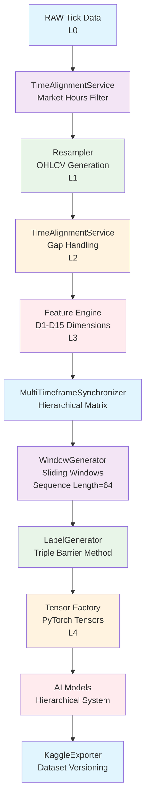

# Processor Architektúra V3 - The Master Plan

## Bevezetés

Ez a dokumentum a `neural_ai/core/processing` modul teljes technikai tervezése, amely a hierarchikus AI rendszer (`docs/models/hierarchical/structure.md`) adatfeldolgozási magját alkotja. A terv integrálja a D1-D15 dimenziók specifikációit (`docs/processors/dimensions/overview.md`), biztosítva az adat-integritást, időszinkronizációt és AI-modell kiszolgálást. A rendszer szigorúan Polars alapokon működik, zero-copy műveletekkel és memória-hatékony architektúrával.

## Architektúra Pillérei (4 Core Components)

### A. The Timekeeper (Időszinkronizáció)

```python
class TimeAlignmentService:
    """Időszinkronizációs szolgáltatás - tökéletes időskála biztosítása."""

    def reindex_to_grid(self, df: pl.DataFrame, timeframe: str) -> pl.DataFrame:
        """Tökéletes időskála generálása minden timeframe-re."""
        # Létrehozza az összes szükséges időpontot (pl. minden perc M1-nél)
        # Kezeli a tőzsde nyitvatartási időket
        return df.select([
            pl.date_range(
                pl.col("timestamp").min(),
                pl.col("timestamp").max(),
                interval=timeframe,
                eager=True
            ).alias("timestamp")
        ]).join(df, on="timestamp", how="left")

    def handle_gaps(self, df: pl.DataFrame, method: str = "forward_fill") -> pl.DataFrame:
        """Lyukak kezelése az adatokban."""
        if method == "forward_fill":
            return df.fill_null(strategy="forward")
        elif method == "mask":
            return df.with_columns(
                pl.when(pl.col("close").is_null()).then(None).otherwise(pl.col("close")).alias("close")
            )

    def market_hours_filter(self, df: pl.DataFrame, market: str = "forex") -> pl.DataFrame:
        """Szűrés tőzsdei nyitvatartási időkre."""
        # Forex: Hétfő 00:00 - Péntek 23:59 (UTC)
        # Kivéve ünnepek
        return df.filter(
            (pl.col("timestamp").dt.weekday() != 7) &  # Nem vasárnap
            ~pl.col("timestamp").is_in(holidays)        # Nem ünnep
        )
```

**Felelősség:**
- Tökéletes időskála generálása (nincs hiányzó időpont)
- Lyukak kezelése (Forward Fill vs NaN masking)
- Tőzsdei nyitvatartás szűrése

### B. The Feature Engine (Dimenziók)

```python
class IDimensionProcessor(ABC):
    """Absztrakt interfész minden dimenzió processzor számára."""

    @abstractmethod
    def process(self, df: pl.DataFrame) -> pl.DataFrame:
        """Polars Expr alapú dimenzió számítás."""
        pass

    @property
    @abstractmethod
    def dimension_id(self) -> int:
        """Dimenzió azonosító (1-15)."""
        pass

# Moduláris struktúra
# dimensions/d01_price/processor.py
class D01PriceProcessor(IDimensionProcessor):
    """D1 - Alap adatok (Base Data) processzor."""

    def process(self, df: pl.DataFrame) -> pl.DataFrame:
        return df.select([
            pl.col("timestamp"),
            pl.col("open"),
            pl.col("high"),
            pl.col("low"),
            pl.col("close"),
            pl.col("tick_volume"),
            pl.col("spread"),
            pl.col("real_volume")
        ])

# dimensions/d02_support/processor.py
class D02SupportResistanceProcessor(IDimensionProcessor):
    """D2 - Support/Resistance szintek."""

    def process(self, df: pl.DataFrame) -> pl.DataFrame:
        # Swing pontok keresése
        swing_highs = (pl.col("high") == pl.col("high").rolling_max(window_size=5))
        swing_lows = (pl.col("low") == pl.col("low").rolling_min(window_size=5))

        return df.with_columns([
            swing_highs.alias("swing_high"),
            swing_lows.alias("swing_low")
        ])
```

**D1-D15 Dimenziók Lista:**

| Dimenzió | Bemenet | Kimenet | Timeframe |
|----------|---------|---------|-----------|
| D1 - Base Data | raw_price_data, tick_data | normalized_data, basic_features | all |
| D2 - Support/Resistance | normalized_price_data | support_levels, resistance_levels | H1, H4, D1 |
| D3 - Trend | normalized_price_data | trend_direction, strength, changes | all |
| D4 - Moving Averages | normalized_price_data | sma, ema, wma, hull values | all |
| D5 - Momentum | price_data, volume_data | rsi, macd, stochastic, signals | M5, M15, H1, H4 |
| D6 - Fibonacci | price_data | retracements, extensions, harmonics | all |
| D7 - Candlesticks | price_data, volume_data | patterns, quality | all |
| D8 - Chart Patterns | price_data | reversal, continuation, breakouts | M15, H1, H4, D1 |
| D9 - Volume Flow | price_data, volume_data | delta, pressure, zones, patterns | M15, H1, H4, D1 |
| D10 - Volatility | price_data | atr, bands, regime, risk_params | M1, M5, M15, H1 |
| D11 - Market Context | price_data, session_data | session_type, liquidity, market_type | all |
| D12 - Order Flow | price_data, volume_data | imbalance, momentum, levels | M1, M5, M15, H1 |
| D13 - Divergence | price_data, indicators | price_div, indicator_div, volume_div | all |
| D14 - Breakouts | price_data | quality, retest, continuation | all |
| D15 - Risk Management | all_dimension_data | position_sizing, stops, targets | M5, M15, H1 |

### C. The Hierarchy Builder (Multi-Timeframe)

```python
class MultiTimeframeSynchronizer:
    """Hierarchikus adat-összeillesztés különböző timeframe-ek között."""

    def upsample_higher_to_lower(self, higher_tf: pl.DataFrame, lower_tf: pl.DataFrame) -> pl.DataFrame:
        """Upsampling: D1 adat széthúzása H1-re (Forward Fill)."""
        # D1 adatok H1 időskálára
        return lower_tf.join(
            higher_tf,
            on="timestamp",
            how="left"
        ).fill_null(strategy="forward")

    def downsample_lower_to_higher(self, lower_tf: pl.DataFrame, higher_tf: str) -> pl.DataFrame:
        """Downsampling: H1 adat aggregálása D1-re."""
        # Feature engineering időszint aggregációval
        return lower_tf.group_by_dynamic(
            "timestamp",
            every=higher_tf
        ).agg([
            pl.col("close").last().alias("close"),
            pl.col("volume").sum().alias("volume"),
            # ... egyéb aggregációk
        ])

    def create_hierarchical_matrix(self, data_dict: Dict[str, pl.DataFrame]) -> pl.DataFrame:
        """Egyetlen koherens mátrix létrehozása a modellnek."""
        # Összeilleszt minden timeframe-et
        # D1 modell látja a H1 aggregált feature-öket
        base_df = data_dict["M1"]

        for tf, df in data_dict.items():
            if tf != "M1":
                base_df = base_df.join(
                    self.downsample_lower_to_higher(df, "H1"),
                    on="timestamp",
                    how="left",
                    suffix=f"_{tf}"
                )

        return base_df
```

### D. The Tensor Factory (AI Interface)

```python
class WindowGenerator:
    """Sliding Window vágás Polars DataFrame-ből PyTorch Tensor-ba."""

    def generate_windows(self, df: pl.DataFrame, seq_length: int = 64, stride: int = 1) -> torch.Tensor:
        """Memória-hatékony window generálás."""
        # Polars LazyFrame használata
        lazy_df = df.lazy()

        # Window-ok létrehozása
        windows = []
        for i in range(0, len(df) - seq_length + 1, stride):
            window = df.slice(i, seq_length)
            windows.append(window)

        # Batch tensor létrehozása
        batch = torch.stack([
            torch.from_numpy(w.to_numpy()).float()
            for w in windows
        ])

        return batch

    def zero_copy_to_tensor(self, df: pl.DataFrame) -> torch.Tensor:
        """Zero-copy konverzió dlpack használatával."""
        return torch.from_dlpack(df.to_arrow().to_batches()[0])
```

```python
class LabelGenerator:
    """Triple Barrier Method címkézés."""

    def apply_triple_barrier(self, df: pl.DataFrame,
                           pt_multiplier: float = 0.02,
                           sl_multiplier: float = 0.01,
                           time_limit: int = 24) -> pl.Series:
        """Profit Taking, Stop Loss, Time Limit barrierek."""

        labels = []

        for i, row in enumerate(df.rows()):
            entry_price = row["close"]
            pt_barrier = entry_price * (1 + pt_multiplier)
            sl_barrier = entry_price * (1 - sl_multiplier)

            # Forward looking barrier check
            future_prices = df.slice(i, time_limit)["high", "low"]

            if future_prices["high"].max() >= pt_barrier:
                labels.append(1)  # Profit
            elif future_prices["low"].min() <= sl_barrier:
                labels.append(-1)  # Loss
            else:
                labels.append(0)  # Time exit

        return pl.Series("label", labels)
```

## Adat Életciklus (Data Lifecycle)

### L0 - RAW (Tick Data)
- **Forrás:** Dukascopy .bi5 vagy MT5 feed
- **Tárolás:** `data/raw/{symbol}/{year}/` - Immutable LZMA tömörítéssel
- **Cél:** Adat-integritás megőrzése

### L1 - RESAMPLED (OHLCV)
- **Folyamat:** M1, H1, H4 aggregáció Polars Expr-rel
- **Tárolás:** `data/resampled/{symbol}/{timeframe}/` - Particionált Parquet
- **Tartalom:** open, high, low, close, tick_volume, spread, real_volume

### L2 - ALIGNED (Gap-mentes)
- **Folyamat:** TimeAlignmentService alkalmazása
- **Tárolás:** `data/aligned/{symbol}/{timeframe}/` - Parquet
- **Tartalom:** Lyukmentes, forward-filled OHLCV

### L3 - FEATURES (Kiszámolt Dimenziók)
- **Folyamat:** D1-D15 processzorok futtatása
- **Tárolás:** `data/features/{symbol}/{dimension}/{timeframe}/` - Parquet per dimenzió
- **Tartalom:** Minden dimenzió eredményei

### L4 - DATASET (Ablakozott Tenzorok)
- **Folyamat:** WindowGenerator + LabelGenerator
- **Tárolás:** `data/datasets/{symbol}/{model_version}/` - PyTorch .pt fájlok
- **Tartalom:** Ablakozott feature mátrixok címkékkel

## Adatfolyam Diagram



## Export & Integráció

```python
class KaggleExporter:
    """Automatikus dataset export Kaggle-ra."""

    def export_dataset(self, tensors: Dict[str, torch.Tensor], metadata: Dict) -> str:
        """Verzióztatott export .pt formátumban."""

        # Verzió generálás
        version = f"{datetime.now().strftime('%Y%m%d_%H%M%S')}_{hash(str(metadata))}"

        # Metadata mentése
        metadata.update({
            "version": version,
            "dimensions": list(tensors.keys()),
            "tensor_shapes": {k: v.shape for k, v in tensors.items()},
            "feature_count": tensors["features"].shape[-1],
            "sequence_length": tensors["features"].shape[1]
        })

        # Tenzorok mentése
        for name, tensor in tensors.items():
            torch.save(tensor, f"data/datasets/{metadata['symbol']}/{version}/{name}.pt")

        # Kaggle API upload
        self._upload_to_kaggle(metadata)

        return version

    def _upload_to_kaggle(self, metadata: Dict):
        """Kaggle dataset frissítés."""
        # Automatikus verzió bump
        # Public dataset közzététel
        pass
```

## Technikai Specifikációk

- **Framework:** Polars Expr minden számításhoz (Nincs Python loop)
- **Memory:** Zero-copy műveletek dlpack használatával
- **Storage:** Particionált Parquet minden rétegben
- **GPU:** CUDA tensor műveletek ahol szükséges
- **Async:** Big data chunk-ok kezelése

Ez az architektúra teljes mértékben támogatja a hierarchikus AI rendszer komplex igényeit, biztosítva a data integrity-t és hatékony AI modell kiszolgálást.