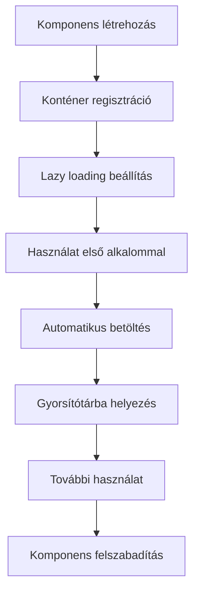

# Base Komponens

## Áttekintés

A Base komponens a Neural AI Next projekt alapvető infrastruktúráját biztosítja. Ez a komponenscsomag tartalmazza a dependency injection konténert, a core komponensek kezelését, a lazy loading mechanizmust és a singleton mintát. A Base komponens célja, hogy egységes és újrafelhasználható alapokat nyújtson a projekt összes többi komponensének.

## Főbb funkciók

- **Dependency Injection (DI) Konténer** - [`DIContainer`](api/container.md) osztály a komponensek függőségkezeléséhez
- **Core Komponensek** - [`CoreComponents`](api/core_components.md) osztály a logger, config és storage komponensek egységes kezeléséhez
- **Komponens Factory** - [`CoreComponentFactory`](api/factory.md) a komponensek létrehozásához és konfigurálásához
- **Lazy Loading** - Erőforrás-hatékony betöltési mechanizmus drága műveletekhez
- **Singleton Minta** - Biztonságos singleton implementáció metaclass segítségével
- **Kivételkezelés** - Átfogó kivétel hierarchia a hibakezeléshez

## Gyors kezdés

### Alapvető használat

```python
from neural_ai.core.base import CoreComponentFactory, CoreComponents

# Komponensek létrehozása a Factory-vel
components: CoreComponents = CoreComponentFactory.create_components(
    config_path='configs/system_config.yaml',
    log_path='logs/app.log',
    storage_path='./data'
)

# Komponensek használata
if components.has_logger():
    components.logger.info("Alkalmazás elindult")

if components.has_config():
    settings = components.config.get_section('app_settings')

if components.has_storage():
    components.storage.save_object({"data": "value"}, "test.json")
```

### Minimális konfiguráció

```python
from neural_ai.core.base import CoreComponentFactory

# Minimális komponens készlet létrehozása
components = CoreComponentFactory.create_minimal()

# Használat
components.logger.info("Minimális konfigurációval működik")
```

### Egyedi komponens regisztráció

```python
from neural_ai.core.base import DIContainer, CoreComponents

# Konténer létrehozása
container = DIContainer()

# Egyedi komponens regisztrálása
container.register_instance(MyInterface, MyImplementation())

# Core komponensek létrehozása a konténerrel
components = CoreComponents(container=container)
```

## Telepítés

A Base komponens a Neural AI Next projekt része, és automatikusan települ a projekt függőségeivel együtt.

```bash
# Projekt klónozása
git clone https://github.com/neural-ai/neural-ai-next.git

# Függőségek telepítése
pip install -r requirements.txt

# Vagy használd a projekt install scriptjét
python install_environment.py
```

## Struktúra

```
neural_ai/core/base/
├── __init__.py           # Fő exportok
├── container.py          # DI konténer implementáció
├── core_components.py    # Core komponensek
├── factory.py            # Komponens factory
├── exceptions.py         # Kivétel hierarchia
├── lazy_loading.py       # Lazy loading mechanizmus
└── singleton.py          # Singleton metaclass
```

## Dokumentáció

- [**API Dokumentáció**](api/overview.md) - Teljes API referencia
- [**Architektúra**](architecture/overview.md) - Rendszertervezés és alapelvek
- [**Példák**](examples/basic_usage.md) - Gyakorlati használati példák
- [**Fejlesztési útmutató**](guides/getting_started.md) - Első lépések
- [**Tervezési specifikáció**](design_spec.md) - Döntések és tervezés

## Komponens életciklus



## Főbb osztályok

### DIContainer

A dependency injection konténer, amely kezeli a komponensek közötti függőségeket és biztosítja azok megfelelő inicializálását.

**Kulcsfontosságú metódusok:**
- [`register_instance()`](api/container.md#register_instance) - Példány regisztrálása
- [`register_lazy()`](api/container.md#register_lazy) - Lazy komponens regisztrálása
- [`get()`](api/container.md#get) - Komponens lekérése
- [`resolve()`](api/container.md#resolve) - Függőség feloldása

### CoreComponents

A core komponensek gyűjteménye, amely egységes interfészt biztosít a logger, config és storage komponensek eléréséhez.

**Kulcsfontosságú tulajdonságok:**
- [`config`](api/core_components.md#config) - Konfiguráció kezelő
- [`logger`](api/core_components.md#logger) - Naplózó komponens
- [`storage`](api/core_components.md#storage) - Tároló komponens

### CoreComponentFactory

Factory osztály a core komponensek létrehozásához és konfigurálásához.

**Kulcsfontosságú metódusok:**
- [`create_components()`](api/factory.md#create_components) - Teljes komponens készlet létrehozása
- [`create_minimal()`](api/factory.md#create_minimal) - Minimális komponens készlet
- [`create_with_container()`](api/factory.md#create_with_container) - Létrehozás meglévő konténerből

## Hibakezelés

A Base komponens átfogó kivétel hierarchiát biztosít:

```python
from neural_ai.core.base.exceptions import (
    ComponentNotFoundError,
    SingletonViolationError,
    ConfigurationError,
    DependencyError
)

try:
    component = container.get('unknown_component')
except ComponentNotFoundError as e:
    print(f"Komponens nem található: {e}")
```

További részletek: [Kivétel hierarchia](api/exceptions.md)

## Teljesítmény optimalizációk

- **Lazy Loading**: A komponensek csak akkor töltődnek be, amikor először használják őket
- **Singleton Minta**: Biztosítja, hogy minden komponensből csak egy példány legyen
- **Gyorsítótár**: A betöltött komponensek gyorsítótárba kerülnek a gyorsabb hozzáférés érdekében
- **Thread Safe**: Minden művelet szálbiztos, biztonságos több szálas környezetben

## Kapcsolódó dokumentáció

- [Komponens fejlesztési útmutató](../../docs/development/component_development_guide.md)
- [Dependency injection minták](../../docs/development/implementation_guide.md)
- [Hibakezelés best practices](../../docs/development/error_handling.md)

## Példák

- [Alap használat](examples/basic_usage.md)
- [Haladó használat](examples/advanced_usage.md)
- [Egyedi komponensek](examples/custom_components.md)
- [Tesztelés](examples/testing.md)

## Közreműködés

Ha szeretnél hozzájárulni a Base komponens fejlesztéséhez, kérlek olvasd el a [CONTRIBUTING.md](CONTRIBUTING.md) fájlt.

## Változások

A komponens változásainak teljes listája a [CHANGELOG.md](CHANGELOG.md) fájlban található.

## Licenc

A projekt licencéről a fő [README.md](../../README.md) fájlban található információ.

---

**Utolsó frissítés:** 2025-12-19
**Verzió:** 1.0.0
**Felelős:** Base Komponens Csapat
