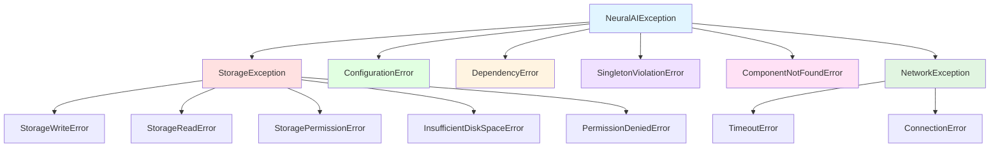

# Kivétel Hierarchia

## Áttekintés

Ez a dokumentum a Base komponens kivétel hierarchiáját dokumentálja. A Neural AI Next projekt átfogó kivételrendszert használ, amely lehetővé teszi a specifikus hibakezelést és a hibák pontos diagnosztizálását.

## Kivétel hierarchia



## Alap kivétel: NeuralAIException

```python
class NeuralAIException(Exception):
    """Alap kivétel az összes Neural AI Next kivételhez."""
    pass
```

**Leírás:** Ez az osztály az összes Neural AI Next kivétel alaposztálya. Minden egyéni kivétel ebből az osztályból származik.

**Használat:**
```python
from neural_ai.core.base.exceptions import NeuralAIException

# Egyéni kivétel létrehozása
class MyCustomError(NeuralAIException):
    """Egyéni hiba a saját komponenshez."""
    pass

# Kivétel dobása
raise MyCustomError("Hiba történt a komponensben")
```

## Tárolással kapcsolatos kivételek

### StorageException

```python
class StorageException(NeuralAIException):
    """Alap kivétel a tárolással kapcsolatos hibákhoz."""
    pass
```

**Leírás:** A tárolással kapcsolatos hibák alaposztálya. Minden tárolási hiba ebből az osztályból származik.

**Használat:**
```python
from neural_ai.core.base.exceptions import StorageException

try:
    storage.save_object(data, "file.json")
except StorageException as e:
    print(f"Tárolási hiba: {e}")
```

### StorageWriteError

```python
class StorageWriteError(StorageException):
    """Akkor dobódik, ha a fájlírási művelet sikertelen."""
    pass
```

**Leírás:** Akkor dobódik, ha a fájlírási művelet sikertelen.

**Használat:**
```python
from neural_ai.core.base.exceptions import StorageWriteError

try:
    storage.save_object(large_data, "output.json")
except StorageWriteError as e:
    print(f"Fájlírási hiba: {e}")
    # Alternatív mentési stratégia
    storage.save_object(large_data, "output_backup.json")
```

### StorageReadError

```python
class StorageReadError(StorageException):
    """Akkor dobódik, ha a fájlolvasási művelet sikertelen."""
    pass
```

**Leírás:** Akkor dobódik, ha a fájlolvasási művelet sikertelen.

**Használat:**
```python
from neural_ai.core.base.exceptions import StorageReadError

try:
    data = storage.load_object("data.json")
except StorageReadError as e:
    print(f"Fájlolvasási hiba: {e}")
    # Alapértelmezett érték használata
    data = get_default_data()
```

### StoragePermissionError

```python
class StoragePermissionError(StorageException):
    """Akkor dobódik, ha jogosultsági problémák merülnek fel."""
    pass
```

**Leírás:** Akkor dobódik, ha jogosultsági problémák merülnek fel a tárolási műveletek során.

**Használat:**
```python
from neural_ai.core.base.exceptions import StoragePermissionError

try:
    storage.save_object(data, "/system/data.json")
except StoragePermissionError as e:
    print(f"Jogosultsági hiba: {e}")
    # Alternatív helyre mentés
    storage.save_object(data, "./local_data.json")
```

### InsufficientDiskSpaceError

```python
class InsufficientDiskSpaceError(StorageException):
    """Akkor dobódik, ha nincs elég lemezterület."""
    pass
```

**Leírás:** Akkor dobódik, ha nincs elég lemezterület a tárolási művelet végrehajtásához.

**Használat:**
```python
from neural_ai.core.base.exceptions import InsufficientDiskSpaceError

try:
    storage.save_object(large_dataset, "dataset.json")
except InsufficientDiskSpaceError as e:
    print(f"Nincs elég lemezterület: {e}")
    # Adatok törlése vagy tömörítése
    cleanup_old_data()
    storage.save_object(large_dataset, "dataset.json")
```

### PermissionDeniedError

```python
class PermissionDeniedError(StorageException):
    """Akkor dobódik, ha a jogosultság megtagadva."""
    pass
```

**Leírás:** Akkor dobódik, ha a jogosultság megtagadva a tárolási művelethez.

**Használat:**
```python
from neural_ai.core.base.exceptions import PermissionDeniedError

try:
    storage.save_object(data, "/root/data.json")
except PermissionDeniedError as e:
    print(f"Jogosultság megtagadva: {e}")
    # Felhasználói könyvtárba mentés
    storage.save_object(data, os.path.expanduser("~/data.json"))
```

## Konfigurációval kapcsolatos kivételek

### ConfigurationError

```python
class ConfigurationError(NeuralAIException):
    """Akkor dobódik, ha a konfiguráció érvénytelen vagy hiányos."""
    pass
```

**Leírás:** Akkor dobódik, ha a konfiguráció érvénytelen vagy hiányos.

**Használat:**
```python
from neural_ai.core.base.exceptions import ConfigurationError

try:
    config = load_configuration("config.yaml")
    if not config.is_valid():
        raise ConfigurationError("A konfiguráció érvénytelen")
except ConfigurationError as e:
    print(f"Konfigurációs hiba: {e}")
    # Alapértelmezett konfiguráció használata
    config = get_default_config()
```

## Függőségi kivételek

### DependencyError

```python
class DependencyError(NeuralAIException):
    """Akkor dobódik, ha szükséges függőségek nem elérhetőek."""
    pass
```

**Leírás:** Akkor dobódik, ha szükséges függőségek nem elérhetőek.

**Használat:**
```python
from neural_ai.core.base.exceptions import DependencyError

try:
    components = CoreComponentFactory.create_components()
    if not components.validate():
        raise DependencyError("Néhány komponens hiányzik")
except DependencyError as e:
    print(f"Függőségi hiba: {e}")
    # Alternatív inicializálás
    components = CoreComponentFactory.create_minimal()
```

## Singleton kivételek

### SingletonViolationError

```python
class SingletonViolationError(NeuralAIException):
    """Akkor dobódik, ha a singleton minta megsérül."""
    pass
```

**Leírás:** Akkor dobódik, ha a singleton minta megsérül, például amikor megpróbálunk egy második példányt létrehozni egy singleton osztályból.

**Használat:**
```python
from neural_ai.core.base.exceptions import SingletonViolationError

class MySingleton(metaclass=SingletonMeta):
    pass

# Első példány létrehozása
instance1 = MySingleton()

try:
    # Második példány létrehozása (kivételt dob)
    instance2 = MySingleton()
    # Ez a kód sosem fut le, mert a SingletonMeta megakadályozza
except SingletonViolationError as e:
    print(f"Singleton minta megsérült: {e}")
```

## Komponens kivételek

### ComponentNotFoundError

```python
class ComponentNotFoundError(NeuralAIException):
    """Akkor dobódik, ha egy komponens nem található a konténerben."""
    pass
```

**Leírás:** Akkor dobódik, ha egy komponens nem található a konténerben.

**Használat:**
```python
from neural_ai.core.base import DIContainer
from neural_ai.core.base.exceptions import ComponentNotFoundError

container = DIContainer()

try:
    component = container.get('non_existent_component')
except ComponentNotFoundError as e:
    print(f"Komponens nem található: {e}")
    # Alternatív komponens használata
    component = get_fallback_component()
```

## Hálózati kivételek

### NetworkException

```python
class NetworkException(NeuralAIException):
    """Alap kivétel a hálózati hibákhoz."""
    pass
```

**Leírás:** A hálózati hibák alaposztálya. Minden hálózati hiba ebből az osztályból származik.

**Használat:**
```python
from neural_ai.core.base.exceptions import NetworkException

try:
    response = make_network_request(url)
except NetworkException as e:
    print(f"Hálózati hiba: {e}")
    # Offline módba váltás
    use_cached_data()
```

### TimeoutError

```python
class TimeoutError(NetworkException):
    """Akkor dobódik, ha egy művelet időtúllépést okoz."""
    pass
```

**Leírás:** Akkor dobódik, ha egy művelet időtúllépést okoz.

**Használat:**
```python
from neural_ai.core.base.exceptions import TimeoutError

try:
    response = make_network_request(url, timeout=30)
except TimeoutError as e:
    print(f"Időtúllépés: {e}")
    # Újrapróbálkozás
    response = make_network_request(url, timeout=60)
```

### ConnectionError

```python
class ConnectionError(NetworkException):
    """Akkor dobódik, ha a kapcsolódás sikertelen."""
    pass
```

**Leírás:** Akkor dobódik, ha a kapcsolódás sikertelen.

**Használat:**
```python
from neural_ai.core.base.exceptions import ConnectionError

try:
    connection = establish_connection(host, port)
except ConnectionError as e:
    print(f"Kapcsolódási hiba: {e}")
    # Alternatív szerver használata
    connection = establish_connection(backup_host, port)
```

## Kivételkezelési minták

### 1. Specifikus hibakezelés

```python
from neural_ai.core.base.exceptions import (
    StorageWriteError,
    StorageReadError,
    StoragePermissionError,
    InsufficientDiskSpaceError
)

try:
    storage.save_object(data, "important.json")
except StorageWriteError:
    print("Írási hiba történt")
except StorageReadError:
    print("Olvasási hiba történt")
except StoragePermissionError:
    print("Jogosultsági hiba történt")
except InsufficientDiskSpaceError:
    print("Nincs elég lemezterület")
```

### 2. Általános hibakezelés

```python
from neural_ai.core.base.exceptions import StorageException

try:
    storage.save_object(data, "file.json")
except StorageException as e:
    print(f"Tárolási hiba: {e}")
    # Általános hibakezelés
    handle_storage_error(e)
```

### 3. Láncolt hibakezelés

```python
from neural_ai.core.base.exceptions import (
    NeuralAIException,
    StorageException,
    ConfigurationError
)

try:
    config = load_config()
    storage = create_storage(config)
    storage.save_object(data, "output.json")
except ConfigurationError as e:
    print(f"Konfigurációs hiba: {e}")
except StorageException as e:
    print(f"Tárolási hiba: {e}")
except NeuralAIException as e:
    print(f"Általános hiba: {e}")
```

### 4. Újrapróbálkozás mintázat

```python
from neural_ai.core.base.exceptions import TimeoutError, ConnectionError
import time

def retry_operation(operation, max_retries=3, delay=1):
    """Újrapróbálkozás mintázat hálózati hibákhoz."""
    for attempt in range(max_retries):
        try:
            return operation()
        except (TimeoutError, ConnectionError) as e:
            if attempt == max_retries - 1:
                raise
            print(f"Próbálkozás {attempt + 1}/{max_retries} sikertelen, újrapróbálkozás...")
            time.sleep(delay)

# Használat
response = retry_operation(lambda: make_network_request(url))
```

### 5. Fallback stratégia

```python
from neural_ai.core.base.exceptions import ComponentNotFoundError

def get_component_with_fallback(container, component_name, fallback_component):
    """Fallback stratégia komponens lekéréséhez."""
    try:
        return container.get(component_name)
    except ComponentNotFoundError:
        print(f"Komponens '{component_name}' nem található, fallback használata")
        return fallback_component

# Használat
logger = get_component_with_fallback(
    container,
    'advanced_logger',
    default_logger
)
```

## Egyéni kivételek létrehozása

### Alapvető egyéni kivétel

```python
from neural_ai.core.base.exceptions import NeuralAIException

class MyCustomException(NeuralAIException):
    """Egyéni kivétel a saját komponenshez."""
    pass

# Használat
def process_data(data):
    if not data:
        raise MyCustomException("Az adatok nem lehetnek üresek")
    # Folyamatás...
```

### Bővített egyéni kivétel

```python
from neural_ai.core.base.exceptions import NeuralAIException

class DataProcessingError(NeuralAIException):
    """Adatfeldolgozási hiba."""

    def __init__(self, message, data=None, error_code=None):
        super().__init__(message)
        self.data = data
        self.error_code = error_code

    def __str__(self):
        base_msg = super().__str__()
        if self.error_code:
            return f"{base_msg} (Error Code: {self.error_code})"
        return base_msg

# Használat
def process_data(data):
    try:
        result = expensive_processing(data)
        return result
    except Exception as e:
        raise DataProcessingError(
            "Hiba az adatfeldolgozás során",
            data=data,
            error_code="DP_001"
        ) from e
```

## Hibakeresés és naplózás

### Kivétel részletek naplózása

```python
import logging
from neural_ai.core.base.exceptions import NeuralAIException

logger = logging.getLogger(__name__)

def handle_exception(e: NeuralAIException):
    """Kivétel részletes naplózása."""
    logger.error(f"Kivétel típusa: {type(e).__name__}")
    logger.error(f"Kivétel üzenet: {str(e)}")
    logger.error(f"Kivétel forrása: {e.__class__.__module__}")

    # Stack trace naplózása
    import traceback
    logger.error("Stack trace:")
    for line in traceback.format_exc().splitlines():
        logger.error(line)

# Használat
try:
    risky_operation()
except NeuralAIException as e:
    handle_exception(e)
```

### Kivétel statisztikák gyűjtése

```python
from collections import defaultdict
from neural_ai.core.base.exceptions import NeuralAIException

class ExceptionStats:
    """Kivétel statisztikák gyűjtése."""

    def __init__(self):
        self.stats = defaultdict(int)

    def record_exception(self, e: NeuralAIException):
        """Kivétel rögzítése."""
        exception_name = type(e).__name__
        self.stats[exception_name] += 1

    def get_report(self):
        """Statisztikai jelentés készítése."""
        report = "Kivétel statisztikák:\n"
        for exception_name, count in self.stats.items():
            report += f"  {exception_name}: {count}\n"
        return report

# Használat
stats = ExceptionStats()

try:
    operation()
except NeuralAIException as e:
    stats.record_exception(e)
    # További hibakezelés

print(stats.get_report())
```

## Kapcsolódó dokumentáció

- [API Áttekintés](overview.md)
- [DIContainer API](container.md)
- [CoreComponents API](core_components.md)
- [CoreComponentFactory API](factory.md)
- [Hibakezelés best practices](../../development/error_handling.md)

## Példák

- [Alap használati példák](../examples/basic_usage.md)
- [Haladó példák](../examples/advanced_usage.md)
- [Tesztelési példák](../examples/testing.md)

---

**Dokumentum verzió:** 1.0
**Utolsó frissítés:** 2025-12-19
**Kivétel hierarchia:** Base komponens
