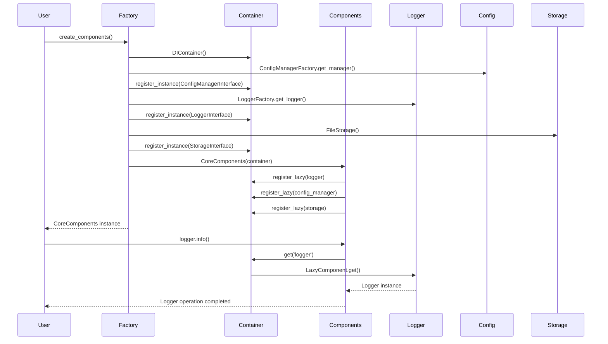
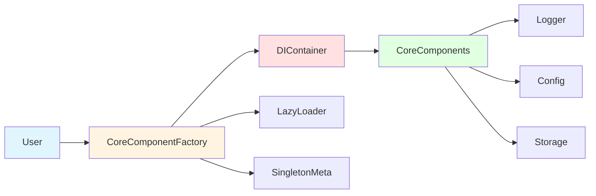
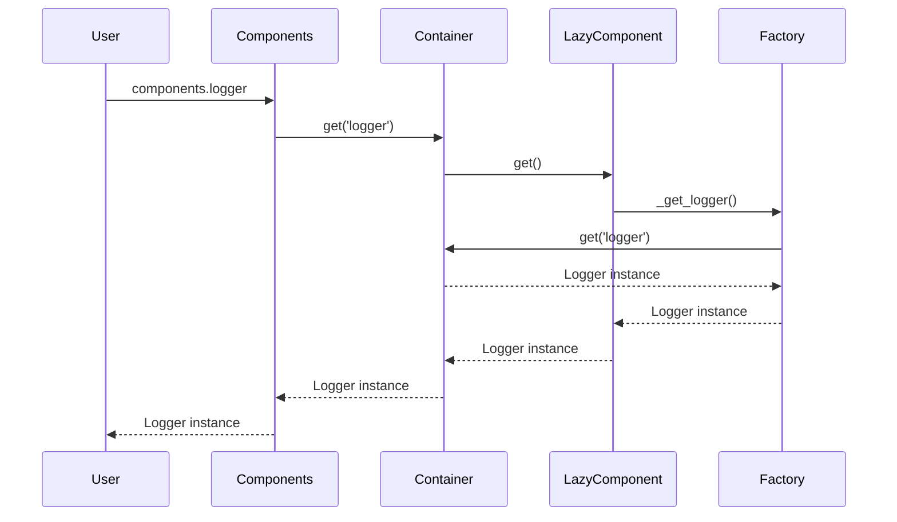
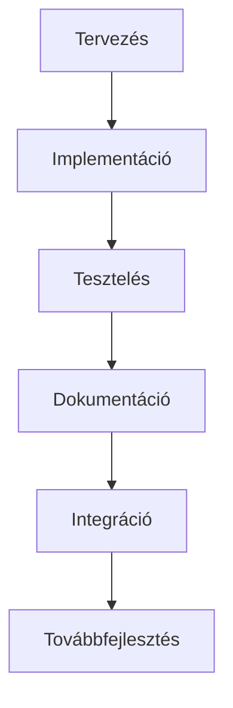

# Base Komponens Architektúra Áttekintés

## Áttekintés

A Base komponens a Neural AI Next projekt alapvető infrastruktúráját biztosítja. Ez a dokumentum a komponens architektúráját, tervezési alapelveit és a komponensek közötti kapcsolatokat mutatja be.

## Architektúra célok

A Base komponens architektúrájának fő céljai:

1. **Egyszerűség** - Egyszerű és könnyen érthető API biztosítása
2. **Bővíthetőség** - Könnyű bővítés új komponensekkel és funkciókkal
3. **Teljesítmény** - Optimalizált működés lazy loadinggel és gyorsítótárazással
4. **Megbízhatóság** - Szálbiztos működés és robusztus hibakezelés
5. **Karbantarthatóság** - Tiszta kódstruktúra és jól dokumentált API

## Főbb komponensek

### 1. DIContainer (Dependency Injection Container)

A DIContainer a dependency injection mintát valósítja meg, és felelős a komponensek életciklusának kezeléséért.

**Kulcsfontosságú funkciók:**
- Komponens regisztráció és feloldás
- Lazy loading támogatás
- Singleton minta kényszerítése
- Memóriahasználat monitorozása

**Kapcsolódó dokumentáció:** [DIContainer API](../api/container.md)

### 2. CoreComponents

A CoreComponents osztály egységes interfészt biztosít a logger, config és storage komponensek eléréséhez.

**Kulcsfontosságú funkciók:**
- Egységes komponens elérés
- Lazy loading támogatás
- Komponens validáció
- Preload funkció

**Kapcsolódó dokumentáció:** [CoreComponents API](../api/core_components.md)

### 3. CoreComponentFactory

A CoreComponentFactory felelős a core komponensek létrehozásáért és konfigurálásáért.

**Kulcsfontosságú funkciók:**
- Komponensek létrehozása
- Konfiguráció kezelés
- Függőség validáció
- Singleton mintázat

**Kapcsolódó dokumentáció:** [CoreComponentFactory API](../api/factory.md)

### 4. Lazy Loading Mechanizmus

A lazy loading mechanizmus optimalizálja a memóriahasználatot és a betöltési időt.

**Kulcsfontosságú funkciók:**
- Erőforrások lustabetöltése
- Thread-safe működés
- Reset funkció teszteléshez

**Kapcsolódó dokumentáció:** [Lazy Loading API](../api/lazy_loading.md)

### 5. Singleton Minta

A singleton minta biztosítja, hogy minden komponensből csak egy példány legyen.

**Kulcsfontosságú funkciók:**
- Metaclass alapú implementáció
- Thread-safe működés
- Egyszerű használat

**Kapcsolódó dokumentáció:** [Singleton API](../api/singleton.md)

## Komponens struktúra

```mermaid
graph TB
    A[Base Komponens] --> B[DIContainer]
    A --> C[CoreComponents]
    A --> D[CoreComponentFactory]
    A --> E[Lazy Loading]
    A --> F[Singleton Meta]
    A --> G[Kivételek]

    B --> B1[LazyComponent]
    B --> B2[Komponens regisztráció]
    B --> B3[Komponens feloldás]

    C --> C1[Logger tulajdonság]
    C --> C2[Config tulajdonság]
    C --> C3[Storage tulajdonság]
    C --> C4[LazyLoader]

    D --> D1[create_components]
    D --> D2[create_minimal]
    D --> D3[create_with_container]
    D --> D4[SingletonMeta]

    E --> E1[LazyLoader osztály]
    E --> E2[lazy_property dekorátor]

    F --> F1[__call__ metódus]
    F --> F2[_instances szótár]

    G --> G1[NeuralAIException]
    G --> G2[StorageException]
    G --> G3[ConfigurationError]
    G --> G4[ComponentNotFoundError]

    style A fill:#e1f5ff
    style B fill:#fff4e1
    style C fill:#ffe1e1
    style D fill:#e1ffe1
    style E fill:#f0e1ff
    style F fill:#ffe1f5
    style G fill:#e1f5e1
```



## Adatfolyam diagram



## Tervezési minták

### 1. Dependency Injection (DI)

A dependency injection minta lehetővé teszi a komponensek lazítását és a függőségek egyszerű kezelését.

```python
from neural_ai.core.base import DIContainer, CoreComponentFactory

# DI konténer használata
container = DIContainer()
container.register_instance(MyInterface, MyImplementation())

# Factory használata
components = CoreComponentFactory.create_with_container(container)
```

### 2. Singleton

A singleton minta biztosítja, hogy minden komponensből csak egy példány legyen.

```python
from neural_ai.core.base.singleton import SingletonMeta

class MySingleton(metaclass=SingletonMeta):
    pass

instance1 = MySingleton()
instance2 = MySingleton()
assert instance1 is instance2  # True
```

### 3. Lazy Loading

A lazy loading optimalizálja a memóriahasználatot és a betöltési időt.

```python
from neural_ai.core.base.lazy_loading import LazyLoader

loader = LazyLoader(expensive_operation)
# A művelet csak itt hajtódik végre:
result = loader()
```

### 4. Factory Method

A factory method minta a komponensek létrehozását egységesíti.

```python
from neural_ai.core.base import CoreComponentFactory

components = CoreComponentFactory.create_components(
    config_path='config.yaml',
    log_path='app.log',
    storage_path='./data'
)
```

## Komponens kölcsönhatások

### 1. Alapvető interakciók



### 2. Lazy loading interakciók



## Teljesítmény jellemzők

### 1. Lazy Loading

- **Memóriahatékonyság**: A komponensek csak akkor töltődnek be, amikor szükség van rájuk
- **Gyors indítás**: Az alkalmazás gyorsabban indul, mert nem tölt be mindent előre
- **Optimalizált erőforrás használat**: Csak a ténylegesen használt erőforrások kerülnek betöltésre

### 2. Singleton Pattern

- **Memóriatakarékosság**: Minden komponensből csak egy példány létezik
- **Konzisztencia**: Biztosítja, hogy mindenhol ugyanaz a példány legyen használva
- **Thread safety**: Szálbiztos hozzáférés a singleton példányokhoz

### 3. Thread Safety

- **Szálbiztos konténer**: A DIContainer szálbiztos működést biztosít
- **Védett erőforrások**: A lazy loading szálbiztos
- **Lock mechanizmus**: RLock használata a kritikus szakaszok védelméhez

## Biztonsági megfontolások

### 1. Komponens izoláció

A komponensek jól el vannak különítve egymástól, ami növeli a biztonságot:

```python
# Minden komponens saját interfészen keresztül érhető el
components.logger  # LoggerInterface
components.config  # ConfigManagerInterface
components.storage  # StorageInterface
```

### 2. Singleton védelme

A singleton minta megakadályozza a nem kívánt példányok létrehozását:

```python
# Csak egy példány létezik
factory1 = CoreComponentFactory(container)
factory2 = CoreComponentFactory(container)
assert factory1 is factory2  # True
```

### 3. Hibakezelés

Átfogó kivétel hierarchia biztosítja a biztonságos hibakezelést:

```python
from neural_ai.core.base.exceptions import (
    ComponentNotFoundError,
    SingletonViolationError,
    ConfigurationError
)

try:
    component = container.get('unknown')
except ComponentNotFoundError as e:
    # Biztonságos hibakezelés
    handle_error(e)
```

## Skálázhatóság

### 1. Horizontális skálázás

A Base komponens támogatja a horizontális skálázást:

```python
# Több példány is használhatja ugyanazt a konténert
container = DIContainer()
components1 = CoreComponents(container)
components2 = CoreComponents(container)
```

### 2. Vertikális skálázás

A lazy loading lehetővé teszi a vertikális skálázást:

```python
# Csak a szükséges komponensek töltődnek be
if user_needs_logger:
    components.logger.info("Üzenet")

if user_needs_config:
    settings = components.config.get_section('app')
```

## Karbantarthatóság

### 1. Modularitás

A komponensek jól elkülöníthető modulokra vannak bontva:

```
neural_ai/core/base/
├── __init__.py
├── container.py
├── core_components.py
├── factory.py
├── exceptions.py
├── lazy_loading.py
└── singleton.py
```

### 2. Dokumentáció

Minden komponens rendelkezik átfogó dokumentációval:

- API dokumentáció
- Használati példák
- Hibakezelési útmutatók
- Teljesítmény optimalizációk

### 3. Tesztelhetőség

A komponensek könnyen tesztelhetők:

```python
# Lazy loader reset teszteléshez
loader.reset()

# Mock objektumok használata
container.register_instance(MyInterface, MockImplementation())
```

## Fejlesztési folyamat

### 1. Komponens létrehozása



### 2. Verziókezelés

A komponensek verzióit a [CHANGELOG.md](../CHANGELOG.md) fájlban követjük nyomon.

### 3. Visszamenőleges kompatibilitás

A Base komponens biztosítja a visszamenőleges kompatibilitást:

```python
# Régi API (továbbra is működik)
container = DIContainer()
container.register_instance(MyInterface, MyImplementation())

# Új API
components = CoreComponentFactory.create_components()
```

## Kapcsolódó dokumentáció

- [Tervezési alapelvek](design_principles.md)
- [Komponens kölcsönhatások](component_interactions.md)
- [Függőségi gráf](dependency_graph.md)
- [Komponens életciklus](lifecycle.md)
- [API dokumentáció](../api/overview.md)
- [Fejlesztési útmutató](../../guides/getting_started.md)

## Következő lépések

1. [Tervezési alapelvek](design_principles.md) - A Base komponens tervezési alapelveinek megismerése
2. [Komponens kölcsönhatások](component_interactions.md) - A komponensek közötti interakciók részletes elemzése
3. [Függőségi gráf](dependency_graph.md) - A komponensek függőségi viszonyainak megértése
4. [Komponens életciklus](lifecycle.md) - A komponensek életciklusának tanulmányozása
5. [API dokumentáció](../api/overview.md) - A teljes API referencia áttekintése

---

**Dokumentum verzió:** 1.0
**Utolsó frissítés:** 2025-12-19
**Architektúra:** Base Komponens
