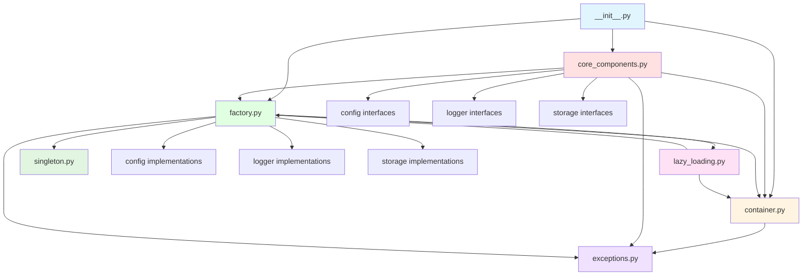
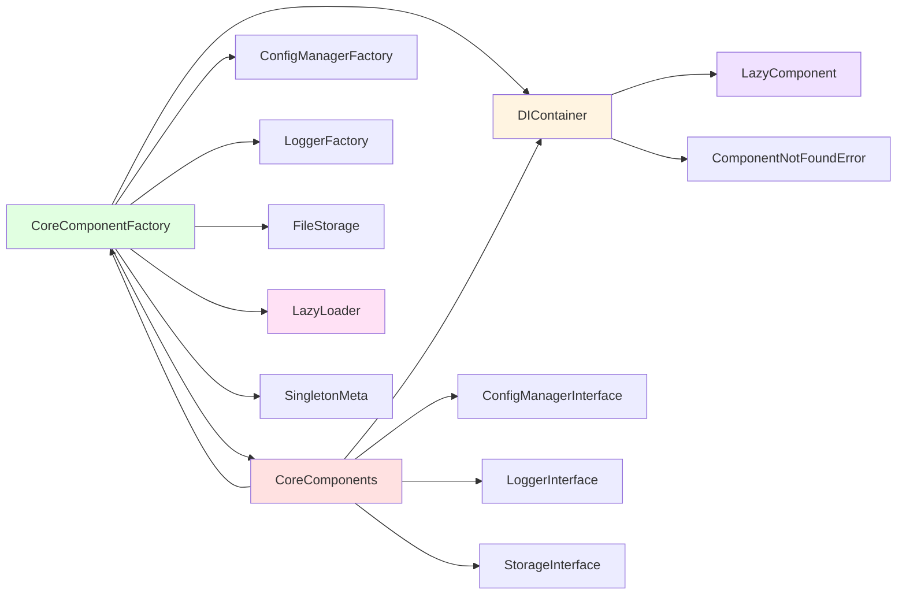
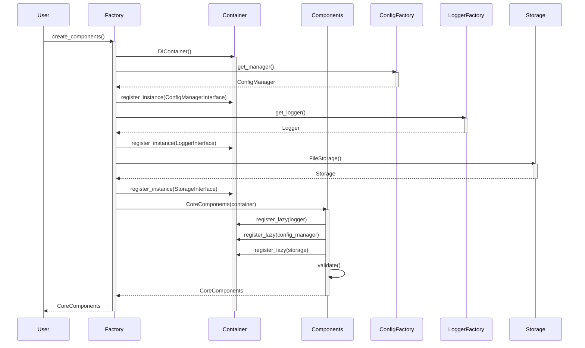
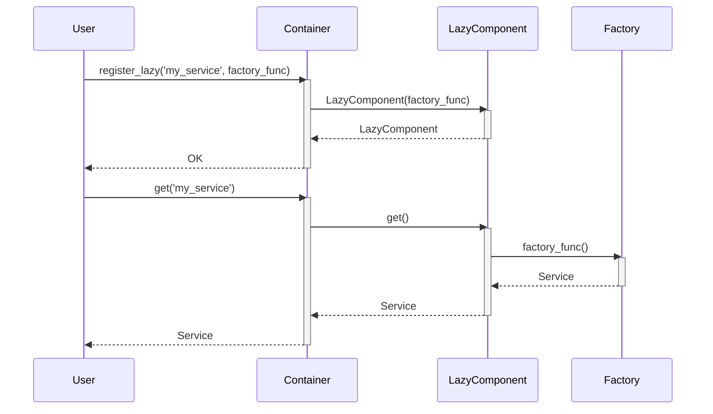

# Funkció-hívási Térkép és Függőségi Diagramok

## Áttekintés

Ez a dokumentum a Base komponens metódus hívási gráfját és függőségi diagramjait tartalmazza. A dokumentum segít megérteni, hogy a különböző osztályok és metódusaik hogyan kapcsolódnak egymáshoz, és melyik metódus melyik fájlból hívja meg a másikat.

## Tartalomjegyzék

1. [Osztályok és metódusok listája](#osztályok-és-metódusok-listája)
2. [Metódus hívási gráf](#metódus-hívási-gráf)
3. [Függőségi gráf](#függőségi-gráf)
4. [Import kapcsolatok](#import-kapcsolatok)
5. [Komponens függőségi gráf](#komponens-függőségi-gráf)
6. [Metódus szintű függőségi gráf](#metódus-szintű-függőségi-gráf)

## Osztályok és metódusok listája

### [`__init__.py`](neural_ai/core/base/__init__.py:1)

**Exportált osztályok:**
- `DIContainer` - Dependency injection konténer
- `CoreComponents` - Core komponensek gyűjteménye
- `CoreComponentFactory` - Komponens factory

### [`container.py`](neural_ai/core/base/container.py:1)

#### LazyComponent osztály

- `__init__(factory_func: Callable[[], Any])` - Inicializálás
- `get() -> Any` - Komponens lekérése (lazy loading)
- `is_loaded: bool` - Betöltöttség ellenőrzése

#### DIContainer osztály

- `__init__()` - Konténer inicializálása
- `register_instance(interface, instance)` - Példány regisztrálása
- `register_factory(interface, factory)` - Factory regisztrálása
- `resolve(interface) -> Optional[Any]` - Függőség feloldása
- `register_lazy(component_name, factory_func)` - Lazy komponens regisztrálása
- `get(component_name) -> Any` - Komponens lekérése
- `get_lazy_components() -> Dict[str, bool]` - Lazy komponensek státusza
- `preload_components(component_names)` - Komponensek előtöltése
- `clear()` - Konténer ürítése
- `_verify_singleton(instance, component_name)` - Singleton ellenőrzés
- `_enforce_singleton(component_name, instance)` - Singleton kényszerítés
- `register(component_name, instance)` - Komponens regisztrálása
- `get_memory_usage() -> Dict[str, Any]` - Memóriahasználat lekérdezése

### [`core_components.py`](neural_ai/core/base/core_components.py:1)

#### LazyLoader osztály

- `__init__(loader_func: Callable[[], T])` - Inicializálás
- `_load() -> T` - Erőforrás betöltése
- `__call__() -> T` - Betöltött erőforrás lekérése
- `is_loaded: bool` - Betöltöttség ellenőrzése
- `reset()` - Betöltő alaphelyzetbe állítása

#### CoreComponents osztály

- `__init__(container: Optional[DIContainer])` - Inicializálás
- `_register_lazy_components()` - Lazy komponensek regisztrálása
- `config: Optional[ConfigManagerInterface]` - Konfiguráció tulajdonság
- `logger: Optional[LoggerInterface]` - Logger tulajdonság
- `storage: Optional[StorageInterface]` - Storage tulajdonság
- `preload_all()` - Összes komponens előtöltése
- `has_config() -> bool` - Konfiguráció ellenőrzése
- `has_logger() -> bool` - Logger ellenőrzése
- `has_storage() -> bool` - Storage ellenőrzése
- `validate() -> bool` - Komponensek validálása

### [`exceptions.py`](neural_ai/core/base/exceptions.py:1)

#### Kivétel hierarchia

- `NeuralAIException` (alap kivétel)
  - `StorageException`
    - `StorageWriteError`
    - `StorageReadError`
    - `StoragePermissionError`
    - `InsufficientDiskSpaceError`
    - `PermissionDeniedError`
  - `ConfigurationError`
  - `DependencyError`
  - `SingletonViolationError`
  - `ComponentNotFoundError`
  - `NetworkException`
    - `TimeoutError`
    - `ConnectionError`

### [`factory.py`](neural_ai/core/base/factory.py:1)

#### CoreComponentFactory osztály

- `__init__(container: DIContainer)` - Inicializálás
- `_get_logger() -> LoggerInterface` - Logger lekérése
- `_get_config_manager() -> ConfigManagerInterface` - Konfiguráció lekérése
- `_get_storage() -> StorageInterface` - Storage lekérése
- `logger: LoggerInterface` - Logger tulajdonság
- `config_manager: ConfigManagerInterface` - Konfiguráció tulajdonság
- `storage: StorageInterface` - Storage tulajdonság
- `_expensive_config: Dict[str, Any]` - Drága konfiguráció (lazy property)
- `_component_cache: Dict[str, Any]` - Komponens gyorsítótár (lazy property)
- `_process_config(config) -> Dict[str, Any]` - Konfiguráció feldolgozása
- `_load_component_cache() -> Dict[str, Any]` - Gyorsítótár betöltése
- `reset_lazy_loaders()` - Lazy loader-ek alaphelyzetbe állítása
- `_validate_dependencies(component_type, config)` - Függőségek validálása
- `create_components(config_path, log_path, storage_path) -> CoreComponents` - Komponensek létrehozása
- `create_with_container(container) -> CoreComponents` - Létrehozás konténerből
- `create_minimal() -> CoreComponents` - Minimális komponensek létrehozása
- `create_logger(name, config) -> LoggerInterface` - Logger létrehozása
- `create_config_manager(config_file_path, config) -> ConfigManagerInterface` - Konfiguráció létrehozása
- `create_storage(base_directory, config) -> StorageInterface` - Storage létrehozása

### [`lazy_loading.py`](neural_ai/core/base/lazy_loading.py:1)

#### LazyLoader osztály

- `__init__(loader_func: Callable[[], T])` - Inicializálás
- `_load() -> T` - Erőforrás betöltése
- `__call__() -> T` - Betöltött erőforrás lekérése
- `is_loaded: bool` - Betöltöttség ellenőrzése
- `reset()` - Betöltő alaphelyzetbe állítása

#### lazy_property dekorátor

- `lazy_property(func) -> property` - Lazy property létrehozása

### [`singleton.py`](neural_ai/core/base/singleton.py:1)

#### SingletonMeta osztály

- `_instances: Dict[type, Any]` - Osztály szintű példány tároló
- `__call__(cls, *args, **kwargs) -> Any` - Singleton példány létrehozása/visszaadása

## Metódus hívási gráf

### CoreComponentFactory.__init__

```
CoreComponentFactory.__init__
  ├─> LazyLoader.__init__ (logger_loader)
  ├─> LazyLoader.__init__ (config_loader)
  └─> LazyLoader.__init__ (storage_loader)
```

### CoreComponentFactory.create_components

```
CoreComponentFactory.create_components
  ├─> DIContainer.__init__
  ├─> ConfigManagerFactory.get_manager
  ├─> DIContainer.register_instance (ConfigManagerInterface)
  ├─> LoggerFactory.get_logger
  ├─> DIContainer.register_instance (LoggerInterface)
  ├─> FileStorage.__init__
  ├─> DIContainer.register_instance (StorageInterface)
  ├─> CoreComponents.__init__
  │   └─> CoreComponents._register_lazy_components
  │       ├─> DIContainer.register_lazy (logger)
  │       ├─> DIContainer.register_lazy (config_manager)
  │       └─> DIContainer.register_lazy (storage)
  └─> CoreComponents.validate
      ├─> CoreComponents.has_config
      ├─> CoreComponents.has_logger
      └─> CoreComponents.has_storage
```

### CoreComponentFactory.create_minimal

```
CoreComponentFactory.create_minimal
  ├─> ConfigManagerFactory.get_manager
  ├─> ConfigManagerInterface.get_section
  ├─> LoggerFactory.get_logger
  ├─> FileStorage.__init__
  ├─> DIContainer.__init__
  ├─> DIContainer.register_instance (ConfigManagerInterface)
  ├─> DIContainer.register_instance (LoggerInterface)
  ├─> DIContainer.register_instance (StorageInterface)
  ├─> CoreComponentFactory._validate_dependencies
  └─> CoreComponents.__init__
```

### CoreComponents.config (property getter)

```
CoreComponents.config (property getter)
  └─> DIContainer.get
      └─> LazyComponent.get
          └─> CoreComponentFactory._get_config_manager
              └─> DIContainer.get
```

### CoreComponents.logger (property getter)

```
CoreComponents.logger (property getter)
  └─> DIContainer.get
      └─> LazyComponent.get
          └─> CoreComponentFactory._get_logger
              └─> DIContainer.get
```

### CoreComponents.storage (property getter)

```
CoreComponents.storage (property getter)
  └─> DIContainer.get
      └─> LazyComponent.get
          └─> CoreComponentFactory._get_storage
              └─> DIContainer.get
```

### DIContainer.register_lazy

```
DIContainer.register_lazy
  └─> LazyComponent.__init__
```

### DIContainer.get

```
DIContainer.get
  ├─> DIContainer._verify_singleton
  └─> LazyComponent.get (ha lazy komponens)
```

### DIContainer.register

```
DIContainer.register
  └─> DIContainer._enforce_singleton
```

### LazyLoader._load

```
LazyLoader._load
  └─> loader_func (factory függvény)
```

### lazy_property (dekorátor)

```
lazy_property (dekorátor)
  └─> func (a dekorált metódus)
```

## Függőségi gráf

### Import kapcsolatok

```
neural_ai/core/base/__init__.py
  └─> neural_ai/core/base/container.py (DIContainer)
  └─> neural_ai/core/base/core_components.py (CoreComponents)
  └─> neural_ai/core/base/factory.py (CoreComponentFactory)

neural_ai/core/base/container.py
  └─> neural_ai/core/base/exceptions.py (ComponentNotFoundError, SingletonViolationError)

neural_ai/core/base/core_components.py
  └─> neural_ai/core/base/container.py (DIContainer)
  └─> neural_ai/core/base/exceptions.py (ComponentNotFoundError)
  └─> neural_ai/core/base/factory.py (CoreComponentFactory)
  └─> neural_ai/core/config/interfaces/config_interface.py (ConfigManagerInterface)
  └─> neural_ai/core/logger/interfaces/logger_interface.py (LoggerInterface)
  └─> neural_ai/core/storage/interfaces/storage_interface.py (StorageInterface)

neural_ai/core/base/factory.py
  └─> neural_ai/core/base/container.py (DIContainer)
  └─> neural_ai/core/base/exceptions.py (ComponentNotFoundError, ConfigurationError, DependencyError)
  └─> neural_ai/core/base/lazy_loading.py (LazyLoader, lazy_property)
  └─> neural_ai/core/base/singleton.py (SingletonMeta)
  └─> neural_ai/core/config/exceptions.py (ConfigLoadError)
  └─> neural_ai/core/config/implementations/ (ConfigManagerFactory)
  └─> neural_ai/core/config/interfaces/config_interface.py (ConfigManagerInterface)
  └─> neural_ai/core/logger/implementations/ (LoggerFactory)
  └─> neural_ai/core/logger/interfaces/logger_interface.py (LoggerInterface)
  └─> neural_ai/core/storage/implementations/file_storage.py (FileStorage)
  └─> neural_ai/core/storage/interfaces/storage_interface.py (StorageInterface)

neural_ai/core/base/lazy_loading.py
  └─> (nincs külső függőség, csak standard library)

neural_ai/core/base/singleton.py
  └─> (nincs külső függőség, csak standard library)

neural_ai/core/base/exceptions.py
  └─> (nincs függőség)
```

### Komponens függőségi gráf



### Metódus szintű függőségi gráf



## Részletes metódus hívások

### 1. Komponens inicializálás



### 2. Lazy loading működése

```mermaid
sequenceDiagram
    participant User
    participant Components
    participant Container
    participant LazyComponent
    participant Factory

    User->>Components: components.logger
    activate Components

    Components->>Container: get('logger')
    activate Container

    Container->>LazyComponent: get()
    activate LazyComponent

    LazyComponent->>Factory: _get_logger()
    activate Factory

    Factory->>Container: get('logger')
    Container-->>Factory: Logger
    deactivate Container

    Factory-->>LazyComponent: Logger
    deactivate Factory

    LazyComponent-->>Container: Logger
    deactivate LazyComponent

    Container-->>Components: Logger
    deactivate Container

    Components-->>User: Logger
    deactivate Components
```

### 3. Komponens regisztráció és lekérés



## Függőségi láncok

### 1. Logger elérési lánc

```
User
  └─> CoreComponents.logger (property)
      └─> DIContainer.get('logger')
          └─> LazyComponent.get()
              └─> CoreComponentFactory._get_logger()
                  └─> DIContainer.get('logger')
                      └─> (visszakerül a konténerbe)
```

### 2. Config elérési lánc

```
User
  └─> CoreComponents.config (property)
      └─> DIContainer.get('config_manager')
          └─> LazyComponent.get()
              └─> CoreComponentFactory._get_config_manager()
                  └─> DIContainer.get('config_manager')
                      └─> (visszakerül a konténerbe)
```

### 3. Storage elérési lánc

```
User
  └─> CoreComponents.storage (property)
      └─> DIContainer.get('storage')
          └─> LazyComponent.get()
              └─> CoreComponentFactory._get_storage()
                  └─> DIContainer.get('storage')
                      └─> (visszakerül a konténerbe)
```

## Kritikus metódusok

### 1. Magas prioritású metódusok

Ezek a metódusok gyakran használtak és kritikusak a rendszer működéséhez:

- `CoreComponentFactory.create_components()` - Fő komponens létrehozó metódus
- `CoreComponents.logger` - Logger elérés
- `CoreComponents.config` - Konfiguráció elérés
- `CoreComponents.storage` - Tároló elérés
- `DIContainer.get()` - Komponens lekérés
- `DIContainer.register_lazy()` - Lazy komponens regisztráció

### 2. Alacsony prioritású metódusok

Ezek a metódusok ritkábban használtak vagy segédmetódusok:

- `DIContainer.get_memory_usage()` - Memóriahasználat lekérdezése
- `DIContainer.get_lazy_components()` - Lazy komponensek státusza
- `CoreComponentFactory.reset_lazy_loaders()` - Lazy loader reset (főleg teszteléshez)
- `LazyLoader.reset()` - Betöltő reset (főleg teszteléshez)

## Teljesítmény szempontok

### 1. Gyakori hívási útvonalak

```
CoreComponents.logger (gyakran hívott)
  └─> DIContainer.get (gyors, ha már betöltött)
  └─> LazyComponent.get (csak első hívásnál lassú)
```

### 2. Lassú műveletek

- `CoreComponentFactory.create_components()` - Több komponens létrehozása
- `LazyComponent.get()` (első hívás) - Komponens betöltése
- `CoreComponentFactory._validate_dependencies()` - Függőségek validálása

### 3. Gyors műveletek

- `DIContainer.get()` (ha már betöltött) - Gyorsítótárból való lekérés
- `CoreComponents.has_*()` - Egyszerű ellenőrzések
- `DIContainer.register_instance()` - Gyors regisztráció

## Kapcsolódó dokumentáció

- [API Áttekintés](api/overview.md)
- [Architektúra áttekintés](architecture/overview.md)
- [Komponens kölcsönhatások](architecture/component_interactions.md)
- [Függőségi gráf](architecture/dependency_graph.md)

---

**Dokumentum verzió:** 1.0
**Utolsó frissítés:** 2025-12-19
**Funkció-hívási térkép:** Base Komponens
