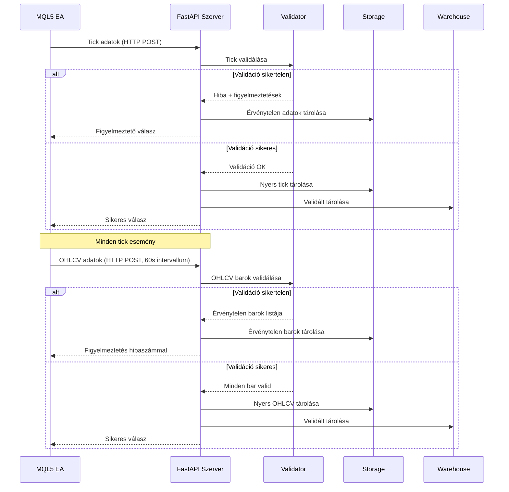
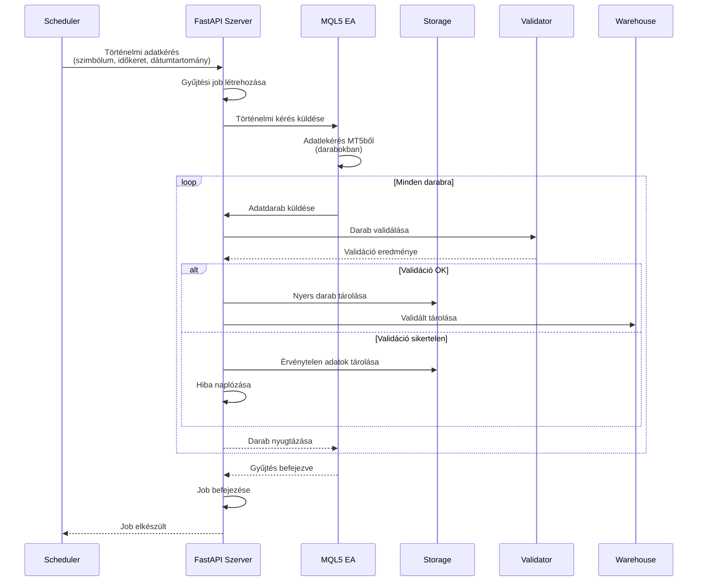
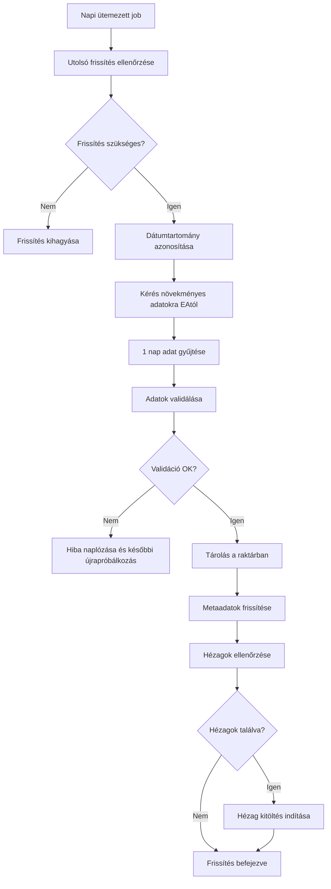
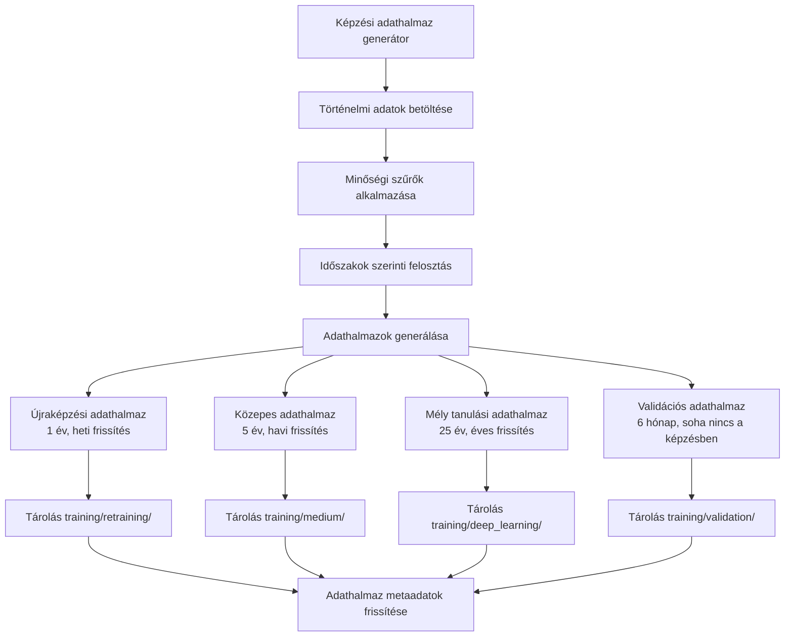

# Adatgyűjtési Stratégia Átfogó - Architektúra Terv

**Dátum:** 2025-12-16
**Verzió:** 1.0.0
**Állapot:** Vázlat ellenőrzésre

---

## Fordítás állapota

✅ **Teljes dokumentum lefordítva**
✅ **Minden szakasz magyar nyelven**
✅ **Markdown formázás megtartva**
✅ **Kódpéldák angolul maradtak**
⚠️ **Implementáció állapota: Tervezési fázis**

---

## Vezetői Összefoglaló

Ez a dokumentum az MT5 Collector adatgyűjtési stratégia átfogó felülvizsgálatát mutatja be, amely támogatja:

1. **Történelmi adatgyűjtés** (25 év visszamenőleg) - Modellképzéshez
2. **Növekményes frissítések** (3-12 hónap) - Adatfrissesség fenntartása
3. **Valós idejű adatgyűjtés** - Jelenlegi funkcionalitás (továbbra is működik)
4. **Adatminőség-ellenőrzés** - Automatizált validációs keretrendszer
5. **Képzési adathalmazok** - Különböző modelltípusokhoz szegregált adathalmazok

---

## Tartalomjegyzék

1. [Jelenlegi állapot elemzése](#1-jelenlegi-állapot-elemzése)
2. [Javasolt architektúra](#2-javasolt-architektúra)
3. [Adatfolyam diagramok](#3-adatfolyam-diagramok)
4. [Adatraktár szerkezet](#4-adatraktár-szerkezet)
5. [API specifikációk](#5-api-specifikációk)
6. [Adatminőségi keretrendszer](#6-adatminőségi-keretrendszer)
7. [Képzési adathalmaz szervezés](#7-képzési-adathalmaz-szervezés)
8. [Implementációs terv](#8-implementációs-terv)
9. [Kockázatértékelés](#9-kockázatértékelés)

---

## 1. Jelenlegi állapot elemzése

### 1.1 Meglévő rendszer áttekintése

**Jelenlegi képességek:**
- ✅ Valós idejű tick adatgyűjtés (4 instrumentum)
- ✅ Valós idejű OHLCV adatgyűjtés (4 instrumentum × 6 időkeret = 24 kombináció)
- ✅ FastAPI szerver adatfogadásra
- ✅ Adatvalidáció és hibakezelés
- ✅ Többformátumú tárolás (CSV, JSONL, Parquet)
- ✅ Adatraktár szerkezet (alap)

**Jelenlegi korlátozások:**
- ❌ Nincs történelmi adatgyűjtési stratégia
- ❌ Nincs növekményes frissítési mechanizmus
- ❌ Nincs képzési adathalmaz szegregáció
- ❌ Korlátozott adatminőség monitorozás
- ❌ Nincs automatizált hézag detektálás

### 1.2 Technológiai stack

**Backend:**
- Python 3.x FastAPI-val
- Pandas adatfeldolgozáshoz
- FastParquet hatékony tároláshoz
- Pydantic adatvalidációhoz

**MQL5 Expert Advisor:**
- Több instrumentum támogatás (EURUSD, GBPUSD, USDJPY, XAUUSD)
- Több időkeret támogatás (M1, M5, M15, H1, H4, D1)
- HTTP kommunikáció FastAPI szerverrel
- Időzítő alapú OHLCV frissítések (60 másodperces intervallum)
- Eseményvezérelt tick adatgyűjtés

**Adattárolás:**
- Alap útvonal: `data/`
- Jelenlegi szerkezet: `data/collectors/mt5/` és `data/mt5/`
- Formátumok: CSV, JSONL, Parquet
- Raktár szerkezet: `data/warehouse/`

---

## 2. Javasolt architektúra

### 2.1 Magas szintű architektúra

```
┌─────────────────────────────────────────────────────────────────┐
│                      MQL5 Expert Advisor                        │
│  ┌──────────────────────────────────────────────────────────┐  │
│  │  Valós idejű mód        │  Történelmi mód                │  │
│  │  - Tick gyűjtés        │  - Kötegelt adatkérések         │  │
│  │  - OHLCV frissítések   │  - Darabolt válaszok            │  │
│  │  - Eseményvezérelt     │  - Folyamat nyomon követése     │  │
│  └──────────────────────────────────────────────────────────┘  │
└────────────────────────┬────────────────────────────────────────┘
                          │ HTTP/JSON
                          │
┌────────────────────────▼────────────────────────────────────────┐
│                    FastAPI Szerver (Python)                     │
│  ┌──────────────────────────────────────────────────────────┐  │
│  │  API végpontok                                             │  │
│  │  - /api/v1/collect/tick (valós idejű)                     │  │
│  │  - /api/v1/collect/ohlcv (valós idejű)                    │  │
│  │  - /api/v1/historical/request (ÚJ)                        │  │
│  │  - /api/v1/historical/collect (ÚJ)                        │  │
│  │  - /api/v1/validation/report                              │  │
│  │  - /api/v1/storage/stats                                  │  │
│  └──────────────────────────────────────────────────────────┘  │
│  ┌──────────────────────────────────────────────────────────┐  │
│  │  Adatfeldolgozó réteg                                     │  │
│  │  - Validáció és minőségellenőrzések                      │  │
│  │  - Hézag detektálás és kitöltés                          │  │
│  │  - Adat transzformáció                                    │  │
│  │  - Képzési adathalmaz generálás                           │  │
│  └──────────────────────────────────────────────────────────┘  │
└────────────────────────┬────────────────────────────────────────┘
                          │
          ┌───────────────┴───────────────┐
          │                               │
┌────────▼────────┐            ┌────────▼────────┐
│  Adattárolás    │            │  Képzési halmazok│
│  - Nyers adatok │            │  - Újraképzés   │
│  - Validált     │            │  - Közepes      │
│  - Feldolgozott │            │  - Mély tanulás │
│  - Történelmi   │            │  - Validáció    │
└─────────────────┘            └─────────────────┘
```

### 2.2 Komponens architektúra

#### 2.2.1 MQL5 Expert Advisor bővítmények

**Új funkcionalitás:**
1. **Történelmi adatkérés kezelő**
   - Figyeli a történelmi adatkéréseket a Pythontól
   - Feldolgozza a kötegelt kéréseket (pl. "szerezz 1 év EURUSD M1 adatot")
   - Darabokban küldi az adatokat timeout elkerülésére

2. **Folyamat nyomon követés**
   - Jelentést készít a hosszú futású történelmi kérésekről
   - Kezeli a megszakításokat és folytatási képességet

3. **Konfigurálható adatlekérés**
   - Támogatja a különböző dátumtartományokat
   - Konfigurálható kötegméretek
   - Rátelimítés az MT5 API túlterhelés elkerülésére

#### 2.2.2 FastAPI szerver bővítmények

**Új végpontok:**
```
POST /api/v1/historical/request
- Történelmi adatkérés az EAtól
- Visszaadja a követéshez a job ID-t

GET /api/v1/historical/status/{job_id}
- Történelmi adatgyűjtési job állapotának ellenőrzése

POST /api/v1/historical/collect
- EA küld történelmi adatdarabokat
- Szerver validál és tárol

GET /api/v1/data/gaps
- Hézagok azonosítása a tárolóban

POST /api/v1/data/fill-gaps
- Hézag kitöltés kérése az EAtól
```

**Bővített feldolgozás:**
1. **Történelmi adatkezelő**
   - Kezeli a történelmi adatgyűjtési jobokat
   - Követi a folyamatot és kezeli a hibákat
   - Koordinál az EAval

2. **Hézag detektáló motor**
   - Szkennelja a meglévő adatokat hézagokért
   - Azonosítja a hiányzó időszakokat
   - Indítja az automatikus hézag kitöltést

3. **Képzési adathalmaz generátor**
   - Létrehozza a képzési adathalmazokat a történelmi adatokból
   - Szegregálja modelltípus és időszak szerint
   - Validálja az adatminőséget

#### 2.2.3 Adattároló architektúra

**Háromszintű tárolási stratégia:**

1. **Nyers tároló** (`data/collectors/mt5/raw/`)
   - Közvetlenül az EAtól, minimális feldolgozással
   - Instrumentum/időkeret/dátum szerint szervezve
   - Parquet formátum a hatékonyságért

2. **Validált tároló** (`data/warehouse/validated/`)
   - Minőségellenőrzött adatok
   - Hézagmentes, validált
   - Feldolgozásra kész

3. **Képzési tároló** (`data/training/`)
   - ML modellekhez kurált adathalmazok
   - Modelltípus szerint szegregálva
   - Képzési folyamatokhoz optimalizálva

---

## 3. Adatfolyam diagramok

### 3.1 Valós idejű adatgyűjtési folyam



### 3.2 Történelmi adatgyűjtési folyam



### 3.3 Növekményes frissítési folyam



### 3.4 Képzési adathalmaz generálási folyam



---

## 4. Adatraktár szerkezet

### 4.1 Teljes könyvtárszerkezet

```
data/
├── collectors/
│   └── mt5/
│       ├── raw/                          # Nyers adatok az EAtól
│       │   ├── ticks/                    # Tick adatok
│       │   │   ├── EURUSD/
│       │   │   │   └── 2025/
│       │   │   │       └── 12/
│       │   │   │           └── 16.jsonl
│       │   │   ├── GBPUSD/
│       │   │   ├── USDJPY/
│       │   │   └── XAUUSD/
│       │   └── ohlcv/                    # OHLCV adatok
│       │       ├── EURUSD/
│       │       │   ├── M1/
│       │       │   │   └── 2025/
│       │       │   │       └── 12.parquet
│       │       │   ├── M5/
│       │       │   ├── M15/
│       │       │   ├── H1/
│       │       │   ├── H4/
│       │       │   └── D1/
│       │       ├── GBPUSD/
│       │       ├── USDJPY/
│       │       └── XAUUSD/
│       ├── invalid/                      # Érvénytelen adatok elemzésre
│       │   ├── EURUSD_ticks_invalid.jsonl
│       │   └── EURUSD_ohlcv_invalid.jsonl
│       └── logs/                         # Collector naplók
│           └── collector.log
│
├── warehouse/                            # Adatraktár
│   ├── historical/                       # 25 év történelmi adat
│   │   ├── EURUSD/
│   │   │   ├── M1_2000_2025.parquet
│   │   │   ├── M5_2000_2025.parquet
│   │   │   ├── M15_2000_2025.parquet
│   │   │   ├── H1_2000_2025.parquet
│   │   │   ├── H4_2000_2025.parquet
│   │   │   └── D1_2000_2025.parquet
│   │   ├── GBPUSD/
│   │   ├── USDJPY/
│   │   └── XAUUSD/
│   │
│   ├── update/                           # Növekményes frissítések (3-12 hónap)
│   │   ├── EURUSD/
│   │   │   ├── M1_2025_01_2025_12.parquet
│   │   │   └── ...
│   │   ├── GBPUSD/
│   │   ├── USDJPY/
│   │   └── XAUUSD/
│   │
│   ├── realtime/                         # Valós idejű adatok (jelenlegi)
│   │   ├── EURUSD/
│   │   │   ├── M1_current.parquet
│   │   │   └── ...
│   │   ├── GBPUSD/
│   │   ├── USDJPY/
│   │   └── XAUUSD/
│   │
│   └── validated/                        # Minőség-validált adatok
│       ├── EURUSD/
│       │   ├── M1_validated.parquet
│       │   └── ...
│       ├── GBPUSD/
│       ├── USDJPY/
│       └── XAUUSD/
│
├── training/                             # Képzési adathalmazok
│   ├── retraining/                       # 1 év, heti frissítések
│   │   ├── EURUSD/
│   │   │   ├── M1_retraining_2024_2025.parquet
│   │   │   └── ...
│   │   ├── GBPUSD/
│   │   ├── USDJPY/
│   │   └── XAUUSD/
│   │
│   ├── medium/                           # 5 év, havi frissítések
│   │   ├── EURUSD/
│   │   │   ├── M1_medium_2020_2025.parquet
│   │   │   └── ...
│   │   ├── GBPUSD/
│   │   ├── USDJPY/
│   │   └── XAUUSD/
│   │
│   ├── deep_learning/                    # 25 év, éves frissítések
│   │   ├── EURUSD/
│   │   │   ├── M1_deep_2000_2025.parquet
│   │   │   └── ...
│   │   ├── GBPUSD/
│   │   ├── USDJPY/
│   │   └── XAUUSD/
│   │
│   └── validation/                       # 6 hónap, soha nincs a képzésben
│       ├── EURUSD/
│       │   ├── M1_validation_2025_06_2025_12.parquet
│       │   └── ...
│       ├── GBPUSD/
│       ├── USDJPY/
│       └── XAUUSD/
│
└── metadata/                             # Metaadatok és követés
    ├── instruments.json                  # Instrumentum definíciók
    ├── timeframes.json                   # Időkeret definíciók
    ├── data_quality.json                 # Minőségi metrikák
    ├── collection_jobs.json              # Történelmi gyűjtési jobok
    ├── training_datasets.json            # Képzési adathalmaz metaadatok
    └── gaps.json                         # Azonosított adat hézagok
```

### 4.2 Tároló formátum specifikációk

**Parquet formátum (Elsődleges):**
- Tömörítés: Snappy
- Séma:
  ```python
  {
      "timestamp": int64,      # Unix időbélyeg
      "time": int64,           # Bar nyitási idő
      "open": float64,
      "high": float64,
      "low": float64,
      "close": float64,
      "volume": int64,
      "symbol": string,        # Partíciós kulcs
      "timeframe": string      # Partíciós kulcs
  }
  ```
- Particionálás: Szimbólum és időkeret szerint
- Előnyök: Gyors lekérdezés, tömörítés, séma evolúció

**JSONL formátum (Másodlagos):**
- Használat: Tick adatok, érvénytelen adatok, naplók
- Szerkezet: Egy JSON objektum soronként
- Előnyök: Csak hozzáfűzés, könnyű hibakeresés

**CSV formátum (Harmadlagos):**
- Használat: Emberi ellenőrzés, adatexportok
- Szerkezet: Szabványos CSV fejlécekkel
- Előnyök: Ember által olvasható, univerzális kompatibilitás

### 4.3 Adatmegőrzési politika

| Adattípus          | Megőrzési időszak | Tárolási hely               | Tisztítási politika            |
| ------------------ | ----------------- | --------------------------- | ------------------------------ |
| Nyers tickek       | 30 nap            | `collectors/mt5/raw/ticks/` | Automatikus törlés 30 nap után |
| Nyers OHLCV        | 90 nap            | `collectors/mt5/raw/ohlcv/` | Automatikus törlés 90 nap után |
| Érvénytelen adatok | 1 év              | `collectors/mt5/invalid/`   | Kézi ellenőrzés majd törlés    |
| Történelmi         | Állandó           | `warehouse/historical/`     | Soha ne töröljük               |
| Frissítés          | 1 év              | `warehouse/update/`         | Évente történelmihez egyesítés |
| Valós idejű        | 30 nap            | `warehouse/realtime/`       | Havi frissítésre gördítés      |
| Képzési            | Állandó           | `training/`                 | Verziózott, mindet megtartjuk  |

---

## 5. API specifikációk

### 5.1 Új történelmi adat végpontok

#### 5.1.1 Történelmi adatkérés

**Végpont:** `POST /api/v1/historical/request`

**Kérés törzse:**
```json
{
  "symbol": "EURUSD",
  "timeframe": "M1",
  "start_date": "2000-01-01",
  "end_date": "2025-12-31",
  "batch_size": 365,  // napok per köteg
  "priority": "low"   // low, normal, high
}
```

**Válasz:**
```json
{
  "job_id": "job_12345",
  "status": "queued",
  "estimated_duration": "2 hours",
  "total_batches": 26,
  "message": "Történelmi adatgyűjtési job létrehozva"
}
```

#### 5.1.2 Job állapot ellenőrzése

**Végpont:** `GET /api/v1/historical/status/{job_id}`

**Válasz:**
```json
{
  "job_id": "job_12345",
  "status": "in_progress",
  "progress": {
    "completed_batches": 10,
    "total_batches": 26,
    "percentage": 38.46
  },
  "current_batch": {
    "batch_number": 11,
    "date_range": "2010-01-01 to 2010-12-31"
  },
  "errors": [],
  "started_at": "2025-12-16T20:00:00Z",
  "estimated_completion": "2025-12-16T22:00:00Z"
}
```

#### 5.1.3 Történelmi adatgyűjtés (EA → Szerver)

**Végpont:** `POST /api/v1/historical/collect`

**Kérés törzse:**
```json
{
  "job_id": "job_12345",
  "batch_number": 1,
  "symbol": "EURUSD",
  "timeframe": "M1",
  "date_range": {
    "start": "2000-01-01",
    "end": "2000-12-31"
  },
  "bars": [
    {
      "time": 946684800,
      "open": 1.0100,
      "high": 1.0120,
      "low": 1.0090,
      "close": 1.0115,
      "volume": 1000
    }
    // ... több bar
  ]
}
```

**Válasz:**
```json
{
  "status": "success",
  "batch_number": 1,
  "bars_received": 525600,
  "bars_stored": 525600,
  "message": "Köteg sikeresen tárolva"
}
```

### 5.2 Hézag detektáló végpontok

#### 5.2.1 Hézagok azonosítása

**Végpont:** `GET /api/v1/data/gaps`

**Query paraméterek:**
- `symbol` (opcionális): Szűrés szimbólum szerint
- `timeframe` (opcionális): Szűrés időkeret szerint
- `start_date` (opcionális): Elemzési időszak kezdete
- `end_date` (opcionális): Elemzési időszak vége

**Válasz:**
```json
{
  "analysis_period": {
    "start": "2000-01-01",
    "end": "2025-12-16"
  },
  "gaps": [
    {
      "symbol": "EURUSD",
      "timeframe": "M1",
      "start": "2020-03-15T10:30:00Z",
      "end": "2020-03-15T12:45:00Z",
      "duration_minutes": 135,
      "missing_bars": 135
    }
  ],
  "total_gaps": 15,
  "total_missing_bars": 2047
}
```

#### 5.2.2 Hézagok kitöltése

**Végpont:** `POST /api/v1/data/fill-gaps`

**Kérés törzse:**
```json
{
  "gaps": [
    {
      "symbol": "EURUSD",
      "timeframe": "M1",
      "start": "2020-03-15T10:30:00Z",
      "end": "2020-03-15T12:45:00Z"
    }
  ],
  "priority": "high"
}
```

**Válasz:**
```json
{
  "job_id": "gap_fill_123",
  "gaps_requested": 1,
  "status": "queued",
  "message": "Hézag kitöltési job létrehozva"
}
```

### 5.3 Képzési adathalmaz végpontok

#### 5.3.1 Képzési adathalmaz generálása

**Végpont:** `POST /api/v1/training/generate`

**Kérés törzse:**
```json
{
  "dataset_type": "retraining",  // retraining, medium, deep_learning, validation
  "symbols": ["EURUSD", "GBPUSD", "USDJPY", "XAUUSD"],
  "timeframes": ["M1", "M5", "M15", "H1", "H4", "D1"],
  "date_range": {
    "start": "2024-01-01",
    "end": "2025-12-16"
  },
  "quality_threshold": 0.95,  // Minimális adatminőség pontszám
  "output_format": "parquet"
}
```

**Válasz:**
```json
{
  "dataset_id": "dataset_retraining_2025_12",
  "status": "generating",
  "estimated_size_gb": 2.5,
  "estimated_records": 15000000,
  "message": "Képzési adathalmaz generálás elindítva"
}
```

#### 5.3.2 Adathalmaz állapot lekérdezése

**Végpont:** `GET /api/v1/training/status/{dataset_id}`

**Válasz:**
```json
{
  "dataset_id": "dataset_retraining_2025_12",
  "status": "completed",
  "size_gb": 2.3,
  "records": 14250000,
  "quality_score": 0.98,
  "created_at": "2025-12-16T18:00:00Z",
  "completed_at": "2025-12-16T19:30:00Z",
  "location": "data/training/retraining/"
}
```

---

## 6. Adatminőségi keretrendszer

### 6.1 Minőség validációs szabályok

**1. szint - Alap validáció (Valós idejű):**
- ✅ Adattípus validáció
- ✅ Tartomány validáció (ár, volumen)
- ✅ Idő sorrend validáció
- ✅ OHLC kapcsolat validáció (high >= low, stb.)
- ✅ Spread validáció (bid-ask)

**2. szint - Statisztikai validáció (Köteg):**
- ✅ Kiugró érték detektálás (3-szigma szabály)
- ✅ Hézag detektálás (hiányzó barok)
- ✅ Duplikátum detektálás
- ✅ Volumen anomália detektálás
- ✅ Árugrás detektálás

**3. szint - Konzisztencia validáció (Történelmi):**
- ✅ Kereszt-ido keret konzisztencia
- ✅ Kereszt-instrumentum korreláció
- ✅ Piaci órák validáció
- ✅ Ünnep detektálás
- ✅ Adat teljességi pontszám

### 6.2 Minőségi metrikák

**Adatminőség pontszám (0-100%):**
```
Minőségi pontszám = (
    Teljesség * 0.3 +
    Pontosság * 0.3 +
    Konzisztencia * 0.2 +
    Időbenesség * 0.2
)
```

**Teljesség:**
- Jelen lévő várt barok százaléka
- Hézagok száma és időtartama
- Hiányzó adatok mintázatai

**Pontosság:**
- Validációs hibaráta
- Kiugró értékek százaléka
- Anomália detektálási ráta

**Konzisztencia:**
- Keresztvalidációs sikeraránya
- Korreláció kapcsolódó instrumentumokkal
- Idő sorozat integritás

**Időbenesség:**
- Adatfrissesség (utolsó frissítés ideje)
- Késés a forrástól a tárolóig
- Frissítési gyakoriság megfelelés

### 6.3 Minőség monitorozás

**Valós idejű monitorozás:**
- Vezérlőpult élő minőségi metrikákkal
- Riasztások minőségromlás esetén
- Automatikus visszaállítási mechanizmusok

**Köteg monitorozás:**
- Napi minőségi jelentések
- Heti trend elemzés
- Havi minőségi auditok

**Minőségi jelentések:**
```json
{
  "report_date": "2025-12-16",
  "overall_quality": 98.5,
  "by_instrument": {
    "EURUSD": 99.2,
    "GBPUSD": 98.1,
    "USDJPY": 97.8,
    "XAUUSD": 98.9
  },
  "by_timeframe": {
    "M1": 97.5,
    "M5": 98.8,
    "M15": 99.1,
    "H1": 99.3,
    "H4": 99.5,
    "D1": 99.7
  },
  "issues": [
    {
      "type": "gap",
      "count": 3,
      "severity": "low"
    }
  ]
}
```

---

## 7. Képzési adathalmaz szervezés

### 7.1 Adathalmaz kategóriák

#### 7.1.1 Újraképzési adathalmaz
- **Cél:** Gyors modell frissítések, finomhangolás
- **Méret:** 1 év adat
- **Frissítési gyakoriság:** Hetente
- **Használati esetek:**
  - Gyors modell adaptáció
  - Rövid távú mintázat tanulás
  - Kísérleti modell tesztelés

**Szerkezet:**
```
data/training/retraining/
├── EURUSD/
│   ├── M1_retraining_2024_2025.parquet    (legújabb 1 év)
│   ├── M5_retraining_2024_2025.parquet
│   └── ...
├── GBPUSD/
├── USDJPY/
└── XAUUSD/
```

#### 7.1.2 Közepes adathalmaz
- **Cél:** Kiegyensúlyozott modell képzés
- **Méret:** 5 év adat
- **Frissítési gyakoriság:** Havonta
- **Használati esetek:**
  - Középtávú mintázat tanulás
  - Termelési modell képzés
  - Backtesting validáció

**Szerkezet:**
```
data/training/medium/
├── EURUSD/
│   ├── M1_medium_2020_2025.parquet        (legújabb 5 év)
│   ├── M5_medium_2020_2025.parquet
│   └── ...
├── GBPUSD/
├── USDJPY/
└── XAUUSD/
```

#### 7.1.3 Mély tanulási adathalmaz
- **Cél:** Átfogó modell képzés
- **Méret:** 25 év adat
- **Frissítési gyakoriság:** Évente
- **Használati esetek:**
  - Hosszú távú mintázat tanulás
  - Mély neurális háló képzés
  - Piaci rezsim elemzés

**Szerkezet:**
```
data/training/deep_learning/
├── EURUSD/
│   ├── M1_deep_2000_2025.parquet          (teljes 25 év)
│   ├── M5_deep_2000_2025.parquet
│   └── ...
├── GBPUSD/
├── USDJPY/
└── XAUUSD/
```

#### 7.1.4 Validációs adathalmaz
- **Cél:** Modell validáció és backtesting
- **Méret:** 6 hónap legújabb adat
- **Frissítési gyakoriság:** Hetente
- **Különleges szabály:** SOHA ne használd képzésben
- **Használati esetek:**
  - Modell validáció
  - Backtesting
  - Teljesítmény értékelés

**Szerkezet:**
```
data/training/validation/
├── EURUSD/
│   ├── M1_validation_2025_06_2025_12.parquet
│   ├── M5_validation_2025_06_2025_12.parquet
│   └── ...
├── GBPUSD/
├── USDJPY/
└── XAUUSD/
```

### 7.2 Adathalmaz generálási folyamat

**1. lépés: Forrás adatok kiválasztása**
```python
def select_training_data(
    dataset_type: str,
    symbols: List[str],
    timeframes: List[str],
    end_date: datetime
) -> Dict[str, pd.DataFrame]:
    """
    Megfelelő adatok kiválasztása képzési adathalmazhoz.

    Args:
        dataset_type: retraining, medium, deep_learning, validation
        symbols: Instrumentum szimbólumok listája
        timeframes: Időkeret kódok listája
        end_date: Adathalmaz végdátuma

    Returns:
        Szótár DataFramekkel szimbólum-időkeret szerint
    """
    date_ranges = {
        "retraining": relativedelta(years=1),
        "medium": relativedelta(years=5),
        "deep_learning": relativedelta(years=25),
        "validation": relativedelta(months=6)
    }

    start_date = end_date - date_ranges[dataset_type]

    # Adatok betöltése warehouse/validated/-ből
    # Minőségi szűrők alkalmazása
    # Szervezett adatok visszaadása
```

**2. lépés: Minőségi szűrés**
```python
def apply_quality_filters(
    data: pd.DataFrame,
    min_quality_score: float = 0.95
) -> pd.DataFrame:
    """
    Minőségi szűrők alkalmazása képzési adatokra.

    - Minőségi problémákkal rendelkező időszakok eltávolítása
    - Kis hézagok kitöltése (interpoláció)
    - Nagy hézagok flaggel ellátása kézi ellenőrzésre
    - Kiugró értékek eltávolítása (opcionális)
    """
    # Implementációs részletek
```

**3. lépés: Jellemző mérnökség** (Opcionális)
```python
def add_training_features(data: pd.DataFrame) -> pd.DataFrame:
    """
    Képzéshez hasznos jellemzők hozzáadása.

    - Visszatérítések (log returns)
    - Volatilitás mértékek
    - Technikai indikátorok (opcionális)
    - Idő alapú jellemzők
    """
    # Implementációs részletek
```

**4. lépés: Adathalmaz felosztás** (Opcionális)
```python
def split_training_data(
    data: pd.DataFrame,
    train_ratio: float = 0.8,
    val_ratio: float = 0.1,
    test_ratio: float = 0.1
) -> Dict[str, pd.DataFrame]:
    """
    Adatok felosztása train/validation/test halmazokra.

    Megjegyzés: Idősorokhoz használj temporális felosztást, ne véletlenszerűt.
    """
    # Implementációs részletek
```

### 7.3 Adathalmaz metaadatok

Minden adathalmaz tartalmaz metaadat fájlt:

```json
{
  "dataset_id": "dataset_retraining_2025_12",
  "dataset_type": "retraining",
  "version": "1.0.0",
  "created_at": "2025-12-16T19:30:00Z",
  "date_range": {
    "start": "2024-01-01",
    "end": "2025-12-16"
  },
  "instruments": ["EURUSD", "GBPUSD", "USDJPY", "XAUUSD"],
  "timeframes": ["M1", "M5", "M15", "H1", "H4", "D1"],
  "quality_score": 0.98,
  "total_records": 14250000,
  "total_size_gb": 2.3,
  "features": [
    "open", "high", "low", "close", "volume",
    "returns", "volatility", "hour", "day_of_week"
  ],
  "quality_notes": [
    "Kis hézagok interpolációval kitöltve",
    "Kiugró értékek eltávolítva 3-szigma szabállyal"
  ],
  "usage_notes": [
    "Alkalmas meglévő modellek újraképzésére",
    "Heti frissítési ütemezés",
    "Ne használd mély tanuláshoz"
  ]
}
```

---

## 8. Implementációs terv

### 8.1 1. fázis: Történelmi adatgyűjtés (1-4. hét)

#### 1. hét: MQL5 EA bővítmények
- [ ] Történelmi adatkérés protokoll tervezése
- [ ] Kötegelt adatlekérés implementálása az EAben
- [ ] Folyamat követési funkcionalitás hozzáadása
- [ ] Tesztelés kis dátumtartományokkal (1 hónap)

**Teljesítmények:**
- Frissített MQL5 EA forráskód
- Történelmi adatgyűjtési teszt eredmények
- Dokumentáció az új EA funkcionalitáshoz

#### 2. hét: FastAPI szerver bővítmények
- [ ] Történelmi adatkérés végpont implementálása
- [ ] Job menedzsment rendszer hozzáadása
- [ ] Történelmi adatgyűjtési végpont létrehozása
- [ ] Folyamat követési API implementálása

**Teljesítmények:**
- Új API végpontok implementálva
- Job menedzsment rendszer
- API dokumentáció

#### 3. hét: Adattárolás és validáció
- [ ] Tároló réteg kiterjesztése történelmi adatokhoz
- [ ] Köteg validáció implementálása
- [ ] Történelmi adat minőségellenőrzések hozzáadása
- [ ] Adat hézag detektálás létrehozása

**Teljesítmények:**
- Történelmi adattároló rendszer
- Köteg validációs keretrendszer
- Hézag detektáló eszköz

#### 4. hét: Integráció és tesztelés
- [ ] End-to-end integrációs tesztelés
- [ ] Teljesítmény optimalizálás
- [ ] Hibakezelés és helyreállítás
- [ ] Dokumentáció és felhasználói útmutatók

**Teljesítmények:**
- Teljesen funkcionális történelmi adatgyűjtés
- Teljesítmény benchmarkok
- Felhasználói dokumentáció

### 8.2 2. fázis: Növekményes frissítések (5-6. hét)

#### 5. hét: Ütemező és automatizálás
- [ ] Napi ütemező implementálása
- [ ] Növekményes frissítési logika hozzáadása
- [ ] Hézag detektálás automatizálás létrehozása
- [ ] Értesítési rendszer építése

**Teljesítmények:**
- Automatizált ütemező
- Növekményes frissítési rendszer
- Értesítési rendszer

#### 6. hét: Monitorozás és karbantartás
- [ ] Monitorozó vezérlőpult építése
- [ ] Health check implementálása
- [ ] Naplózás és riasztás hozzáadása
- [ ] Karbantartási szkriptek létrehozása

**Teljesítmények:**
- Monitorozó vezérlőpult
- Health check rendszer
- Karbantartási eszközök

### 8.3 3. fázis: Képzési adathalmaz generálás (7-8. hét)

#### 7. hét: Adathalmaz generátor
- [ ] Adathalmaz kiválasztási logika implementálása
- [ ] Minőségi szűrés hozzáadása
- [ ] Jellemző mérnökség folyamat létrehozása
- [ ] Adathalmaz felosztási funkcionalitás építése

**Teljesítmények:**
- Képzési adathalmaz generátor
- Minőségi szűrőrendszer
- Jellemző mérnökségi eszközök

#### 8. hét: Adathalmaz menedzsment
- [ ] Adathalmaz verziózás implementálása
- [ ] Adathalmaz metaadat menedzsment hozzáadása
- [ ] Adathalmaz validációs eszközök létrehozása
- [ ] Adathalmaz export funkcionalitás építése

**Teljesítmények:**
- Adathalmaz menedzsment rendszer
- Verziózási rendszer
- Export eszközök

### 8.4 4. fázis: Adatminőségi keretrendszer (9-10. hét)

#### 9. hét: Fejlett validáció
- [ ] Statisztikai validáció implementálása
- [ ] Konzisztencia ellenőrzések hozzáadása
- [ ] Kiugró érték detektálás építése
- [ ] Anomália detektálás létrehozása

**Teljesítmények:**
- Fejlett validációs rendszer
- Kiugró érték detektálás
- Anomália detektálás

#### 10. hét: Minőség monitorozás
- [ ] Minőségi vezérlőpult építése
- [ ] Minőség pontozás implementálása
- [ ] Automatikus jelentéskészítés hozzáadása
- [ ] Minőségi riasztások létrehozása

**Teljesítmények:**
- Minőség monitorozó vezérlőpult
- Automatikus jelentéskészítés
- Riasztó rendszer

### 8.5 Implementációs ellenőrzőlista

**MQL5 EA változtatások:**
- [ ] Történelmi adatkérés kezelő hozzáadása
- [ ] Kötegelt adatlekérés implementálása
- [ ] Folyamat követés hozzáadása
- [ ] Tesztelés különböző dátumtartományokkal
- [ ] Optimalizálás nagy adatmennyiségekre

**Python backend változtatások:**
- [ ] Új történelmi adat végpontok
- [ ] Job menedzsment rendszer
- [ ] Köteg validáció
- [ ] Hézag detektálás
- [ ] Képzési adathalmaz generátor

**Tároló változtatások:**
- [ ] Adatraktár szerkezet kiterjesztése
- [ ] Megőrzési politikák implementálása
- [ ] Adathalmaz tárolás hozzáadása
- [ ] Optimalizálás nagy adathalmazokra

**Monitorozás változtatások:**
- [ ] Minőségi vezérlőpult
- [ ] Job monitorozás
- [ ] Riasztó rendszer
- [ ] Jelentéskészítő eszközök

---

## 9. Kockázatértékelés

### 9.1 Technikai kockázatok

**Kockázat 1: MT5 API korlátozások**
- **Leírás:** Az MT5-nek lehetnek korlátai a történelmi adatlekérésre
- **Hatás:** Magas - Megakadályozhatja a 25 éves adatgyűjtést
- **Enyhítés:**
  - Tesztelés kisebb dátumtartományokkal először
  - Darabolási stratégia implementálása
  - Rátelimítés hozzáadása az API throttling elkerülésére

**Kockázat 2: Tároló kapacitás**
- **Leírás:** A 25 év adat meghaladhatja a tároló kapacitást
- **Hatás:** Közepes - További tárhelyre lehet szükség
- **Enyhítés:**
  - Tároló igények becslése előre
  - Adattömörítés implementálása
  - Cloud tárolás fontolóra vétele történelmi adatokhoz

**Kockázat 3: Adatminőségi problémák**
- **Leírás:** A történelmi adatok minőségi problémákkal rendelkezhetnek
- **Hatás:** Magas - Hatással lehet a modell képzésre
- **Enyhítés:**
  - Átfogó validáció implementálása
  - Adattisztító folyamat hozzáadása
  - Kézi ellenőrzés gyanús adatokra

**Kockázat 4: Teljesítmény szűk keresztmetszetek**
- **Leírás:** A nagymértékű adatfeldolgozás lassú lehet
- **Hatás:** Közepes - Késleltetheti az adathalmaz generálást
- **Enyhítés:**
  - Adatfeldolgozó algoritmusok optimalizálása
  - Párhuzamos feldolgozás használata
  - Gyorsítótár stratégiák implementálása

### 9.2 Operációs kockázatok

**Kockázat 5: EA kapcsolat stabilitás**
- **Leírás:** A hosszú futású történelmi kérések timeoutolhatnak
- **Hatás:** Közepes - Megszakíthatja az adatgyűjtést
- **Enyhítés:**
  - Folytatási képesség implementálása
  - Checkpointing hozzáadása
  - Kapcsolat hibák gracióz kezelése

**Kockázat 6: Adat konzisztencia**
- **Leírás:** Az egyidejű hozzáférés konzisztencia problémákat okozhat
- **Hatás:** Közepes - Adatsérüléshez vezethet
- **Enyhítés:**
  - Megfelelő lock mechanizmusok implementálása
  - Tranzakciós műveletek használata
  - Konzisztencia ellenőrzések hozzáadása

### 9.3 Üzleti kockázatok

**Kockázat 7: Modell teljesítmény**
- **Leírás:** A történelmi adatok nem javítanak a modell teljesítményén
- **Hatás:** Alacsony - A kísérletezés az ML része
- **Enyhítés:**
  - Kezdés kisebb adathalmazokkal
  - A/B tesztelés különböző megközelítések
  - Modell teljesítmény metrikák monitorozása

---

## 10. Siker metrikák

### 10.1 Technikai metrikák

- **Adat lefedettség:** 100% a kért dátumtartományokból gyűjtve
- **Adatminőség:** >95% minőségi pontszám minden adathalmazra
- **Gyűjtési sebesség:** <24 óra 25 év gyűjtése 1 instrumentum/időkeretre
- **Tároló hatékonyság:** <1GB évente instrumentum/időkeretenként (tömörítve)

### 10.2 Operációs metrikák

- **Uptime:** 99.9% collector elérhetőség
- **Késés:** <1 másodperc valós idejű adattárolásra
- **Hibaráta:** <0.1% adatgyűjtési hibák
- **Helyreállítási idő:** <5 perc sikertelen jobokra

### 10.3 Üzleti metrikák

- **Modell teljesítmény:** Javult pontosság történelmi adatokkal
- **Képzési idő:** Csökkent képzési idő optimalizált adathalmazokkal
- **Adatfrissesség:** <24 óra növekményes frissítésekhez
- **Felhasználói elégedettség:** Pozitív visszajelzés az ML csapattól

---

## 11. Következtetés

Ez az architektúra terv átfogó stratégiát nyújt az MT5 Collector adatgyűjtési rendszer felülvizsgálatához a következők támogatására:

1. ✅ **Történelmi adatgyűjtés** - 25 év adat modell képzéshez
2. ✅ **Növekményes frissítések** - Automatizált 3-12 hónapos adatfrissesség
3. ✅ **Valós idejű gyűjtés** - Bővített jelenlegi funkcionalitás
4. ✅ **Adatminőség validáció** - Átfogó minőségi keretrendszer
5. ✅ **Képzési adathalmazok** - Különböző modelltípusokhoz szegregált adathalmazok

A javasolt megoldás kihasználja a meglévő MQL5 Expert Advisor és FastAPI infrastruktúrát, miközben új képességeket ad a történelmi adatgyűjtéshez, automatizált frissítésekhez és képzési adathalmaz generáláshoz.

**Következő lépések:**
1. Ellenőrzés és jóváhagyás ennek az architektúra tervnek
2. 1. fázis implementáció megkezdése (Történelmi adatgyűjtés)
3. Iteráció visszajelzés és tesztelési eredmények alapján
4. Továbblépés a következő fázisokra

**Becsült idővonal:** 10 hét a teljes implementációhoz
**Becsült erőfeszítés:** 2-3 fejlesztő
**Becsült költség:** Fejlesztési idő + tároló infrastruktúra

---

**Dokumentum verzió:** 1.0.0
**Utolsó frissítés:** 2025-12-16
**Szerző:** Roo (AI Architect)
**Állapot:** Vázlat ellenőrzésre
