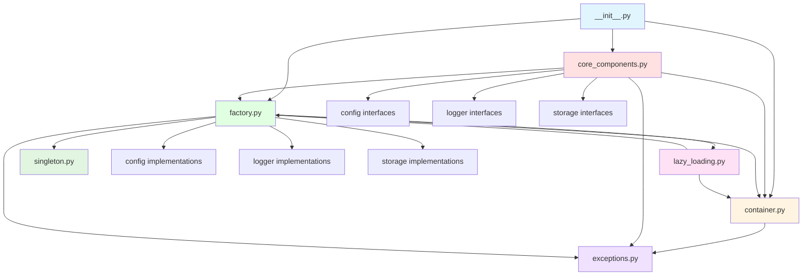
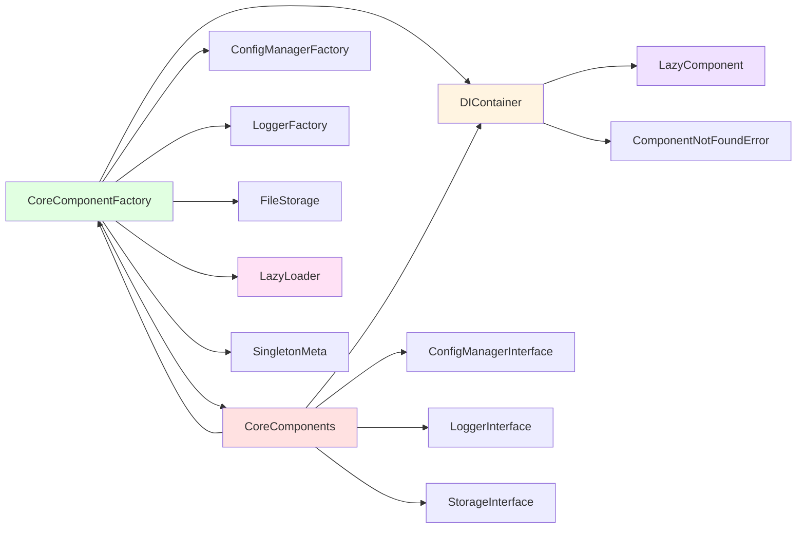

# Base Komponens Dokumentációs Terv

## Áttekintés

Ez a dokumentum a Neural AI Next projekt base komponensének új dokumentációs struktúráját tervezi meg a `docs2/components/base/` mappához. A terv tartalmazza a dokumentációs struktúrát, a funkció-hívási gráfot, a függőségi gráfot és a szükséges dokumentációs sablonokat.

## 1. Dokumentációs Struktúra Terve

### 1.1 Mappa struktúra

```
docs2/components/base/
├── README.md                          # Áttekintés és gyors kezdés
├── api/                               # API dokumentáció részletesen
│   ├── overview.md                    # API áttekintés
│   ├── container.md                   # DIContainer API
│   ├── core_components.md             # CoreComponents API
│   ├── factory.md                     # CoreComponentFactory API
│   ├── exceptions.md                  # Kivétel hierarchia
│   ├── lazy_loading.md                # Lazy loading API
│   └── singleton.md                   # Singleton minta API
├── architecture/                      # Architektúra dokumentáció
│   ├── overview.md                    # Architektúra áttekintés
│   ├── design_principles.md           # Tervezési alapelvek
│   ├── component_interactions.md      # Komponens kölcsönhatások
│   ├── dependency_graph.md            # Függőségi gráf
│   └── lifecycle.md                   # Komponens életciklus
├── design_spec.md                     # Tervezési specifikáció
├── development_checklist.md           # Fejlesztési checklist
├── examples/                          # Használati példák
│   ├── basic_usage.md                 # Alap használat
│   ├── advanced_usage.md              # Haladó használat
│   ├── custom_components.md           # Egyedi komponensek
│   └── testing.md                     # Tesztelési példák
├── guides/                            # Útmutatók
│   ├── getting_started.md             # Első lépések
│   ├── best_practices.md              # Ajánlott eljárások
│   ├── migration_guide.md             # Migrációs útmutató
│   └── troubleshooting.md             # Hibaelhárítás
└── CHANGELOG.md                       # Változások naplója
```

### 1.2 Dokumentációs sablonok

Minden dokumentációs fájl kövesse a következő sablont:

```markdown
# [Cím]

## Áttekintés

[Rövid leírás a tartalomról]

## Tartalom

### 1. [Első fő szekció]

[Részletes tartalom]

### 2. [Második fő szekció]

[Részletes tartalom]

## Kapcsolódó dokumentáció

- [Linkek a kapcsolódó dokumentációhoz]

## Példák

```python
# Kódpéldák
```

## További információk

- [Egyéb hasznos információk]
```

## 2. Funkció-hívási Gráf

### 2.1 Osztályok és metódusok listája

#### [`__init__.py`](neural_ai/core/base/__init__.py:1)
- **Exportált osztályok**: `DIContainer`, `CoreComponents`, `CoreComponentFactory`

#### [`container.py`](neural_ai/core/base/container.py:1)

**LazyComponent osztály:**
- `__init__(factory_func: Callable[[], Any])` - Inicializálás
- `get() -> Any` - Komponens lekérése (lazy loading)
- `is_loaded: bool` - Betöltöttség ellenőrzése

**DIContainer osztály:**
- `__init__()` - Konténer inicializálása
- `register_instance(interface, instance)` - Példány regisztrálása
- `register_factory(interface, factory)` - Factory regisztrálása
- `resolve(interface) -> Optional[Any]` - Függőség feloldása
- `register_lazy(component_name, factory_func)` - Lazy komponens regisztrálása
- `get(component_name) -> Any` - Komponens lekérése
- `get_lazy_components() -> Dict[str, bool]` - Lazy komponensek státusza
- `preload_components(component_names)` - Komponensek előtöltése
- `clear()` - Konténer ürítése
- `_verify_singleton(instance, component_name)` - Singleton ellenőrzés
- `_enforce_singleton(component_name, instance)` - Singleton kényszerítés
- `register(component_name, instance)` - Komponens regisztrálása
- `get_memory_usage() -> Dict[str, Any]` - Memóriahasználat lekérdezése

#### [`core_components.py`](neural_ai/core/base/core_components.py:1)

**LazyLoader osztály:**
- `__init__(loader_func: Callable[[], T])` - Inicializálás
- `_load() -> T` - Erőforrás betöltése
- `__call__() -> T` - Betöltött erőforrás lekérése
- `is_loaded: bool` - Betöltöttség ellenőrzése
- `reset()` - Betöltő alaphelyzetbe állítása

**CoreComponents osztály:**
- `__init__(container: Optional[DIContainer])` - Inicializálás
- `_register_lazy_components()` - Lazy komponensek regisztrálása
- `config: Optional[ConfigManagerInterface]` - Konfiguráció tulajdonság
- `logger: Optional[LoggerInterface]` - Logger tulajdonság
- `storage: Optional[StorageInterface]` - Storage tulajdonság
- `preload_all()` - Összes komponens előtöltése
- `has_config() -> bool` - Konfiguráció ellenőrzése
- `has_logger() -> bool` - Logger ellenőrzése
- `has_storage() -> bool` - Storage ellenőrzése
- `validate() -> bool` - Komponensek validálása

#### [`exceptions.py`](neural_ai/core/base/exceptions.py:1)

**Kivétel hierarchia:**
- `NeuralAIException` (alap kivétel)
  - `StorageException`
    - `StorageWriteError`
    - `StorageReadError`
    - `StoragePermissionError`
    - `InsufficientDiskSpaceError`
    - `PermissionDeniedError`
  - `ConfigurationError`
  - `DependencyError`
  - `SingletonViolationError`
  - `ComponentNotFoundError`
  - `NetworkException`
    - `TimeoutError`
    - `ConnectionError`

#### [`factory.py`](neural_ai/core/base/factory.py:1)

**CoreComponentFactory osztály:**
- `__init__(container: DIContainer)` - Inicializálás
- `_get_logger() -> LoggerInterface` - Logger lekérése
- `_get_config_manager() -> ConfigManagerInterface` - Konfiguráció lekérése
- `_get_storage() -> StorageInterface` - Storage lekérése
- `logger: LoggerInterface` - Logger tulajdonság
- `config_manager: ConfigManagerInterface` - Konfiguráció tulajdonság
- `storage: StorageInterface` - Storage tulajdonság
- `_expensive_config: Dict[str, Any]` - Drága konfiguráció (lazy property)
- `_component_cache: Dict[str, Any]` - Komponens gyorsítótár (lazy property)
- `_process_config(config) -> Dict[str, Any]` - Konfiguráció feldolgozása
- `_load_component_cache() -> Dict[str, Any]` - Gyorsítótár betöltése
- `reset_lazy_loaders()` - Lazy loader-ek alaphelyzetbe állítása
- `_validate_dependencies(component_type, config)` - Függőségek validálása
- `create_components(config_path, log_path, storage_path) -> CoreComponents` - Komponensek létrehozása
- `create_with_container(container) -> CoreComponents` - Létrehozás konténerből
- `create_minimal() -> CoreComponents` - Minimális komponensek létrehozása
- `create_logger(name, config) -> LoggerInterface` - Logger létrehozása
- `create_config_manager(config_file_path, config) -> ConfigManagerInterface` - Konfiguráció létrehozása
- `create_storage(base_directory, config) -> StorageInterface` - Storage létrehozása

#### [`lazy_loading.py`](neural_ai/core/base/lazy_loading.py:1)

**LazyLoader osztály:**
- `__init__(loader_func: Callable[[], T])` - Inicializálás
- `_load() -> T` - Erőforrás betöltése
- `__call__() -> T` - Betöltött erőforrás lekérése
- `is_loaded: bool` - Betöltöttség ellenőrzése
- `reset()` - Betöltő alaphelyzetbe állítása

**lazy_property dekorátor:**
- `lazy_property(func) -> property` - Lazy property létrehozása

#### [`singleton.py`](neural_ai/core/base/singleton.py:1)

**SingletonMeta osztály:**
- `_instances: Dict[type, Any]` - Osztály szintű példány tároló
- `__call__(cls, *args, **kwargs) -> Any` - Singleton példány létrehozása/visszaadása

### 2.2 Metódus hívási gráf

```
CoreComponentFactory.__init__
  ├─> LazyLoader.__init__ (logger_loader)
  ├─> LazyLoader.__init__ (config_loader)
  └─> LazyLoader.__init__ (storage_loader)

CoreComponentFactory.create_components
  ├─> DIContainer.__init__
  ├─> ConfigManagerFactory.get_manager
  ├─> DIContainer.register_instance (ConfigManagerInterface)
  ├─> LoggerFactory.get_logger
  ├─> DIContainer.register_instance (LoggerInterface)
  ├─> FileStorage.__init__
  ├─> DIContainer.register_instance (StorageInterface)
  ├─> CoreComponents.__init__
  │   └─> CoreComponents._register_lazy_components
  │       ├─> DIContainer.register_lazy (logger)
  │       ├─> DIContainer.register_lazy (config_manager)
  │       └─> DIContainer.register_lazy (storage)
  └─> CoreComponents.validate
      ├─> CoreComponents.has_config
      ├─> CoreComponents.has_logger
      └─> CoreComponents.has_storage

CoreComponentFactory.create_minimal
  ├─> ConfigManagerFactory.get_manager
  ├─> ConfigManagerInterface.get_section
  ├─> LoggerFactory.get_logger
  ├─> FileStorage.__init__
  ├─> DIContainer.__init__
  ├─> DIContainer.register_instance (ConfigManagerInterface)
  ├─> DIContainer.register_instance (LoggerInterface)
  ├─> DIContainer.register_instance (StorageInterface)
  ├─> CoreComponentFactory._validate_dependencies
  └─> CoreComponents.__init__

CoreComponents.config (property getter)
  └─> DIContainer.get
      └─> LazyComponent.get
          └─> CoreComponentFactory._get_config_manager
              └─> DIContainer.get

CoreComponents.logger (property getter)
  └─> DIContainer.get
      └─> LazyComponent.get
          └─> CoreComponentFactory._get_logger
              └─> DIContainer.get

CoreComponents.storage (property getter)
  └─> DIContainer.get
      └─> LazyComponent.get
          └─> CoreComponentFactory._get_storage
              └─> DIContainer.get

DIContainer.register_lazy
  └─> LazyComponent.__init__

DIContainer.get
  ├─> DIContainer._verify_singleton
  └─> LazyComponent.get (ha lazy komponens)

DIContainer.register
  └─> DIContainer._enforce_singleton

LazyLoader._load
  └─> loader_func (factory függvény)

lazy_property (dekorátor)
  └─> func (a dekorált metódus)
```

## 3. Függőségi Gráf

### 3.1 Import kapcsolatok

```
neural_ai/core/base/__init__.py
  └─> neural_ai/core/base/container.py (DIContainer)
  └─> neural_ai/core/base/core_components.py (CoreComponents)
  └─> neural_ai/core/base/factory.py (CoreComponentFactory)

neural_ai/core/base/container.py
  └─> neural_ai/core/base/exceptions.py (ComponentNotFoundError, SingletonViolationError)

neural_ai/core/base/core_components.py
  └─> neural_ai/core/base/container.py (DIContainer)
  └─> neural_ai/core/base/exceptions.py (ComponentNotFoundError)
  └─> neural_ai/core/base/factory.py (CoreComponentFactory)
  └─> neural_ai/core/config/interfaces/config_interface.py (ConfigManagerInterface)
  └─> neural_ai/core/logger/interfaces/logger_interface.py (LoggerInterface)
  └─> neural_ai/core/storage/interfaces/storage_interface.py (StorageInterface)

neural_ai/core/base/factory.py
  └─> neural_ai/core/base/container.py (DIContainer)
  └─> neural_ai/core/base/exceptions.py (ComponentNotFoundError, ConfigurationError, DependencyError)
  └─> neural_ai/core/base/lazy_loading.py (LazyLoader, lazy_property)
  └─> neural_ai/core/base/singleton.py (SingletonMeta)
  └─> neural_ai/core/config/exceptions.py (ConfigLoadError)
  └─> neural_ai/core/config/implementations/ (ConfigManagerFactory)
  └─> neural_ai/core/config/interfaces/config_interface.py (ConfigManagerInterface)
  └─> neural_ai/core/logger/implementations/ (LoggerFactory)
  └─> neural_ai/core/logger/interfaces/logger_interface.py (LoggerInterface)
  └─> neural_ai/core/storage/implementations/file_storage.py (FileStorage)
  └─> neural_ai/core/storage/interfaces/storage_interface.py (StorageInterface)

neural_ai/core/base/lazy_loading.py
  └─> (nincs külső függőség, csak standard library)

neural_ai/core/base/singleton.py
  └─> (nincs külső függőség, csak standard library)

neural_ai/core/base/exceptions.py
  └─> (nincs függőség)
```

### 3.2 Komponens függőségi gráf



### 3.3 Metódus szintű függőségi gráf



## 4. Dokumentációs Sablonok

### 4.1 README.md sablon

```markdown
# Base Komponens

## Áttekintés

A Base komponens a Neural AI Next projekt alapvető infrastruktúráját biztosítja.

## Főbb funkciók

- [Funkció 1]
- [Funkció 2]
- [Funkció 3]

## Gyors kezdés

```python
# Példakód
```

## Telepítés

[Telepítési utasítások]

## További információk

- [API Dokumentáció](api/overview.md)
- [Architektúra](architecture/overview.md)
- [Példák](examples/basic_usage.md)
```

### 4.2 API dokumentáció sablon

```markdown
# [Osztály neve] API

## Áttekintés

[Rövid leírás]

## Konstruktor

```python
def __init__(self, param1: type, param2: type = default) -> None
```

**Paraméterek:**
- `param1`: Leírás
- `param2`: Leírás

## Metódusok

### metódus_neve

```python
def method_name(self, param: type) -> return_type
```

**Leírás:** [Részletes leírás]

**Paraméterek:**
- `param`: Leírás

**Visszatérési érték:**
- `return_type`: Leírás

**Kivételek:**
- `ExceptionType`: Mikor és miért dobódik

## Tulajdonságok

### property_name

```python
@property
def property_name(self) -> type
```

**Leírás:** [Részletes leírás]

## Példák

```python
# Használati példák
```
```

### 4.3 Architektúra dokumentáció sablon

```markdown
# [Komponens neve] Architektúra

## Áttekintés

[Architektúra áttekintése]

## Tervezési alapelvek

### 1. [Alapelv neve]

[Leírás]

### 2. [Alapelv neve]

[Leírás]

## Komponens struktúra

```mermaid
graph TB
    [Diagram]
```

## Adatfolyam

```mermaid
sequenceDiagram
    [Diagram]
```

## Biztonsági megfontolások

- [Megfontolás 1]
- [Megfontolás 2]

## Teljesítmény optimalizációk

- [Optimalizáció 1]
- [Optimalizáció 2]
```

### 4.4 Példák dokumentáció sablon

```markdown
# [Példa neve]

## Cél

[Mi a példa célja]

## Előfeltételek

- [Előfeltétel 1]
- [Előfeltétel 2]

## Implementáció

```python
# Teljes kód
```

## Magyarázat

### 1. [Lépés neve]

[Magyarázat]

### 2. [Lépés neve]

[Magyarázat]

## Tesztelés

```bash
# Tesztelési parancsok
```

## Hibaelhárítás

- [Gyakori hiba 1]: [Megoldás]
- [Gyakori hiba 2]: [Megoldás]
```

## 5. Implementációs Terv

### 5.1 Fázisok

**1. Fázis: Alap struktúra létrehozása**
- `docs2/components/base/` mappa létrehozása
- Alap mappa struktúra kialakítása
- Sablonfájlok létrehozása

**2. Fázis: API dokumentáció**
- `api/` mappa dokumentációinak elkészítése
- Minden osztályhoz külön API dokumentáció
- Kivétel hierarchia dokumentálása

**3. Fázis: Architektúra dokumentáció**
- `architecture/` mappa dokumentációinak elkészítése
- Függőségi gráfok létrehozása
- Életciklus dokumentáció

**4. Fázis: Példák és útmutatók**
- `examples/` mappa feltöltése
- `guides/` mappa feltöltése
- Gyakorlati példák készítése

**5. Fázis: Egyéb dokumentációk**
- `design_spec.md` elkészítése
- `development_checklist.md` elkészítése
- `CHANGELOG.md` elkészítése

### 5.2 Prioritási sorrend

1. **Magas prioritás:**
   - `README.md` - Áttekintés és gyors kezdés
   - `api/overview.md` - API áttekintés
   - `architecture/overview.md` - Architektúra áttekintés
   - `examples/basic_usage.md` - Alap használati példák

2. **Közepes prioritás:**
   - Egyedi API dokumentációk (`container.md`, `core_components.md`, stb.)
   - `guides/getting_started.md` - Első lépések útmutató
   - `design_spec.md` - Tervezési specifikáció

3. **Alacsony prioritás:**
   - Részletes architektúra dokumentációk
   - Haladó példák
   - Migrációs útmutatók

## 6. Minőségi követelmények

### 6.1 Dokumentációs szabványok

- Minden fájl Markdown formátumban
- Kódblokkokban syntax highlighting
- Mermaid diagramok használata komplex struktúrákhoz
- Linkek a kapcsolódó dokumentációhoz
- Példakódok minden fő funkcióhoz

### 6.2 Tartalmi követelmények

- Tömör és érthető leírások
- Gyakorlati példák minden koncepcióhoz
- Teljes API leírás minden osztályhoz és metódushoz
- Függőségi gráfok és adatfolyam diagramok
- Hibaelhárítási útmutatók

### 6.3 Karbantarthatóság

- Modularizált struktúra
- Egységes formázás
- Verziókövetés barát
- Könnyen bővíthető
- Automatikusan generálható részek jelölése

## 7. Áttekintő Diagram

### 7.1 Teljes dokumentációs struktúra

```mermaid
graph TB
    A[docs2/components/base/] --> B[README.md]
    A --> C[api/]
    A --> D[architecture/]
    A --> E[examples/]
    A --> F[guides/]
    A --> G[design_spec.md]
    A --> H[development_checklist.md]
    A --> I[CHANGELOG.md]

    C --> C1[overview.md]
    C --> C2[container.md]
    C --> C3[core_components.md]
    C --> C4[factory.md]
    C --> C5[exceptions.md]
    C --> C6[lazy_loading.md]
    C --> C7[singleton.md]

    D --> D1[overview.md]
    D --> D2[design_principles.md]
    D --> D3[component_interactions.md]
    D --> D4[dependency_graph.md]
    D --> D5[lifecycle.md]

    E --> E1[basic_usage.md]
    E --> E2[advanced_usage.md]
    E --> E3[custom_components.md]
    E --> E4[testing.md]

    F --> F1[getting_started.md]
    F --> F2[best_practices.md]
    F --> F3[migration_guide.md]
    F --> F4[troubleshooting.md]

    style A fill:#e1f5ff
    style B fill:#fff4e1
    style C fill:#ffe1e1
    style D fill:#e1ffe1
    style E fill:#f0e1ff
    style F fill:#ffe1f5
```



## 8. Következő lépések

1. **Dokumentációs struktúra létrehozása** - A tervezett mappa struktúra implementálása
2. **Sablonok feltöltése** - Minden dokumentációs fájl sablonjának elkészítése
3. **Tartalom generálás** - A tényleges dokumentációs tartalom írása
4. **Diagramok létrehozása** - Mermaid diagramok generálása
5. **Tesztelés és ellenőrzés** - Dokumentáció minőségellenőrzése
6. **Integráció** - A dokumentáció integrálása a meglévő rendszerbe

## 9. Kapcsolódó dokumentáció

- [Projekt dokumentációs konvenciók](../../docs/development/unified_development_guide.md)
- [Komponens fejlesztési útmutató](../../docs/development/component_development_guide.md)
- [Base komponens régi dokumentációja](../base/README.md)

---

**Dokumentum verzió:** 1.0
**Utolsó frissítés:** 2025-12-19
**Felelős:** Architect mód
