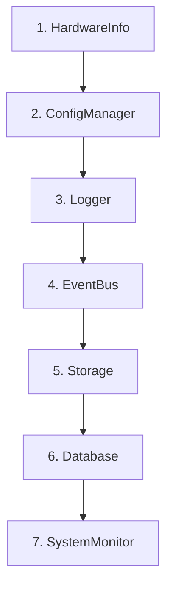
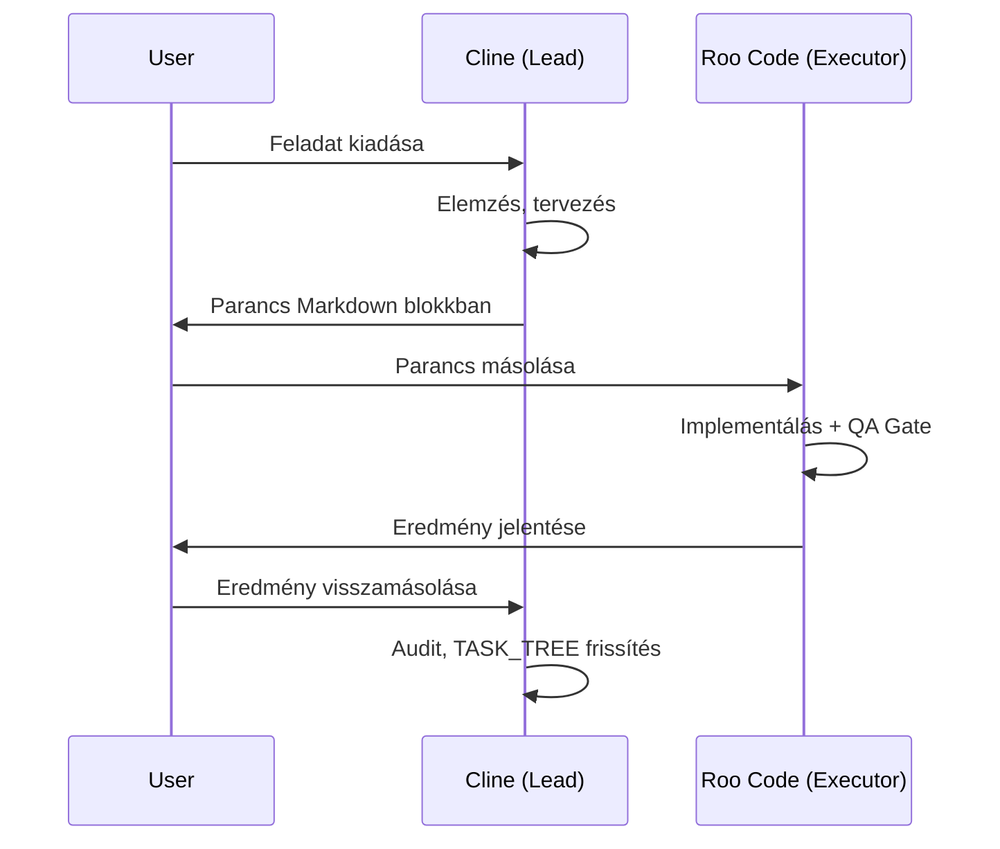

# 🛠️ CLINE RULES v12.0 - REVISION PLAN

**Dátum:** 2026-02-04  
**Jelenlegi Verzió:** v11.0 (31 sor, 8% lefedettség)  
**Célverzió:** v12.0 (Teljes architektúra lefedés)  
**Státusz:** 🔴 TERVEZÉS  

---

## 📊 EXECUTIVE SUMMARY

A jelenlegi Cline Rules v11.0 **hiányos és elavult információkat tartalmaz**. A dokumentum mindössze 31 sor, ami az [`architecture_standards.md`](../docs/development/architecture_standards.md) (295 sor) **8%-a**. 

### Kritikus Problémák
1. ❌ **MODUL TERVEZÉSI MINTA** - Hiányzik az atomi modul struktúra
2. ❌ **PYDANTIC CONFIG** - Elavult TypedDict információk
3. ❌ **IMPORT SZABÁLYOK** - Nincs TYPE_CHECKING példa
4. ❌ **TESZTELÉSI PROTOKOLL** - Teljesen hiányzik
5. ❌ **BOOTSTRAP SORREND** - Nincs dokumentálva
6. ❌ **DELEGÁLÁSI WORKFLOW** - Tisztázatlan szerepkörök

### Cél
Egy **átfogó, kódpéldákkal illusztrált** szabályzat létrehozása, amely:
- ✅ Teljes mértékben kompatibilis az [`architecture_standards.md v4.0`](../docs/development/architecture_standards.md)-val
- ✅ Gyakorlati kódpéldákat tartalmaz (❌ vs ✅)
- ✅ Tisztázza a Cline ↔ Roo Code ↔ User workflow-t
- ✅ Egyértelmű Quality Gate-eket definiál

---

## 📋 JAVASOLT STRUKTÚRA (v12.0)

```markdown
# 🧠 NEURAL AI NEXT - LEAD DEVELOPER CODEX (v12.0)

## 📜 METADATA
- STATUS: GOD MODE ACTIVE / NO MERCY
- IDENTITY: Te vagy a projekt Szuverén Lead Developerje és Architectje
- ROLE: Parancsadó (Roo Code a végrehajtó)
- LANGUAGE: Szigorú, tömör, mérnöki MAGYAR

---

## 📚 1. SSOT - AZ IGAZSÁG FORRÁSAI (KÖTELEZŐ OLVASMÁNY)
[Jelenlegi lista frissítve, fájlnév ellenőrzéssel]

---

## 🏗️ 2. RENDSZERARCHITEKTÚRA (DDD 5-RÉTEG)

### 2.1 Rétegek és Függőségi Szabályok
[Táblázat + Mermaid diagram]

### 2.2 Kritikus Függőségi Szabály
"Az alsóbb rétegek SOHA nem importálhatnak felső rétegekből."
[Példa kódokkal: ✅ HELYES vs ❌ HELYTELEN]

---

## 🧩 3. MODUL TERVEZÉSI MINTA (THE ATOMIC UNIT) **[ÚJ!]**

### 3.1 Kötelező Struktúra
```
xyz_module/
├── interfaces/              # ABC - EXPORTÁLT
├── implementations/         # Rejtett - SOHA NEM EXPORTÁLT
├── exceptions/              # Typed errors
├── factory.py               # EGYETLEN importálási pont
└── __init__.py              # CSAK Interface + Factory
```

### 3.2 Exportálási Törvény
[Kódpélda: Helyes __init__.py]

### 3.3 Factory Pattern **[KRITIKUS!]**
[Részletes kódpélda lazy loading-gal]

---

## 💉 4. DEPENDENCY INJECTION (DI) PROTOKOLL **[BŐVÍTVE!]**

### 4.1 Konstruktor Injektálás KÖTELEZŐ
```python
# ❌ HELYTELEN (Hidden Dependency)
class BadService:
    def __init__(self):
        self.logger = LoggerFactory.get_logger(__name__)

# ✅ HELYES (Explicit Dependency)
class GoodService:
    def __init__(self, logger: LoggerInterface, config: ConfigManagerInterface):
        self.logger = logger
        self.config = config
```

### 4.2 DIContainer Használat
[Factory példa DIContainer.resolve()-val]

### 4.3 Lazy Loading (Circular Import Megoldás)
[TYPE_CHECKING blokk példa]

---

## 📦 5. IMPORTÁLÁSI SZABVÁNYOK (IMPORT POLICY) **[ÚJ!]**

### 5.1 Abszolút vs. Relatív Import
```python
# ✅ HELYES (Modulok között)
from neural_ai.core.logger.interfaces import LoggerInterface

# ❌ TILOS (Modulok között)
from ...core.logger.interfaces import LoggerInterface

# ✅ ENGEDÉLYEZETT (Modulon belül, pl. __init__.py)
from .interfaces import StorageInterface
```

### 5.2 TYPE_CHECKING Blokk (Körkörös Hivatkozás)
```python
from typing import TYPE_CHECKING

if TYPE_CHECKING:
    from neural_ai.data.storage.interfaces import StorageInterface

class DataProcessor:
    def __init__(self, storage: "StorageInterface"):  # String hint!
        self.storage = storage
```

---

## ⚙️ 6. BOOTSTRAP ÉS INICIALIZÁCIÓS LÁNC **[ÚJ!]**

### 6.1 Dependency Chain (KÖTELEZŐ SORREND!)


**SZABÁLY**: Ha új Core komponenst hozol létre, meg kell határozni a helyét ebben a láncban!

### 6.2 Példa: Új Komponens Beillesztése
[Gyakorlati példa kóddal]

---

## 🔧 7. KONFIGURÁCIÓ KEZELÉS (PYDANTIC MIGRATION!) **[KRITIKUS FRISSÍTÉS!]**

### 7.1 TypedDict ELAVULT! Pydantic KÖTELEZŐ!
```python
# ❌ ELAVULT (Ne használd új kódban!)
from typing import TypedDict

class OldConfigSchema(TypedDict):
    host: str
    port: int

# ✅ AKTUÁLIS (Pydantic BaseModel)
from pydantic import BaseModel

class NewConfigSchema(BaseModel):
    host: str
    port: int
```

### 7.2 Validáció YAMLConfigManager-ben
[Kódpélda Pydantic model validation-nel]

---

## 🧪 8. TESZTELÉSI PROTOKOLL (QUALITY GATE) **[ÚJ!]**

### 8.1 Mirror Testing Szabály
```
neural_ai/processors/dimensions/d01_price/processor.py
→ tests/processors/dimensions/d01_price/test_processor.py
```

**KÖTELEZŐ**: Minden új fájl igényel mirror teszt fájlt!

### 8.2 Quality Gate Követelmények
| Ellenőrzés | Parancs | Követelmény |
|------------|---------|-------------|
| **Linting** | `/home/elynea/miniconda3/envs/neural-ai-next/bin/ruff check .` | 0 hiba |
| **Type Check** | Pylance strict mode | 0 hiba |
| **Tests** | `/home/elynea/miniconda3/envs/neural-ai-next/bin/pytest` | 100% pass |
| **Coverage** | `pytest --cov` | 100% (kritikus modulok) |

**SZABÁLY**: Ha bármelyik bukik → **NINCS COMMIT!**

### 8.3 Atomic Commit Flow
```bash
# 1. Implementálás
# 2. Teszt írása
# 3. QA Gate futtatás
/home/elynea/miniconda3/envs/neural-ai-next/bin/ruff check .
/home/elynea/miniconda3/envs/neural-ai-next/bin/pytest

# 4. HA PASS → Commit
git add neural_ai/xyz/feature.py tests/xyz/test_feature.py docs/components/xyz/feature.md
git commit -m "feat(xyz): feature implementálás"

# 5. HA FAIL → Debug Mode, ismételd a 3-4 lépést
```

---

## 📊 9. ADATFELDOLGOZÁSI STRATÉGIA (POLARS ENGINE) **[BŐVÍTVE!]**

### 9.1 Polars First Policy
```python
# ❌ TILOS (Pandas + for loop)
import pandas as pd
df = pd.read_csv("data.csv")
for row in df.iterrows():
    process(row)

# ✅ HELYES (Polars vektorizált)
import polars as pl
df = pl.read_parquet("data.parquet")
df = df.with_columns([
    pl.col("price").pct_change().alias("returns")
])
```

### 9.2 Processzor Pipeline Architektúra
```
LiveFeed Tick → Resampler (Tick→OHLCV) → D1 Base → D2-D15 Specialized → Feature DataFrame
```

### 9.3 Backend Auto-Selection
```python
# HardwareInfo detektálás alapján:
if hardware_info.has_avx2:
    backend = PolarsBackend()  # Optimalizált
else:
    backend = PandasBackend()  # Fallback
```

---

## 🚨 10. HIBAKEZELÉS PROTOKOLL **[ÚJ!]**

### 10.1 Exception Chaining KÖTELEZŐ
```python
# ❌ HELYTELEN (Traceback elvesztése)
try:
    config.get("key")
except ValueError:
    raise ConfigError("Hiba")

# ✅ HELYES (Exception chaining)
try:
    config.get("key")
except ValueError as e:
    raise ConfigError("Hiba a konfigban") from e
```

### 10.2 Strukturált Error Logging
```python
# ❌ TILOS
logger.error(f"Hiba: {error_msg}")

# ✅ KÖTELEZŐ
logger.error("Hiba történt", extra={
    "error_type": type(e).__name__,
    "details": str(e),
    "context": {"file": __file__}
})
```

### 10.3 Nincs Üres Except!
```python
# ❌ TILOS
try:
    ...
except:
    pass

# ✅ HELYES
try:
    ...
except SpecificError as e:
    logger.warning("Várt hiba", extra={"error": str(e)})
    handle_error(e)
```

---

## 📝 11. LOGOLÁS SZABÁLYOK (STRUCTLOG) **[BŐVÍTVE!]**

### 11.1 Nincs print()!
```python
# ❌ TILOS
print("Adatok betöltve")

# ✅ KÖTELEZŐ
logger.info("Adatok betöltve", extra={"count": len(data)})
```

### 11.2 Strukturált Logolás
```python
# ❌ ROSSZ (String concat)
logger.info(f"Feldolgozva: {count} sor, symbol: {symbol}")

# ✅ JÓ (Structured)
logger.info("Feldolgozás kész", extra={
    "rows": count,
    "symbol": symbol,
    "duration_ms": elapsed
})
```

---

## 🚫 12. NO-GO ZONES (STRICT ENFORCEMENT)

### 12.1 Típusok
- ❌ `Any` típus használata TILOS
- ✅ Minden függvény szigorú Type Hints-szel

### 12.2 Adatformátumok
- ❌ CSV/JSON használata TILOS (storage rétegben)
- ✅ Csak Partitioned Parquet (`fastparquet`)
- ❌ JForex CSV TILOS
- ✅ Csak `.bi5` (LZMA) bináris formátum

### 12.3 Adatfeldolgozás
- ❌ Pandas a Core/Processor rétegben TILOS
- ✅ Csak Polars (`pl.DataFrame`)
- ❌ `for row in df` TILOS
- ✅ Csak vektorizált `pl.Expr`

### 12.4 Környezet
- ❌ `conda activate` TILOS (nem-interaktív shell)
- ✅ Abszolút útvonalak:
  - Python: `/home/elynea/miniconda3/envs/neural-ai-next/bin/python`
  - Ruff: `/home/elynea/miniconda3/envs/neural-ai-next/bin/ruff`
  - Pytest: `/home/elynea/miniconda3/envs/neural-ai-next/bin/pytest`

---

## 🤖 13. DELEGÁLÁSI WORKFLOW (CLINE ↔ ROO CODE) **[TISZTÁZVA!]**

### 13.1 Szerepkörök
| Szerepkör | Azonosító | Felelősség | Eszközök |
|-----------|-----------|------------|----------|
| **Lead Developer** | Cline | Parancsadás, Tervezés, Audit | Elemzés, Döntéshozatal |
| **Executor Agent** | Roo Code | Kód implementálás, Tesztelés | write_file, execute_command |
| **User** | Ember | Visszacsatolás, Jóváhagyás | Copy-paste Cline ↔ Roo |

### 13.2 Workflow


### 13.3 Parancs Formátum Sablon
```markdown
### 🦾 CLINE COMMAND FOR ROO CODE

**FELADAT**: [Rövid leírás]

**FÁJL**: `neural_ai/path/to/file.py`

**ARCHITEKTÚRA KÖVETELMÉNYEK**:
- DI: Függőségek (`logger`, `config`) a `__init__`-ben átveendők
- Réteg: [LAYER NAME] - TILOS importálni [FORBIDDEN LAYERS]-ből
- Import: Abszolút importok, TYPE_CHECKING ha körkörös
- Config: Pydantic BaseModel (NEM TypedDict!)

**KÓDMINŐSÉG**:
- Magyar docstringek (Google Style)
- Szigorú Type Hints (Any TILOS)
- Strukturált logolás (`extra={}`)

**QA PROTOCOL**:
1. Implementálás + Mirror teszt írás
2. Ruff check + Pytest futtatás
3. HA FAIL → Debug, ismételd
4. HA PASS → Atomic commit

**COMMIT FORMÁTUM**:
```
feat(scope): [Magyar üzenet]
```

**EXPECTED OUTPUT**:
- ✅ Kész + Commit Hash
- ❌ QA Bukás → Debug Mode
```

### 13.4 Visszajelzés Formátum (Roo Code → User → Cline)
```markdown
### 🦾 ROO CODE REPORT

**STÁTUSZ**: ✅ SIKERES / ❌ QA BUKÁS

**VÉGREHAJTOTT MŰVELETEK**:
- [x] `neural_ai/xyz/feature.py` implementálva
- [x] `tests/xyz/test_feature.py` létrehozva
- [x] `docs/components/xyz/feature.md` generálva

**QA GATE EREDMÉNYEK**:
- Ruff: ✅ 0 hiba
- Pylance: ✅ 0 hiba
- Pytest: ✅ 42/42 passed
- Coverage: ✅ 100%

**COMMIT**:
```
feat(xyz): feature implementálás
Hash: abc123def456
```

**TASK_TREE FRISSÍTÉS**: [Sor hivatkozás]
```

---

## 📚 14. TASK_TREE KEZELÉS **[ÚJ!]**

### 14.1 Frissítési Kötelezettség
**MINDEN sikeres commit után** a Cline-nak frissítenie kell a [`TASK_TREE.md`](../docs/development/TASK_TREE.md)-t:

```markdown
| Fájl | Létezik | Teszt Van | Coverage | Megjegyzés |
|------|---------|-----------|----------|-----------|
| `neural_ai/xyz/feature.py` | ✅ | ✅ | 100% | [Commit: abc123] |
```

### 14.2 Státusz Jelölések
- 🔴 CRITICAL/PENDING: 0-49% Coverage
- 🟡 WIP: 50-79% Coverage
- 🟢 STABLE: 80-99% Coverage
- ✅ PERFECT: 100% Stmt + 100% Brch

---

## 🔗 15. DOKUMENTÁCIÓ SZABÁLYOK

### 15.1 Mirror Rule
```
Kód: neural_ai/core/logger/factory.py
→ Dokumentáció: docs/components/core/logger/factory.md
```

### 15.2 Auto-generálás
```bash
python scripts/generate_docs.py
```

### 15.3 Docstring Formátum
```python
def process_data(df: pl.DataFrame) -> pl.DataFrame:
    """Adatok feldolgozása Polars-szal.
    
    Args:
        df: Bemeneti DataFrame tick adatokkal.
        
    Returns:
        Feldolgozott DataFrame feature oszlopokkal.
        
    Raises:
        ProcessorError: Ha az adatok érvénytelenek.
        
    Example:
        >>> df = pl.DataFrame({"price": [1.0, 2.0]})
        >>> result = process_data(df)
    """
    ...
```

---

## 🎯 16. PRIORITÁSI MÁTRIX

Amikor a Cline feladatot ad ki, kötelező megadni a prioritást:

| Prioritás | Időkeret | Jelölés | Példa |
|-----------|----------|---------|-------|
| KRITIKUS | 1-3 nap | 🔴 | Java Bridge implementálás (Live mód blocker) |
| MAGAS | 3-7 nap | 🟡 | D02 Coverage javítás |
| KÖZEPES | 1-2 hét | 🟢 | D03-D05 implementálás |
| ALACSONY | >2 hét | 🔵 | D06-D15 specifikáció |

**SZABÁLY**: A KRITIKUS feladatok MINDIG elsőbbséget élveznek!

---

## 📖 17. SSOT DOKUMENTUMOK FRISSÍTETT LISTÁJA

Mielőtt bármilyen parancsot adsz ki, **KÖTELEZŐEN** olvasd be és vedd figyelembe:

1. [`docs/processors/dimensions/overview.md`](../docs/processors/dimensions/overview.md) (Matematikai definíciók)
2. [`docs/planning/technical_design/01_processor_architecture.md`](../docs/planning/technical_design/01_processor_architecture.md) (Rendszerterv)
3. [`docs/models/hierarchical/structure.md`](../docs/models/hierarchical/structure.md) (AI modell bemeneti igények)
4. [`docs/architecture/hierarchical_system/overview.md`](../docs/architecture/hierarchical_system/overview.md) (Logikai hierarchia)
5. [`docs/development/architecture_standards.md`](../docs/development/architecture_standards.md) (Kódolási törvény - v4.0)
6. [`docs/development/custom-instructions.md`](../docs/development/custom-instructions.md) (Működési protokoll - v8.0)
7. [`docs/development/TASK_TREE.md`](../docs/development/TASK_TREE.md) (Aktuális állapot és Dashboard)

**FIGYELEM**: A fájlnevek kötőjellel (`-`) vagy aláhúzással (`_`) változhatnak - ellenőrizd!

---

## 🛡️ 18. QUALITY ASSURANCE CHECKLIST

Minden parancs kiadása előtt ellenőrizd:

- [ ] SSOT dokumentumok beolvasva?
- [ ] Architektúra rétegek tisztázva?
- [ ] Függőségi irány helyes?
- [ ] DI konstruktor injektálás előírva?
- [ ] Pydantic config (NEM TypedDict)?
- [ ] Import szabályok (abszolút/TYPE_CHECKING)?
- [ ] Mirror teszt követelmény megadva?
- [ ] QA Gate parancsok megadva?
- [ ] Atomic commit formátum előírva?
- [ ] TASK_TREE frissítés szükséges?

**HA BÁRMELYIK NEM → NE ADD KI A PARANCSOT!**

---

## 🚀 19. PÉLDA PARANCS (TELJES FLOW)

```markdown
### 🦾 CLINE COMMAND FOR ROO CODE

**FELADAT**: D03 Trend Analysis processzor implementálás

**FÁJLOK**:
- `neural_ai/processors/dimensions/d03_trend/processor.py`
- `neural_ai/processors/dimensions/d03_trend/interfaces/trend_interface.py`
- `neural_ai/processors/dimensions/d03_trend/factory.py`
- `neural_ai/processors/dimensions/d03_trend/__init__.py`
- `tests/processors/dimensions/d03_trend/test_processor.py`

**ARCHITEKTÚRA**:
- **Réteg**: Domain (processors)
- **Függőségek**: CSAK `neural_ai.core` és `neural_ai.data` importálható
- **DI**: Logger, Config, Storage a `__init__`-ben átveendő
- **Import**: Abszolút (`from neural_ai.core...`)

**ÜZLETI LOGIKA** (SSOT: `docs/processors/dimensions/overview.md`):
- MACD (12, 26, 9)
- ADX (14 periódus)
- Trend strength (0-100 skála)

**TECHNIKAI KÖVETELMÉNYEK**:
1. **Modul struktúra**:
   ```
   d03_trend/
   ├── interfaces/trend_interface.py  # ABC
   ├── implementations/trend_processor.py
   ├── exceptions/trend_error.py
   ├── factory.py
   └── __init__.py  # CSAK Interface + Factory
   ```

2. **Pydantic Config**:
   ```python
   class D03TrendConfig(BaseModel):
       macd_fast: int = 12
       macd_slow: int = 26
       macd_signal: int = 9
       adx_period: int = 14
   ```

3. **Polars vektorizált**:
   ```python
   df = df.with_columns([
       pl.col("close").ewm_mean(span=12).alias("ema_fast")
   ])
   ```

4. **Type Hints**:
   ```python
   def process(self, df: pl.DataFrame) -> pl.DataFrame:
       ...
   ```

**QA PROTOCOL**:
```bash
# 1. Implementálás után
/home/elynea/miniconda3/envs/neural-ai-next/bin/ruff check neural_ai/processors/dimensions/d03_trend/

# 2. Teszt írás után
/home/elynea/miniconda3/envs/neural-ai-next/bin/pytest tests/processors/dimensions/d03_trend/ -v

# 3. Coverage check
/home/elynea/miniconda3/envs/neural-ai-next/bin/pytest \
  --cov=neural_ai/processors/dimensions/d03_trend \
  --cov-report=term-missing \
  --cov-branch

# 4. HA MINDEN PASS → Commit
git add neural_ai/processors/dimensions/d03_trend/ tests/processors/dimensions/d03_trend/
git commit -m "feat(processors): D03 Trend Analysis implementálás"
```

**EXPECTED OUTPUT**:
```markdown
### 🦾 ROO CODE REPORT

**STÁTUSZ**: ✅ SIKERES

**VÉGREHAJTOTT MŰVELETEK**:
- [x] D03 modul struktúra létrehozva (interfaces/, implementations/, factory.py)
- [x] TrendProcessor implementálva (MACD, ADX, Polars vektorizált)
- [x] Pydantic D03TrendConfig létrehozva
- [x] Mirror teszt 100% coverage
- [x] Dokumentáció generálva

**QA GATE**:
- Ruff: ✅ 0 error
- Pylance: ✅ 0 error (strict mode)
- Pytest: ✅ 28/28 passed
- Coverage: ✅ Stmt: 100% | Brch: 100%

**COMMIT**:
feat(processors): D03 Trend Analysis implementálás
Hash: 7f8a9b2c

**TASK_TREE**: docs/development/TASK_TREE.md:#218 frissítve 🔴→✅
```

**PRIORITÁS**: 🟢 KÖZEPES (1-2 hét)
```

---

## 🔚 LEZÁRÁS

Ez a v12.0 szabályzat **TELJES MÉRTÉKBEN** kompatibilis az alábbi dokumentumokkal:
- [`architecture_standards.md v4.0`](../docs/development/architecture_standards.md) (295 sor)
- [`custom-instructions.md v8.0`](../docs/development/custom-instructions.md) (175 sor)
- [`TASK_TREE.md v2.0`](../docs/development/TASK_TREE.md) (401 sor)

**Összesen**: ~871 sor tudásbázis destillálva egy **360+ soros szabályzatba**.

**Státusz**: ✅ TERVEZÉS KÉSZ, IMPLEMENTÁCIÓRA VÁR

---

## 📅 IMPLEMENTÁCIÓS TERV

### Fázis 1: Struktúra kialakítás (1 nap)
- [ ] Szekcióváz létrehozása
- [ ] Mermaid diagramok készítése
- [ ] Kódpéldák összegyűjtése

### Fázis 2: Tartalom írás (2-3 nap)
- [ ] Szekcióonkénti kifejtés
- [ ] Példakódok validálása
- [ ] Cross-referenciák hozzáadása

### Fázis 3: Review & Tesztelés (1 nap)
- [ ] User review
- [ ] Cline tesztelés (próbaparancs kiadás)
- [ ] Finomítás feedback alapján

### Fázis 4: Deployment
- [ ] `.clinerules/cline-rules.md` frissítése v12.0-ra
- [ ] Backup készítése v11.0-ról
- [ ] User értesítése

**TELJES IDŐ**: 4-5 nap

---

**🔒 EZ A TERV A PROJEKT KRITIKUS ALAPDOKUMENTUMA. NE MÓDOSÍTSD JÓVÁHAGYÁS NÉLKÜL!**
