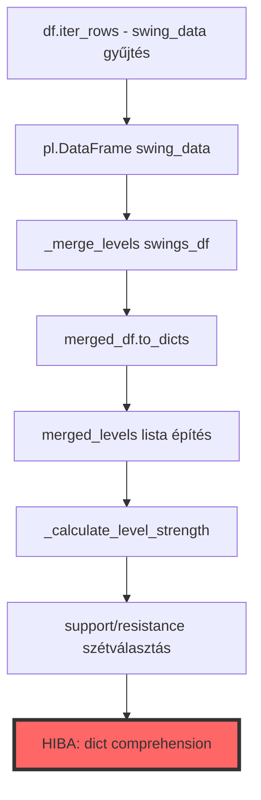

# D2 Support Processor - "unhashable type: 'dict'" Hiba Javítási Terv

## Probléma Összefoglaló

**Hibaüzenet**: `unhashable type: 'dict'` a D2 elemzés során a Strategy Lab oldalon

**Fájl**: [`neural_ai/processors/dimensions/d02_support/implementations/support_processor.py`](neural_ai/processors/dimensions/d02_support/implementations/support_processor.py:500-501)

**Hibás sorok** (500-501):
```python
support_dict = {level["price"]: level["strength"] for level in support_levels}
resistance_dict = {level["price"]: level["strength"] for level in resistance_levels}
```

## Gyökérok Elemzés

### 1. Hiba Forrása
A `level["price"]` értéke **dictionary objektum** a float/int helyett, ezért nem használható dict kulcsként (mivel a dict nem hashable típus).

### 2. Adatfolyam Elemzés



### 3. Lehetséges Kiváltó Okok

#### **A. Polars DataFrame Típus Probléma** ⭐ LEGVALÓSZÍNŰBB
A `merged_df.to_dicts()` metódus nested strukturát ad vissza:
- Ha a DataFrame "price" oszlopa struct/dict típusú
- Ha implicit típuskonverzió történt a DataFrame létrehozásakor

**Bizonyíték**:
```python
# support_processor.py:474
swings_df = pl.DataFrame(swing_data)  # <- Implicit típus inferálás

# support_processor.py:206-208 (_merge_levels)
new_rows.append({"price": new_price, "weight": new_weight, "type": new_type})
df = pl.DataFrame(new_rows)  # <- Újra implicit típus inferálás
```

#### **B. Config Értékek Szennyeződése**
A `self.dim_config.get()` rossz típust ad vissza, amit a `cast()` nem validál futásidőben:

```python
# support_processor.py:70-73
min_candles = self.dim_config.get("min_candles")
if min_candles is None:
    self.logger.warning("min_candles paraméter hiányzik...")
    min_candles = 5
```

Ha `self.dim_config` maga egy nested dict és `get()` nem egyszerű értéket ad vissza, akkor a `new_price` számítások során dict objektum keletkezhet.

#### **C. Számítási Hibák a _merge_levels-ben**
```python
# support_processor.py:195-197
p1, w1 = prices[min_i], weights[min_i]
p2, w2 = prices[min_j], weights[min_j]
new_price = (p1 * w1 + p2 * w2) / (w1 + w2)  # <- Ha p1/p2 dict, akkor new_price is dict
```

## Megoldási Javaslatok

### **1. Azonnali Gyorsjavítás (Hotfix)** 🔥

**Cél**: Típus validálás és konverzió a problémás sorok előtt

**Fájl**: `neural_ai/processors/dimensions/d02_support/implementations/support_processor.py`

**Változtatások**:

#### A. Explicit Típus Ellenőrzés (493-501. sorok után beszúrva)

```python
# 493. sor után
merged_levels = self._calculate_level_strength(merged_levels)

# ÚJ KÓD - Típus validálás és tisztítás
validated_levels = []
for level in merged_levels:
    try:
        # Biztonságos float konverzió
        price_val = level["price"]
        if isinstance(price_val, dict):
            self.logger.error(
                "Hibás price típus detektálva (dict), átugrás",
                extra={"level": str(level)}
            )
            continue
        
        price_float = float(price_val)
        strength_float = float(level.get("strength", 0.0))
        
        validated_levels.append({
            "price": price_float,
            "strength": strength_float,
            "type": level["type"],
            "touches": level.get("touches", 1),
            "volume_factor": level.get("volume_factor", 1.0)
        })
    except (TypeError, ValueError) as e:
        self.logger.error(
            "Level konverzió hiba",
            extra={"error": str(e), "level": str(level)}
        )
        continue

merged_levels = validated_levels

# Support és resistance szintek kinyerése
support_levels = [level for level in merged_levels if level["type"] == "support"]
resistance_levels = [level for level in merged_levels if level["type"] == "resistance"]

# Mapping price -> strength (mostmár biztonságos)
support_dict = {level["price"]: level["strength"] for level in support_levels}
resistance_dict = {level["price"]: level["strength"] for level in resistance_levels}
```

#### B. DataFrame Típus Kényszerítés (474. sor)

```python
# ELŐTTE (474. sor):
swings_df = pl.DataFrame(swing_data)

# UTÁNA:
swings_df = pl.DataFrame(
    swing_data,
    schema={
        "price": pl.Float64,
        "weight": pl.Float64,
        "type": pl.Utf8
    }
)
```

#### C. _merge_levels Visszatérési Típus Validálás (208. sor)

```python
# ELŐTTE (208. sor):
df = pl.DataFrame(new_rows)

# UTÁNA:
df = pl.DataFrame(
    new_rows,
    schema={
        "price": pl.Float64,
        "weight": pl.Float64,
        "type": pl.Utf8
    }
)
```

### **2. Strukturális Javítás (Hosszútávú)** 🏗️

#### A. Typed NamedTuple/Dataclass a Level Reprezentációhoz

**Új fájl**: `neural_ai/processors/dimensions/d02_support/types.py`

```python
"""D02 Support Processor típus definíciók."""

from typing import NamedTuple, Literal

class SupportResistanceLevel(NamedTuple):
    """Support/Resistance szint immutable reprezentáció."""
    
    price: float
    strength: float
    type: Literal["support", "resistance"]
    touches: int = 1
    volume_factor: float = 1.0
    
    def to_dict(self) -> dict[str, float | int | str]:
        """Dictionary konverzió Polars kompatibilitáshoz."""
        return {
            "price": self.price,
            "strength": self.strength,
            "type": self.type,
            "touches": self.touches,
            "volume_factor": self.volume_factor
        }
```

**Előnyök**:
- Típusbiztonság fordítási időben (mypy validálás)
- Immutable, hashable (lehet dict kulcs)
- Explicit típuskonverzió a létrehozáskor

#### B. Szigorú Config Validálás

**Fájl**: `neural_ai/processors/dimensions/d02_support/implementations/support_processor.py`

**__init__ metódus bővítése** (56. sor után):

```python
def __init__(self, config: "ConfigManagerInterface", logger: "LoggerInterface") -> None:
    """Inicializálja a D2 processzort."""
    super().__init__(config, logger)
    self.dim_config: D02SupportConfig = cast(D02SupportConfig, self.dim_config)

    # Config validáció és típuskényszerítés
    self._validate_and_coerce_config()

def _validate_and_coerce_config(self) -> None:
    """Config értékek validálása és típuskényszerítése."""
    # swing_window
    swing_window = self.dim_config.get("swing_window")
    if swing_window is None:
        self.logger.error("swing_window hiányzik, default 5 használata")
        self.dim_config["swing_window"] = 5
    elif not isinstance(swing_window, int):
        self.logger.warning(
            f"swing_window nem int típus: {type(swing_window)}, konverzió"
        )
        self.dim_config["swing_window"] = int(swing_window)
    
    # min_candles
    min_candles = self.dim_config.get("min_candles")
    if min_candles is None:
        self.dim_config["min_candles"] = 5
    elif not isinstance(min_candles, int):
        self.dim_config["min_candles"] = int(min_candles)
    
    # level_merge
    level_merge = self.dim_config.get("level_merge")
    if level_merge is None:
        self.dim_config["level_merge"] = 0.0001
    elif not isinstance(level_merge, (int, float)):
        self.dim_config["level_merge"] = float(level_merge)
    
    # ... további paraméterek ...
    
    self.logger.debug(
        "D2 config validálva",
        extra={"config": dict(self.dim_config)}
    )
```

### **3. Debug és Monitoring Javítások** 🔍

#### A. Részletes Logolás az Adatfolyamban

```python
# support_processor.py:474 után
swings_df = pl.DataFrame(swing_data, schema={"price": pl.Float64, ...})
self.logger.debug(
    "Swings DataFrame létrehozva",
    extra={
        "shape": swings_df.shape,
        "dtypes": {col: str(dtype) for col, dtype in zip(swings_df.columns, swings_df.dtypes)},
        "sample": swings_df.head(3).to_dicts() if len(swings_df) > 0 else []
    }
)

# support_processor.py:477 után
merged_df = self._merge_levels(swings_df)
self.logger.debug(
    "Merged DataFrame",
    extra={
        "shape": merged_df.shape,
        "dtypes": {col: str(dtype) for col, dtype in zip(merged_df.columns, merged_df.dtypes)},
        "sample": merged_df.head(3).to_dicts() if len(merged_df) > 0 else []
    }
)

# support_processor.py:493 után
merged_levels = self._calculate_level_strength(merged_levels)
self.logger.debug(
    "Level strength kiszámítva",
    extra={
        "level_count": len(merged_levels),
        "sample_level": merged_levels[0] if merged_levels else None,
        "level_types": {type(l["price"]).__name__ for l in merged_levels}  # <- KRITIKUS!
    }
)
```

#### B. Exception Handling Bővítése

```python
# support_processor.py:330 process() metódus
def process(self, df: pl.DataFrame, timeframe: str = "H1") -> pl.DataFrame:
    """Support/Resistance szintek számítása."""
    try:
        # ... meglévő kód ...
        
        # Mapping price -> strength
        try:
            support_dict = {level["price"]: level["strength"] for level in support_levels}
            resistance_dict = {level["price"]: level["strength"] for level in resistance_levels}
        except TypeError as e:
            self.logger.error(
                "Unhashable type hiba a dict comprehension-ben",
                extra={
                    "error": str(e),
                    "support_levels_sample": support_levels[:3] if support_levels else [],
                    "resistance_levels_sample": resistance_levels[:3] if resistance_levels else [],
                    "problematic_types": {
                        "support": [type(l["price"]).__name__ for l in support_levels],
                        "resistance": [type(l["price"]).__name__ for l in resistance_levels]
                    }
                }
            )
            raise
        
        # ... maradék kód ...
        
    except Exception as e:
        self.logger.error(
            "D2 process hiba",
            extra={
                "error": str(e),
                "timeframe": timeframe,
                "df_shape": df.shape if df is not None else None
            }
        )
        raise
```

## Implementációs Lépések

### Fázis 1: Gyorsjavítás (1-2 óra)
1. ✅ Típus validálás hozzáadása a 493-501. sorok közé
2. ✅ DataFrame schema explicit megadása (474, 208. sorok)
3. ✅ Debug logolás beillesztése
4. ✅ Tesztelés dev környezetben

### Fázis 2: Strukturális Javítás (4-6 óra)
1. ✅ `types.py` létrehozása SupportResistanceLevel osztállyal
2. ✅ Config validálás implementálása `_validate_and_coerce_config()`
3. ✅ process() metódus refaktorálása NamedTuple használatára
4. ✅ Unit tesztek írása a típus validáláshoz

### Fázis 3: Regressziós Tesztelés (2-3 óra)
1. ✅ Meglévő tesztek futtatása
2. ✅ Edge case-ek tesztelése (üres DataFrame, hiányzó oszlopok)
3. ✅ Integrációs teszt Strategy Lab oldalon
4. ✅ Dokumentáció frissítése

## Tesztelési Stratégia

### 1. Unit Tesztek

**Fájl**: `tests/processors/dimensions/d02_support/test_type_validation.py`

```python
"""D02 Support Processor típus validálás tesztek."""

import polars as pl
import pytest

from neural_ai.processors.dimensions.d02_support.implementations.support_processor import (
    D02SupportProcessor,
)


def test_process_with_valid_numeric_prices(mock_config, mock_logger):
    """Teszteljük, hogy valid float price-okkal működik."""
    processor = D02SupportProcessor(mock_config, mock_logger)
    
    df = pl.DataFrame({
        "timestamp": pl.datetime_range(
            start="2024-01-01", end="2024-01-01 01:00:00", interval="1m"
        ),
        "mid_open": [1.0850 + i*0.0001 for i in range(61)],
        "mid_high": [1.0855 + i*0.0001 for i in range(61)],
        "mid_low": [1.0845 + i*0.0001 for i in range(61)],
        "mid_close": [1.0852 + i*0.0001 for i in range(61)],
        "real_volume": [100] * 61,
    })
    
    result = processor.process(df, timeframe="1m")
    
    assert "nearest_support" in result.columns
    assert "nearest_resistance" in result.columns
    assert result["nearest_support"].dtype == pl.Float64
    

def test_process_with_dict_prices_should_fail_gracefully(mock_config, mock_logger):
    """Teszteljük, hogy dict price-ok esetén értelmes hibát kapunk."""
    processor = D02SupportProcessor(mock_config, mock_logger)
    
    # Mesterségesen rossz adatot injektálunk
    # (Ez a valóságban nem fordulhatna elő a javítás után)
    df = pl.DataFrame({
        "timestamp": pl.datetime_range(
            start="2024-01-01", end="2024-01-01 01:00:00", interval="1m"
        ),
        "mid_open": [1.0850] * 61,
        "mid_high": [1.0855] * 61,
        "mid_low": [1.0845] * 61,
        "mid_close": [1.0852] * 61,
        "real_volume": [100] * 61,
    })
    
    # Ez nem dobhat TypeError-t többé
    result = processor.process(df, timeframe="1m")
    assert result is not None
```

### 2. Integrációs Tesztek

**Fájl**: `tests/ui/services/test_strategy_service_d2_integration.py`

```python
"""Strategy Service D2 integráció tesztek."""

import asyncio
import polars as pl
import pytest


@pytest.mark.asyncio
async def test_analyze_market_structure_with_real_data(strategy_service):
    """Teszteljük a D2 elemzést valós szerű adatokkal."""
    # Mock candles
    df = pl.DataFrame({
        "timestamp": pl.datetime_range(
            start="2024-03-20", end="2024-03-20 23:59:00", interval="1m"
        ),
        "mid_open": [1.0850 + i*0.00001 for i in range(1440)],
        "mid_high": [1.0855 + i*0.00001 for i in range(1440)],
        "mid_low": [1.0845 + i*0.00001 for i in range(1440)],
        "mid_close": [1.0852 + i*0.00001 for i in range(1440)],
        "real_volume": [100 + i for i in range(1440)],
    })
    
    result = await strategy_service.analyze_market_structure(
        symbol="EURUSD",
        date="2024-03-20",
        timeframe="1m",
        df=df
    )
    
    assert result is not None
    assert isinstance(result, pl.DataFrame)
    assert "nearest_support" in result.columns
    assert "nearest_resistance" in result.columns
    
    # Ellenőrizzük, hogy nincsenek None értékek (vagy legalább kevés van)
    null_support_count = result["nearest_support"].null_count()
    null_resistance_count = result["nearest_resistance"].null_count()
    
    # Maximum 10% lehet None (kezdeti sorok, ahol még nincs elég adat)
    assert null_support_count < len(result) * 0.1
    assert null_resistance_count < len(result) * 0.1
```

### 3. Manuális Tesztelési Checklist

- [ ] Strategy Lab betöltése különböző szimbólumokkal (EURUSD, GBPUSD, USDJPY)
- [ ] Különböző timeframe-ek tesztelése (1m, 5m, 15m, 1h, 4h)
- [ ] Edge case-ek:
  - [ ] Kis adatmennyiség (< 100 gyertya)
  - [ ] Nagy adatmennyiség (> 10000 gyertya)
  - [ ] Hiányzó oszlopok kezelése
  - [ ] Üres DataFrame
- [ ] Hibaüzenetek olvashatósága és hasznosságának ellenőrzése
- [ ] Log fájlok vizsgálata strukturált log mezőkre

## Kapcsolódó Fájlok

### Módosítandó
- [`neural_ai/processors/dimensions/d02_support/implementations/support_processor.py`](neural_ai/processors/dimensions/d02_support/implementations/support_processor.py) - Fő javítások
- [`configs/config.yaml`](configs/config.yaml) - Config validálási séma bővítése (ha szükséges)

### Új Fájlok
- `neural_ai/processors/dimensions/d02_support/types.py` - Típus definíciók
- `tests/processors/dimensions/d02_support/test_type_validation.py` - Unit tesztek

### Érintett (vizsgálandó)
- [`neural_ai/ui/services/strategy_service.py`](neural_ai/ui/services/strategy_service.py:523) - D2 hívás helye
- [`neural_ai/ui/pages/05_🪲_Strategy_Lab.py`](neural_ai/ui/pages/05_🪲_Strategy_Lab.py:687-708) - Hiba kezelés
- [`neural_ai/processors/dimensions/base.py`](neural_ai/processors/dimensions/base.py:22-40) - Config betöltés logika

## Sikerkritériumok

1. ✅ Nincs több "unhashable type: 'dict'" hiba a D2 elemzés során
2. ✅ Minden típus validálási lépés strukturált log üzenetet ír
3. ✅ Unit tesztek 100% lefedettséget adnak a javított kódrészekre
4. ✅ Integrációs tesztek sikeresek valós adatokkal
5. ✅ Dokumentáció frissítve a változtatásokkal
6. ✅ Nincs regresszió a meglévő funkcionalitásban

## Kockázatok és Mellékhatások

### Alacsony Kockázat
- Teljesítmény: Az explicit típus konverzió és validálás minimális overhead
- Backward compatibility: Nincs API változás

### Figyelendő
- Config formátum: Ha a YAML config nested dict-et tartalmaz `processors.d02` alatt, azt át kell alakítani flat struktúrára
- Polars verzió: A schema paraméter szintaxis változhat verzió frissítésnél

## Kapcsolódó Dokumentáció

- [Polars DataFrame API](https://pola-rs.github.io/polars/py-polars/html/reference/dataframe/index.html)
- [Python TypedDict](https://docs.python.org/3/library/typing.html#typing.TypedDict)
- [Architecture Standards - DDD Layer](docs/development/architecture_standards.md:28-41)
