# Rendszer Architektúra Diagramok

**Dátum:** 2025-12-16
**Verzió:** 1.0.0

---

## Fordítás állapota

✅ **Teljes dokumentum lefordítva**
✅ **Minden szakasz magyar nyelven**
✅ **Markdown formázás megtartva**
✅ **Mermaid diagramok változatlanok**
⚠️ **Implementáció állapota: Tervezési fázis**

---

Ez a dokumentum az adatgyűjtési rendszer architektúrájának vizuális diagramjait tartalmazza.

---

## 1. Magas szintű rendszer architektúra


---

## 2. Adatgyűjtési módok


---

## 3. Valós idejű adatfolyam


---

## 4. Történelmi adatgyűjtési folyam


---

## 5. Növekményes frissítési folyam


---

## 6. Képzési adathalmaz generálási folyam


---

## 7. Adatraktár szerkezet


---

## 8. API végpont architektúra

```mermaid
graph TB
    API[FastAPI Szerver] --> RT[Valós idejű végpontok]
    API --> HIST[Történelmi végpontok]
    API --> GAP[Hézag végpontok]
    API --> TRAIN[Képzési végpontok]
    API --> MON[Monitorozó végpontok]

    RT --> RT1[POST /collect/tick]
    RT --> RT2[POST /collect/ohlcv]
    RT --> RT3[GET /validation/report]

    HIST --> H1[POST /historical/request]
    HIST --> H2[GET /historical/status/{id}]
    HIST --> H3[POST /historical/collect]

    GAP --> G1[GET /data/gaps]
    GAP --> G2[POST /data/fill-gaps]

    TRAIN --> T1[POST /training/generate]
    TRAIN --> T2[GET /training/status/{id}]

    MON --> M1[GET /storage/stats]
    MON --> M2[GET /errors/report]
```

---

## 9. Adatminőség validációs folyamat


**Validációs szintek:**

1. **1. szint - Alap:** Adattípusok, tartományok, kapcsolatok
2. **2. szint - Statisztikai:** Kiugró értékek, hézagok, duplikátumok
3. **3. szint - Konzisztencia:** Keresztvalidáció, korrelációk

---

## 10. Job menedzsment rendszer


---

## 11. Monitorozás és riasztás

```mermaid
graph TB
    COLL[Adatgyűjtés] --> METRICS[Mérőszámok gyűjtése]

    METRICS --> M1[Adatminőség pontszám]
    METRICS --> M2[Gyűjtési ráta]
    METRICS --> M3[Hibaráta]
    METRICS --> M4[Tároló használat]

    M1 --> DASH[Vezérlőpult]
    M2 --> DASH
    M3 --> DASH
    M4 --> DASH

    DASH --> THRESH{Küszöbérték<br/>túllépve?}

    THRESH -->|Igen| ALERT[Riasztás küldése]
    THRESH -->|Nem| MONITOR[Monitorozás folytatása]

    ALERT --> SLACK[Slack értesítés]
    ALERT --> EMAIL[Email értesítés]
    ALERT --> LOG[Napló bejegyzés]

    MONITOR --> METRICS
```



---

## 12. Hibakezelési folyam


---

## 13. Tároló megőrzési politika


---

## 14. Teljes rendszer áttekintés


---

## 15. Telepítési architektúra


---

**Dokumentum verzió:** 1.0.0
**Utolsó frissítés:** 2025-12-16
**Szerző:** Roo (AI Architect)
