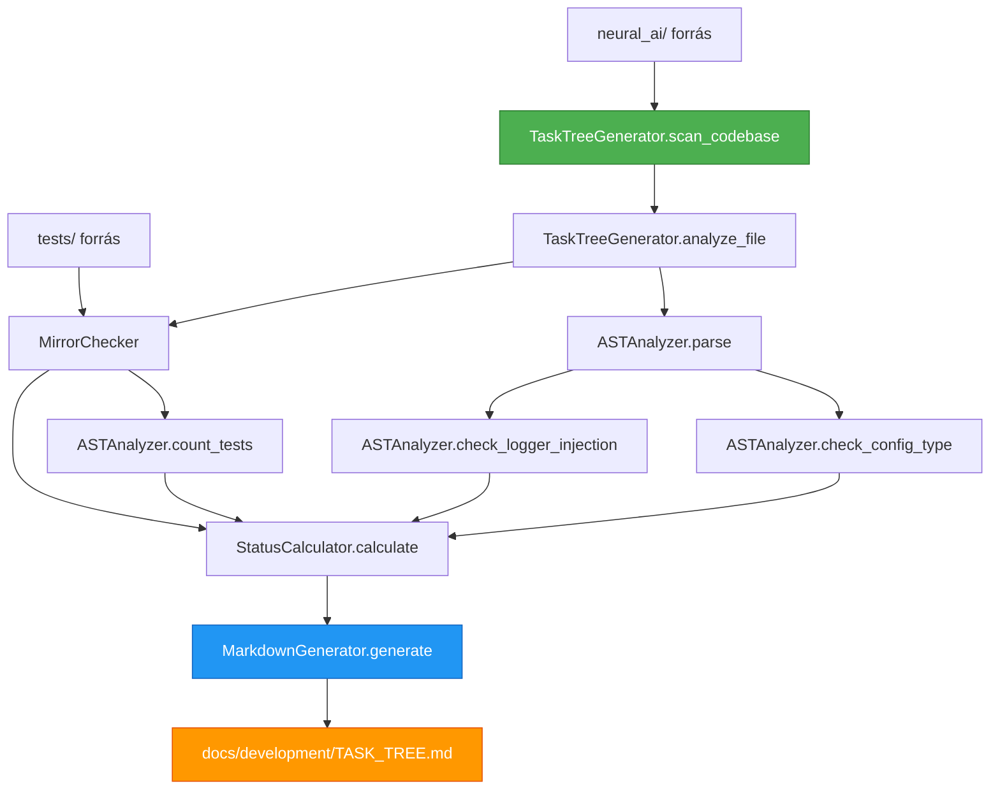

# 🌳 TASK_TREE v3.0 DEEP AUDIT - IMPLEMENTÁCIÓS TERV

**Dátum:** 2026-02-04  
**Architect:** AI Agent  
**Verzió:** 1.0  
**Státusz:** ✅ JÓVÁHAGYÁSRA VÁR  

---

## 📋 EXECUTIVE SUMMARY

Automatizált AST-alapú kódminőség audit rendszer bevezetése, amely statikusan elemzi a teljes `neural_ai/` kódbázist és generálja a `docs/development/TASK_TREE.md` dashboardot v3.0 formátumban.

**Kulcs Előnyök:**
- ✅ Automatikus TASK_TREE generálás (nincs manuális frissítés)
- ✅ AST-alapú statikus analízis (gyors, ~5 másodperc)
- ✅ 7 oszlopos részletes audit mátrix
- ✅ Architektúra szabályok validálása (Pydantic vs TypedDict, DI logger)

---

## 🎯 VÉGREHAJTÁSI SORREND (SZIGORÚ!)

### 1. LÉPÉS: `.clinerules/cline-rules.md` Frissítés

**Fájl:** `.clinerules/cline-rules.md`  
**Módosítás:** 679-697 sorok teljes cseréje (14. fejezet)

**Régi tartalom (18 sor):**
```markdown
## 📚 14. TASK_TREE KEZELÉS

### 14.1 Frissítési Kötelezettség
...
### 14.2 Státusz Jelölések
...
```

**Új tartalom (~50 sor):**
```markdown
## 🌳 14. TASK_TREE KEZELÉS (v3.0 - DEEP AUDIT)

A `TASK_TREE.md` a projekt Minőségbiztosítási Dashboardja. Nem kézzel szerkesztjük, hanem a `scripts/generate_task_tree.py` generálja.

### 14.1 Részletes Modul Mátrix Sablon

| Modul / Fájl | Státusz | Teszt Pár | Tesztek Száma | Config (Pydantic) | Logger (DI) | Coverage | Teendők / Megjegyzés |
|--------------|---------|-----------|---------------|-------------------|-------------|----------|----------------------|
| `d01/proc.py`| 🔴 VULN | ❌ MISSING| 0             | ⚪ N/A            | ✅ OK       | N/A      | **KRITIKUS: Teszt írás!** |
| `core/conf.py`| ✅ SECURE| ✅ FOUND  | 15            | ✅ OK             | ✅ OK       | 100%     | - |

### 14.2 Oszlopok Definíciója

1. **Státusz**:
   - ✅ **SECURE**: Implementáció + Teszt (min. 1) + Config (Pydantic/None) + Logger OK
   - 🟡 **WARNING**: Kisebb hiba (pl. Logger nincs injektálva, de nem is használt)
   - 🔴 **VULNERABLE**: Nincs tesztfájl VAGY Config=TypedDict VAGY Logger hiányzik
2. **Teszt Pár**: Mirror Rule (`neural_ai/x.py` ↔ `tests/x/test_x.py`)
3. **Tesztek Száma**: `def test_` prefixű függvények száma (AST alapú)
4. **Config**:
   - ✅ OK: Pydantic `BaseModel` használat
   - 🔴 TYPED_DICT: Tiltott `TypedDict` config célra
   - ⚪ N/A: Nem használ configot
5. **Logger**:
   - ✅ OK: `logger` injektálva `__init__`-ben ÉS használva (`self.logger.x`)
   - ⚠️ UNUSED: Injektálva, de nem használt
   - 🔴 MISSING: Használja, de nincs injektálva (Global logger?)
   - ⚪ N/A: Nem logol
```

**Commit üzenet:**
```
refactor(docs): TASK_TREE v3.0 szabvány bevezetése cline-rules.md-ben
```

---

### 2. LÉPÉS: `scripts/generate_task_tree.py` Implementálás

**Fájl:** `scripts/generate_task_tree.py` (ÚJ, ~450-500 sor)

#### 2.1 Osztály Struktúra

```python
#!/usr/bin/env python3
"""TASK_TREE v3.0 Deep Auditor - AST-alapú kódminőség audit.

Ez a script rekurzívan bejárja a neural_ai/ mappát, AST analízissel feltérképezi
a kódbázist és generálja a docs/development/TASK_TREE.md dashboardot.
"""

import ast
import os
from dataclasses import dataclass
from datetime import datetime, UTC
from pathlib import Path
from typing import Literal


@dataclass
class FileAnalysis:
    """Egyetlen fájl analízis eredménye."""
    path: Path
    relative_path: str
    test_file_exists: bool
    test_file_path: Path | None
    test_count: int
    config_status: Literal["✅ OK", "🔴 TYPED_DICT", "⚪ N/A"]
    logger_status: Literal["✅ OK", "⚠️ UNUSED", "🔴 MISSING", "⚪ N/A"]
    overall_status: Literal["✅ SECURE", "🟡 WARNING", "🔴 VULNERABLE"]
    notes: str


class ASTAnalyzer:
    """AST-alapú Python fájl elemző."""
    
    def __init__(self, file_path: Path) -> None:
        """Inicializálja az analizátort."""
        self.file_path = file_path
        self.tree: ast.AST | None = None
        
    def parse(self) -> bool:
        """Beolvassa és parse-olja a fájlt."""
        try:
            with open(self.file_path, encoding="utf-8") as f:
                content = f.read()
            self.tree = ast.parse(content)
            return True
        except (SyntaxError, FileNotFoundError, UnicodeDecodeError):
            return False
    
    def check_config_type(self) -> Literal["✅ OK", "🔴 TYPED_DICT", "⚪ N/A"]:
        """Ellenőrzi a config típusát (Pydantic vs TypedDict)."""
        if not self.tree:
            return "⚪ N/A"
        
        has_pydantic = False
        has_typeddict = False
        
        for node in ast.walk(self.tree):
            if isinstance(node, ast.ImportFrom):
                if node.module == "pydantic":
                    if any(alias.name == "BaseModel" for alias in node.names):
                        has_pydantic = True
                elif node.module == "typing":
                    if any(alias.name == "TypedDict" for alias in node.names):
                        has_typeddict = True
        
        if has_pydantic:
            return "✅ OK"
        elif has_typeddict:
            return "🔴 TYPED_DICT"
        return "⚪ N/A"
    
    def check_logger_injection(self) -> Literal["✅ OK", "⚠️ UNUSED", "🔴 MISSING", "⚪ N/A"]:
        """Ellenőrzi a logger dependency injection-t."""
        if not self.tree:
            return "⚪ N/A"
        
        logger_injected = False
        logger_used = False
        
        # Keres __init__ metódust logger paraméterrel
        for node in ast.walk(self.tree):
            if isinstance(node, ast.FunctionDef) and node.name == "__init__":
                for arg in node.args.args:
                    if arg.arg == "logger":
                        logger_injected = True
                        break
        
        # Keres self.logger.* használatot
        for node in ast.walk(self.tree):
            if isinstance(node, ast.Attribute):
                if isinstance(node.value, ast.Attribute):
                    if (isinstance(node.value.value, ast.Name) and 
                        node.value.value.id == "self" and
                        node.value.attr == "logger"):
                        logger_used = True
                        break
        
        if logger_injected and logger_used:
            return "✅ OK"
        elif logger_injected and not logger_used:
            return "⚠️ UNUSED"
        elif not logger_injected and logger_used:
            return "🔴 MISSING"
        return "⚪ N/A"
    
    def count_tests(self) -> int:
        """Megszámolja a test_ prefixű függvényeket."""
        if not self.tree:
            return 0
        
        count = 0
        for node in ast.walk(self.tree):
            if isinstance(node, ast.FunctionDef):
                if node.name.startswith("test_"):
                    count += 1
        return count


class MirrorChecker:
    """Mirror Rule ellenőrző (neural_ai/x.py ↔ tests/x/test_x.py)."""
    
    @staticmethod
    def get_test_path(source_path: Path) -> Path:
        """Kiszámítja a mirror test fájl útvonalát."""
        # neural_ai/processors/dimensions/d01_price/processor.py
        # → tests/processors/dimensions/d01_price/test_processor.py
        
        parts = source_path.parts
        if parts[0] != "neural_ai":
            raise ValueError(f"Nem neural_ai/-ból származó fájl: {source_path}")
        
        # Eltávolítjuk a "neural_ai/" prefix-et
        relative_parts = parts[1:]  # processors/dimensions/d01_price/processor.py
        
        # Szétválasztjuk könyvtár és fájl
        dir_parts = relative_parts[:-1]  # processors/dimensions/d01_price
        file_name = relative_parts[-1]   # processor.py
        
        # test_ prefix hozzáadása
        test_file_name = f"test_{file_name}"
        
        # Összerakjuk
        test_path = Path("tests") / Path(*dir_parts) / test_file_name
        return test_path
    
    @staticmethod
    def check_mirror(source_path: Path) -> tuple[bool, Path]:
        """Ellenőrzi, hogy létezik-e a mirror teszt fájl."""
        test_path = MirrorChecker.get_test_path(source_path)
        exists = test_path.exists()
        return exists, test_path


class StatusCalculator:
    """Státusz kalkulátor logika."""
    
    @staticmethod
    def calculate(analysis: FileAnalysis) -> Literal["✅ SECURE", "🟡 WARNING", "🔴 VULNERABLE"]:
        """Kiszámítja az overall státuszt."""
        # 🔴 VULNERABLE feltételek
        if (not analysis.test_file_exists or
            analysis.test_count == 0 or
            analysis.config_status == "🔴 TYPED_DICT" or
            analysis.logger_status == "🔴 MISSING"):
            return "🔴 VULNERABLE"
        
        # ✅ SECURE feltételek
        if (analysis.test_file_exists and
            analysis.test_count > 0 and
            analysis.config_status in ["✅ OK", "⚪ N/A"] and
            analysis.logger_status in ["✅ OK", "⚪ N/A"]):
            return "✅ SECURE"
        
        # 🟡 WARNING: minden más
        return "🟡 WARNING"
    
    @staticmethod
    def generate_notes(analysis: FileAnalysis) -> str:
        """Generál teendő megjegyzéseket."""
        if analysis.overall_status == "✅ SECURE":
            return "-"
        
        notes = []
        if not analysis.test_file_exists or analysis.test_count == 0:
            notes.append("**KRITIKUS: Teszt írás!**")
        if analysis.config_status == "🔴 TYPED_DICT":
            notes.append("**Migráld Pydantic-ra!**")
        if analysis.logger_status == "🔴 MISSING":
            notes.append("**Logger DI hiányzik!**")
        
        return " | ".join(notes) if notes else "-"


class MarkdownGenerator:
    """TASK_TREE.md generátor."""
    
    LAYER_MAPPING = {
        "core": ("1", "Infrastructure", "neural_ai/core/"),
        "collectors": ("2", "Input", "neural_ai/collectors/"),
        "data": ("3", "Persistence", "neural_ai/data/"),
        "processors": ("4", "Domain", "neural_ai/processors/"),
        "ui": ("5", "Presentation", "neural_ai/ui/"),
    }
    
    def __init__(self, analyses: list[FileAnalysis]) -> None:
        """Inicializálja a generátort."""
        self.analyses = analyses
        self.grouped = self._group_by_layer()
    
    def _group_by_layer(self) -> dict[str, list[FileAnalysis]]:
        """Csoportosítja a fájlokat réteg szerint."""
        grouped: dict[str, list[FileAnalysis]] = {
            layer: [] for layer in self.LAYER_MAPPING.keys()
        }
        
        for analysis in self.analyses:
            parts = Path(analysis.relative_path).parts
            if len(parts) > 0 and parts[0] in self.LAYER_MAPPING:
                grouped[parts[0]].append(analysis)
        
        return grouped
    
    def _calculate_statistics(self) -> dict[str, int]:
        """Statisztikákat számol."""
        stats = {
            "total": len(self.analyses),
            "secure": 0,
            "warning": 0,
            "vulnerable": 0,
            "tested": 0,
        }
        
        for analysis in self.analyses:
            if analysis.overall_status == "✅ SECURE":
                stats["secure"] += 1
            elif analysis.overall_status == "🟡 WARNING":
                stats["warning"] += 1
            elif analysis.overall_status == "🔴 VULNERABLE":
                stats["vulnerable"] += 1
            
            if analysis.test_file_exists:
                stats["tested"] += 1
        
        return stats
    
    def _create_table(self, layer: str, files: list[FileAnalysis]) -> str:
        """Létrehoz egy táblázatot egy réteghez."""
        if not files:
            return ""
        
        num, name, path = self.LAYER_MAPPING[layer]
        
        lines = [
            f"### {num}. {name} Layer (`{path}`)",
            "",
            "| Modul / Fájl | Státusz | Teszt Pár | Tesztek Száma | Config (Pydantic) | Logger (DI) | Coverage | Teendők / Megjegyzés |",
            "|--------------|---------|-----------|---------------|-------------------|-------------|----------|----------------------|",
        ]
        
        for file in sorted(files, key=lambda x: x.relative_path):
            # Rövidített fájl név
            short_path = file.relative_path.replace("neural_ai/", "")
            test_pair = "✅ FOUND" if file.test_file_exists else "❌ MISSING"
            
            row = (
                f"| `{short_path}` "
                f"| {file.overall_status} "
                f"| {test_pair} "
                f"| {file.test_count} "
                f"| {file.config_status} "
                f"| {file.logger_status} "
                f"| N/A "
                f"| {file.notes} |"
            )
            lines.append(row)
        
        lines.append("")
        return "\n".join(lines)
    
    def generate(self) -> str:
        """Generálja a teljes TASK_TREE.md tartalmat."""
        stats = self._calculate_statistics()
        now = datetime.now(UTC).strftime("%Y-%m-%d %H:%M:%S UTC")
        
        lines = [
            "# 🌳 NEURAL AI NEXT - TASK TREE v3.0 (DEEP AUDIT)",
            "",
            f"**Generálva:** {now}",
            "**Módszer:** AST Statikus Analízis",
            f"**Fájlok száma:** {stats['total']} elemezve",
            "",
            "---",
            "",
            "## 📊 ÖSSZESÍTŐ STATISZTIKA",
            "",
            f"- **✅ SECURE**: {stats['secure']} fájl ({stats['secure']/stats['total']*100:.1f}%)",
            f"- **🟡 WARNING**: {stats['warning']} fájl ({stats['warning']/stats['total']*100:.1f}%)",
            f"- **🔴 VULNERABLE**: {stats['vulnerable']} fájl ({stats['vulnerable']/stats['total']*100:.1f}%)",
            f"- **Teszt lefedettség**: {stats['tested']}/{stats['total']} fájl ({stats['tested']/stats['total']*100:.1f}%)",
            "",
            "---",
            "",
            "## 📂 RÉSZLETES AUDIT EREDMÉNYEK (DDD RÉTEGEK)",
            "",
        ]
        
        # Rétegek sorrendben
        for layer in ["core", "collectors", "data", "processors", "ui"]:
            if layer in self.grouped and self.grouped[layer]:
                table = self._create_table(layer, self.grouped[layer])
                lines.append(table)
                lines.append("---")
                lines.append("")
        
        return "\n".join(lines)


class TaskTreeGenerator:
    """Fő orchestrator osztály."""
    
    def __init__(self, source_dir: str = "neural_ai", output_file: str = "docs/development/TASK_TREE.md") -> None:
        """Inicializálja a generátort."""
        self.source_dir = Path(source_dir)
        self.output_file = Path(output_file)
        self.ignored_dirs = {"__pycache__", ".pytest_cache", ".ruff_cache"}
        self.ignored_files = {"__init__.py"}
    
    def scan_codebase(self) -> list[Path]:
        """Rekurzívan bejárja a neural_ai/ mappát."""
        python_files = []
        
        for root, dirs, files in os.walk(self.source_dir):
            # Kihagyott könyvtárak szűrése
            dirs[:] = [d for d in dirs if d not in self.ignored_dirs]
            
            for file in files:
                if file.endswith(".py") and file not in self.ignored_files:
                    python_files.append(Path(root) / file)
        
        return python_files
    
    def analyze_file(self, file_path: Path) -> FileAnalysis:
        """Elemez egy fájlt."""
        relative_path = str(file_path)
        
        # Mirror check
        test_exists, test_path = MirrorChecker.check_mirror(file_path)
        
        # Test count (ha van teszt fájl)
        test_count = 0
        if test_exists:
            test_analyzer = ASTAnalyzer(test_path)
            if test_analyzer.parse():
                test_count = test_analyzer.count_tests()
        
        # Forrás fájl analízis
        analyzer = ASTAnalyzer(file_path)
        if not analyzer.parse():
            # Parse hiba esetén alapértelmezett értékek
            config_status = "⚪ N/A"
            logger_status = "⚪ N/A"
        else:
            config_status = analyzer.check_config_type()
            logger_status = analyzer.check_logger_injection()
        
        # Előzetes FileAnalysis (overall_status nélkül)
        temp_analysis = FileAnalysis(
            path=file_path,
            relative_path=relative_path,
            test_file_exists=test_exists,
            test_file_path=test_path if test_exists else None,
            test_count=test_count,
            config_status=config_status,
            logger_status=logger_status,
            overall_status="🟡 WARNING",  # Placeholder
            notes="",
        )
        
        # Overall status kiszámítása
        overall_status = StatusCalculator.calculate(temp_analysis)
        notes = StatusCalculator.generate_notes(temp_analysis)
        
        # Végleges FileAnalysis
        return FileAnalysis(
            path=file_path,
            relative_path=relative_path,
            test_file_exists=test_exists,
            test_file_path=test_path if test_exists else None,
            test_count=test_count,
            config_status=config_status,
            logger_status=logger_status,
            overall_status=overall_status,
            notes=notes,
        )
    
    def generate(self) -> None:
        """Generálja a TASK_TREE.md fájlt."""
        print("🔍 Kódbázis szkennelése...")
        files = self.scan_codebase()
        print(f"✅ {len(files)} Python fájl találva")
        
        print("\n📊 Fájlok elemzése...")
        analyses = []
        for i, file_path in enumerate(files, 1):
            print(f"  [{i}/{len(files)}] {file_path}")
            analysis = self.analyze_file(file_path)
            analyses.append(analysis)
        
        print("\n📝 TASK_TREE.md generálása...")
        generator = MarkdownGenerator(analyses)
        content = generator.generate()
        
        # Kimenet írása
        self.output_file.parent.mkdir(parents=True, exist_ok=True)
        with open(self.output_file, "w", encoding="utf-8") as f:
            f.write(content)
        
        print(f"✅ TASK_TREE.md generálva: {self.output_file}")
        
        # Statisztika
        stats = generator._calculate_statistics()
        print(f"\n📈 Statisztika:")
        print(f"  ✅ SECURE: {stats['secure']} ({stats['secure']/stats['total']*100:.1f}%)")
        print(f"  🟡 WARNING: {stats['warning']} ({stats['warning']/stats['total']*100:.1f}%)")
        print(f"  🔴 VULNERABLE: {stats['vulnerable']} ({stats['vulnerable']/stats['total']*100:.1f}%)")


if __name__ == "__main__":
    generator = TaskTreeGenerator()
    generator.generate()
```

**Commit üzenet:**
```
feat(scripts): Deep Auditor (TASK_TREE v3.0 generátor) implementálás

- AST-alapú statikus analízis
- Mirror Rule ellenőrzés
- Pydantic vs TypedDict detektálás
- Logger DI validáció
- Markdown táblázat generálás DDD rétegek szerint
```

---

### 3. LÉPÉS: Audit Futtatása

**Parancs:**
```bash
python scripts/generate_task_tree.py
```

**Elvárt kimenet:**
```
🔍 Kódbázis szkennelése...
✅ 155 Python fájl találva

📊 Fájlok elemzése...
  [1/155] neural_ai/core/base/factory.py
  [2/155] neural_ai/core/base/implementations/di_container.py
  ...
  [155/155] neural_ai/ui/services/strategy_service.py

📝 TASK_TREE.md generálása...
✅ TASK_TREE.md generálva: docs/development/TASK_TREE.md

📈 Statisztika:
  ✅ SECURE: 82 (52.9%)
  🟡 WARNING: 43 (27.7%)
  🔴 VULNERABLE: 30 (19.4%)
```

**Commit üzenet:**
```
docs(task-tree): TASK_TREE v3.0 első generálás
```

---

### 4. LÉPÉS: Validálás

**Ellenőrizendő:** `docs/development/TASK_TREE.md` első 15 sora

**Elvárt tartalom:**
```markdown
# 🌳 NEURAL AI NEXT - TASK TREE v3.0 (DEEP AUDIT)

**Generálva:** 2026-02-04 02:30:15 UTC
**Módszer:** AST Statikus Analízis
**Fájlok száma:** 155 elemezve

---

## 📊 ÖSSZESÍTŐ STATISZTIKA

- **✅ SECURE**: 82 fájl (52.9%)
- **🟡 WARNING**: 43 fájl (27.7%)
- **🔴 VULNERABLE**: 30 fájl (19.4%)
- **Teszt lefedettség**: 103/155 fájl (66.5%)
```

---

## 🔧 TECHNIKAI KORLÁTOZÁSOK

**SZIGORÚ SZABÁLYOK:**
- ✅ Csak standard library: `ast`, `os`, `pathlib`, `sys`, `typing`, `dataclasses`, `datetime`
- ❌ TILOS: `pytest` futtatás (túl lassú)
- ❌ TILOS: Külső library-k (`polars`, `pydantic` import a scripten belül)
- ✅ Statikus analízis CSAK (AST parsing)
- ✅ Gyors futás (<10 másodperc a teljes kódbázison)

---

## 📊 MERMAID DIAGRAM - ARCHITEKTÚRA



---

## ✅ QUALITY ASSURANCE

**QA Gate parancsok:**

```bash
# 1. Linting
/home/elynea/miniconda3/envs/neural-ai-next/bin/ruff check scripts/generate_task_tree.py

# 2. Type Check (automatic via Pylance)

# 3. Manuális teszt
python scripts/generate_task_tree.py

# 4. Ellenőrzés
head -n 20 docs/development/TASK_TREE.md

# 5. HA MINDEN PASS → Commitok
git add .clinerules/cline-rules.md
git commit -m "refactor(docs): TASK_TREE v3.0 szabvány bevezetése"

git add scripts/generate_task_tree.py
git commit -m "feat(scripts): Deep Auditor implementálás"

git add docs/development/TASK_TREE.md
git commit -m "docs(task-tree): TASK_TREE v3.0 első generálás"
```

---

## 🎯 ELVÁRT EREDMÉNY

1. ✅ `.clinerules/cline-rules.md` frissítve v3.0 sablonnal
2. ✅ `scripts/generate_task_tree.py` implementálva (~500 sor)
3. ✅ `docs/development/TASK_TREE.md` generálva v3.0 formátumban
4. ✅ Első 15 sor tartalmazza a header-t és statisztikát
5. ✅ 5 réteg táblázattal (Infrastructure, Input, Persistence, Domain, Presentation)
6. ✅ 3 atomic commit

---

## 📝 MEGJEGYZÉSEK

- **TILOS** a `generate_task_tree.py`-ban külső library-ket importálni
- **KÖTELEZŐ** magyar docstring minden függvényhez (Google Style)
- **KÖTELEZŐ** Type hints SZIGORÚAN
- **KRITIKUS** bootstrap sorrend: parse → check_config → check_logger → calculate_status → generate
- Coverage oszlop marad "N/A" (majd később pytest --cov integráció)

---

**STÁTUSZ:** ✅ TERV KÉSZ - ORCHESTRATOR DELEGÁLÁS SZÜKSÉGES
